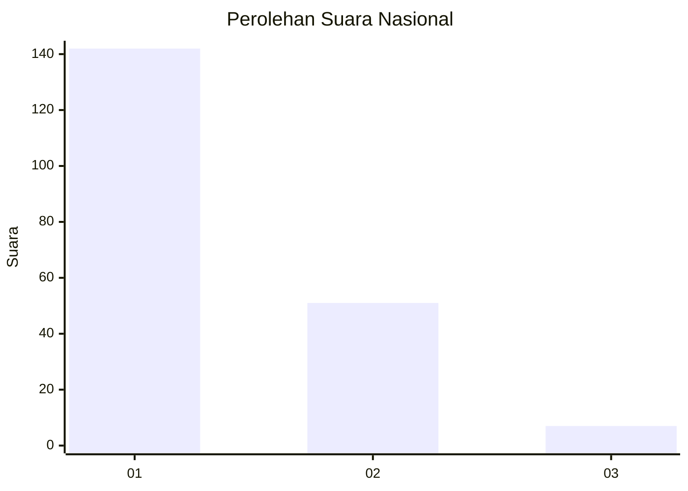
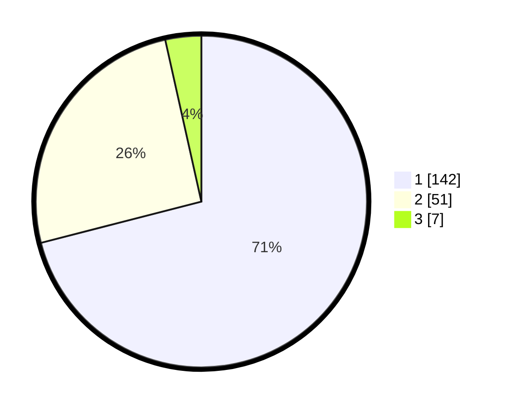

# Hasil

## Grafik

## Tabel

| No. | Nama Paslon    | Suara | Suara (raw) | Persentase |
|:--- |:-------------- | -----:| -----------:| ----------:|
| 1   | ANIES MUHAIMIN | 142   | [142][p-1]  | 71,00      |
| 2   | PRABOWO GIBRAN | 51    | [51][p-2]   | 25,50      |
| 3   | GANJAR MAHFUD  | 7     | [7][p-3]    | 3,50       |

[p-1]: https://github.com/gigit-pemilu/pemilu-2024/blob/main/pilpres/hitung-suara/sub/61-kalimantan-barat/sub/12-kubu-raya/sub/03-sungai-ambawang/sub/2001-simpang-kanan/sub/006-tps/sub/paslon-1.txt
[p-2]: https://github.com/gigit-pemilu/pemilu-2024/blob/main/pilpres/hitung-suara/sub/61-kalimantan-barat/sub/12-kubu-raya/sub/03-sungai-ambawang/sub/2001-simpang-kanan/sub/006-tps/sub/paslon-2.txt
[p-3]: https://github.com/gigit-pemilu/pemilu-2024/blob/main/pilpres/hitung-suara/sub/61-kalimantan-barat/sub/12-kubu-raya/sub/03-sungai-ambawang/sub/2001-simpang-kanan/sub/006-tps/sub/paslon-3.txt

## Foto C Plano

https://sirekap-obj-formc.kpu.go.id/4c8c/pemilu/ppwp/61/12/03/20/01/6112032001006-20240214-215458--4327f158-80c2-43d4-a4f1-3a3e74e24b8a.jpg

https://sirekap-obj-formc.kpu.go.id/4c8c/pemilu/ppwp/61/12/03/20/01/6112032001006-20240214-215708--931412b6-f6cb-42cf-a825-b13eeb664ab3.jpg

https://sirekap-obj-formc.kpu.go.id/4c8c/pemilu/ppwp/61/12/03/20/01/6112032001006-20240214-215837--65ee56df-03c8-481d-ad83-fd237e42a145.jpg

## Metadata

| Key        | Value               |
| ---------- | ------------------- |
| Time Stamp | 2024-02-15 12:00:28 |

