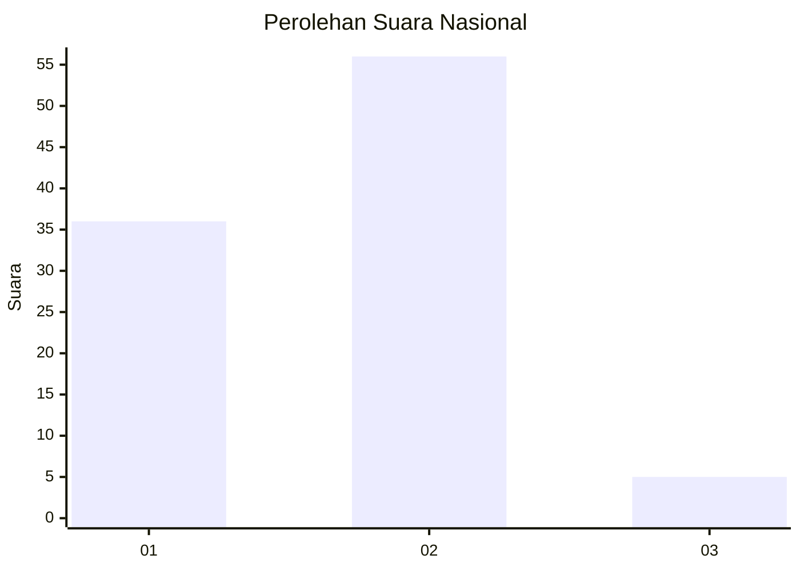
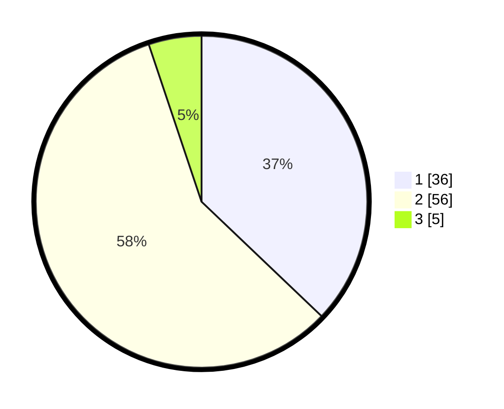

# Hasil

## Grafik

## Tabel

| No. | Nama Paslon    | Suara | Suara (raw) | Persentase |
|:--- |:-------------- | -----:| -----------:| ----------:|
| 1   | ANIES MUHAIMIN | 36    | [36][p-1]   | 37,11      |
| 2   | PRABOWO GIBRAN | 56    | [56][p-2]   | 57,73      |
| 3   | GANJAR MAHFUD  | 5     | [5][p-3]    | 5,15       |

[p-1]: https://github.com/gigit-pemilu/pemilu-2024/blob/main/pilpres/hitung-suara/sub/61-kalimantan-barat/sub/12-kubu-raya/sub/03-sungai-ambawang/sub/2002-mega-timur/sub/028-tps/sub/paslon-1.txt
[p-2]: https://github.com/gigit-pemilu/pemilu-2024/blob/main/pilpres/hitung-suara/sub/61-kalimantan-barat/sub/12-kubu-raya/sub/03-sungai-ambawang/sub/2002-mega-timur/sub/028-tps/sub/paslon-2.txt
[p-3]: https://github.com/gigit-pemilu/pemilu-2024/blob/main/pilpres/hitung-suara/sub/61-kalimantan-barat/sub/12-kubu-raya/sub/03-sungai-ambawang/sub/2002-mega-timur/sub/028-tps/sub/paslon-3.txt

## Foto C Plano

https://sirekap-obj-formc.kpu.go.id/0aaf/pemilu/ppwp/61/12/03/20/02/6112032002028-20240218-063837--d66f9e14-c3f9-4bf7-85a5-393b9d1232bf.jpg

https://sirekap-obj-formc.kpu.go.id/0aaf/pemilu/ppwp/61/12/03/20/02/6112032002028-20240214-155129--f2804a3e-3426-4ef7-b164-650342b44b44.jpg

https://sirekap-obj-formc.kpu.go.id/0aaf/pemilu/ppwp/61/12/03/20/02/6112032002028-20240214-155202--85850490-87a9-4933-8e5d-33d139fcfead.jpg

## Metadata

| Key        | Value               |
| ---------- | ------------------- |
| Time Stamp | 2024-02-19 06:16:00 |

