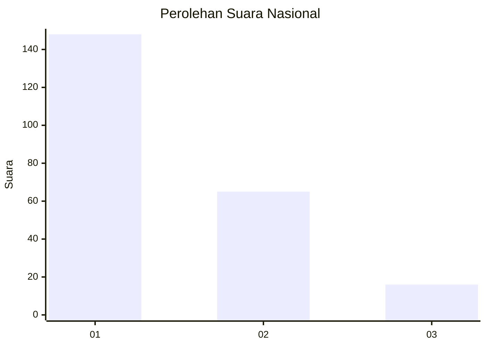
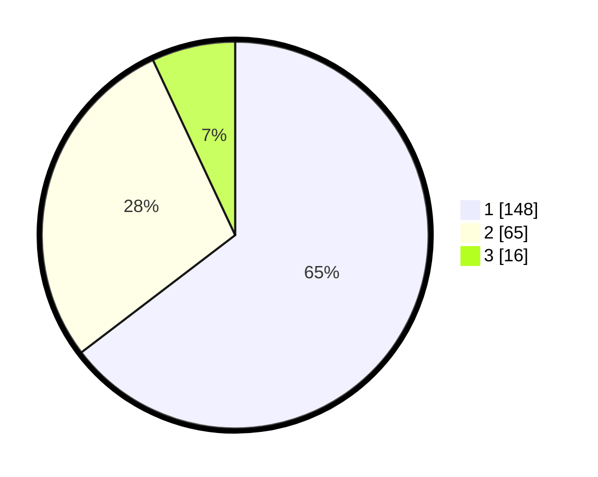

# Hasil

## Grafik

## Tabel

| No. | Nama Paslon    | Suara | Suara (raw) | Persentase |
|:--- |:-------------- | -----:| -----------:| ----------:|
| 1   | ANIES MUHAIMIN | 148   | [148][p-1]  | 64,63      |
| 2   | PRABOWO GIBRAN | 65    | [65][p-2]   | 28,38      |
| 3   | GANJAR MAHFUD  | 16    | [16][p-3]   | 6,99       |

[p-1]: https://github.com/gigit-pemilu/pemilu-2024/blob/main/pilpres/hitung-suara/sub/61-kalimantan-barat/sub/12-kubu-raya/sub/03-sungai-ambawang/sub/2003-bengkarek/sub/005-tps/sub/paslon-1.txt
[p-2]: https://github.com/gigit-pemilu/pemilu-2024/blob/main/pilpres/hitung-suara/sub/61-kalimantan-barat/sub/12-kubu-raya/sub/03-sungai-ambawang/sub/2003-bengkarek/sub/005-tps/sub/paslon-2.txt
[p-3]: https://github.com/gigit-pemilu/pemilu-2024/blob/main/pilpres/hitung-suara/sub/61-kalimantan-barat/sub/12-kubu-raya/sub/03-sungai-ambawang/sub/2003-bengkarek/sub/005-tps/sub/paslon-3.txt

## Foto C Plano

https://sirekap-obj-formc.kpu.go.id/8e88/pemilu/ppwp/61/12/03/20/03/6112032003005-20240214-215239--480c94d4-01bd-47c7-a2ec-1539a200ba72.jpg

https://sirekap-obj-formc.kpu.go.id/8e88/pemilu/ppwp/61/12/03/20/03/6112032003005-20240214-215305--30b4e2ea-b1d2-4ff9-8569-68bbe758b349.jpg

https://sirekap-obj-formc.kpu.go.id/8e88/pemilu/ppwp/61/12/03/20/03/6112032003005-20240214-215738--1806a573-85e4-49b8-bec0-32fbde082c56.jpg

## Metadata

| Key        | Value               |
| ---------- | ------------------- |
| Time Stamp | 2024-02-15 19:00:26 |

