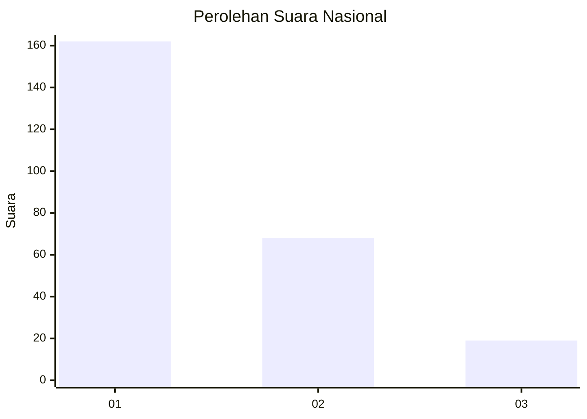
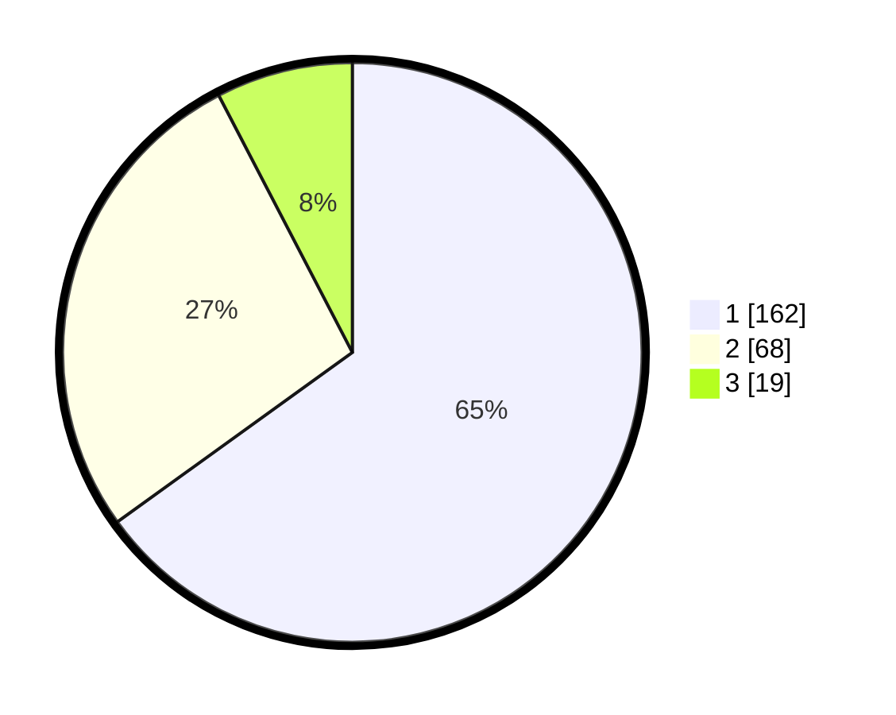

# Hasil

## Grafik

## Tabel

| No. | Nama Paslon    | Suara | Suara (raw) | Persentase |
|:--- |:-------------- | -----:| -----------:| ----------:|
| 1   | ANIES MUHAIMIN | 162   | [162][p-1]  | 65,06      |
| 2   | PRABOWO GIBRAN | 68    | [68][p-2]   | 27,31      |
| 3   | GANJAR MAHFUD  | 19    | [19][p-3]   | 7,63       |

[p-1]: https://github.com/gigit-pemilu/pemilu-2024/blob/main/pilpres/hitung-suara/sub/61-kalimantan-barat/sub/12-kubu-raya/sub/03-sungai-ambawang/sub/2004-lingga/sub/012-tps/sub/paslon-1.txt
[p-2]: https://github.com/gigit-pemilu/pemilu-2024/blob/main/pilpres/hitung-suara/sub/61-kalimantan-barat/sub/12-kubu-raya/sub/03-sungai-ambawang/sub/2004-lingga/sub/012-tps/sub/paslon-2.txt
[p-3]: https://github.com/gigit-pemilu/pemilu-2024/blob/main/pilpres/hitung-suara/sub/61-kalimantan-barat/sub/12-kubu-raya/sub/03-sungai-ambawang/sub/2004-lingga/sub/012-tps/sub/paslon-3.txt

## Foto C Plano

https://sirekap-obj-formc.kpu.go.id/eb9e/pemilu/ppwp/61/12/03/20/04/6112032004012-20240215-182814--74baadef-9ab3-46d5-8301-9c000e430ff7.jpg

https://sirekap-obj-formc.kpu.go.id/eb9e/pemilu/ppwp/61/12/03/20/04/6112032004012-20240215-025459--bbd0dc2d-4b12-4cbd-a9b3-5655f2cf35d7.jpg

https://sirekap-obj-formc.kpu.go.id/eb9e/pemilu/ppwp/61/12/03/20/04/6112032004012-20240215-063443--11a094a6-7937-4feb-b580-9ee250763ed0.jpg

## Metadata

| Key        | Value               |
| ---------- | ------------------- |
| Time Stamp | 2024-02-15 22:30:27 |

