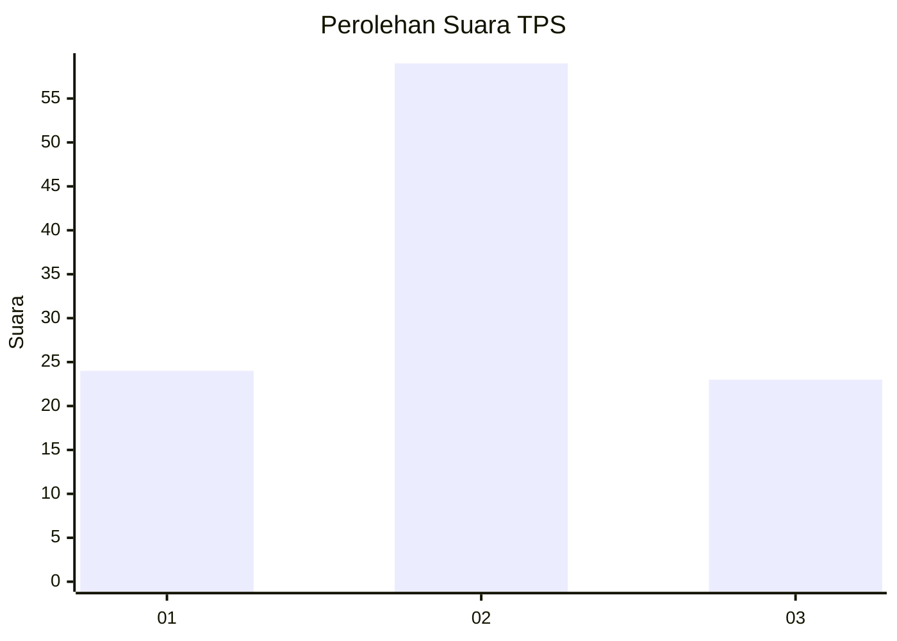
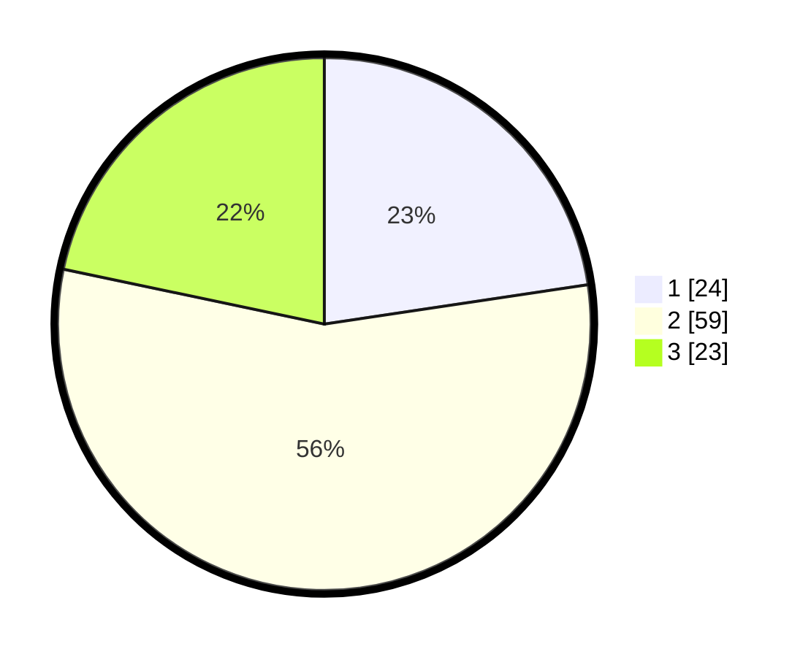

# Hasil

## Grafik

## Tabel

| No. | Nama Paslon    | Suara | Suara (raw) | Persentase |
|:--- |:-------------- | -----:| -----------:| ----------:|
| 1   | ANIES MUHAIMIN | 24    | [24][p-1]   | 22,64      |
| 2   | PRABOWO GIBRAN | 59    | [59][p-2]   | 55,66      |
| 3   | GANJAR MAHFUD  | 23    | [23][p-3]   | 21,70      |

[p-1]: https://github.com/gigit-pemilu/pemilu-2024-61-kalimantan-barat/blob/main/pilpres/hitung-suara/sub/61-kalimantan-barat/sub/12-kubu-raya/sub/03-sungai-ambawang/sub/2005-sungai-ambawang-kuala/sub/014-tps/sub/paslon-1.txt
[p-2]: https://github.com/gigit-pemilu/pemilu-2024-61-kalimantan-barat/blob/main/pilpres/hitung-suara/sub/61-kalimantan-barat/sub/12-kubu-raya/sub/03-sungai-ambawang/sub/2005-sungai-ambawang-kuala/sub/014-tps/sub/paslon-2.txt
[p-3]: https://github.com/gigit-pemilu/pemilu-2024-61-kalimantan-barat/blob/main/pilpres/hitung-suara/sub/61-kalimantan-barat/sub/12-kubu-raya/sub/03-sungai-ambawang/sub/2005-sungai-ambawang-kuala/sub/014-tps/sub/paslon-3.txt

## Foto C Plano

https://sirekap-obj-formc.kpu.go.id/f6b4/pemilu/ppwp/61/12/03/20/05/6112032005014-20240214-212450--33876174-d927-4030-84d3-aedef532af52.jpg

https://sirekap-obj-formc.kpu.go.id/f6b4/pemilu/ppwp/61/12/03/20/05/6112032005014-20240214-212756--c7d94a6f-c4d4-4832-a876-c0a3b5fb9488.jpg

https://sirekap-obj-formc.kpu.go.id/f6b4/pemilu/ppwp/61/12/03/20/05/6112032005014-20240216-124206--806c63eb-43ce-48e0-95ad-e9233130e5a3.jpg

## Metadata

| Key        | Value               |
| ---------- | ------------------- |
| Time Stamp | 2024-02-16 12:51:22 |

