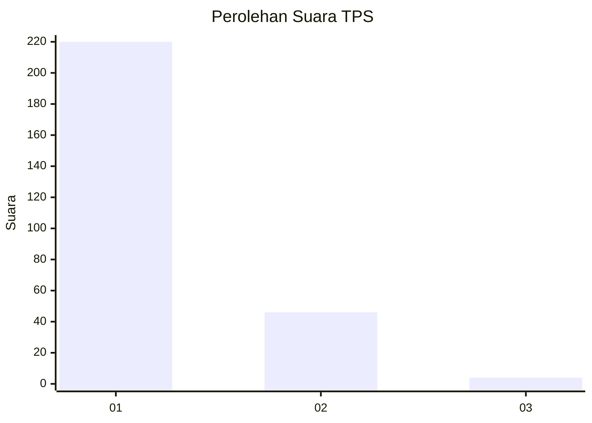
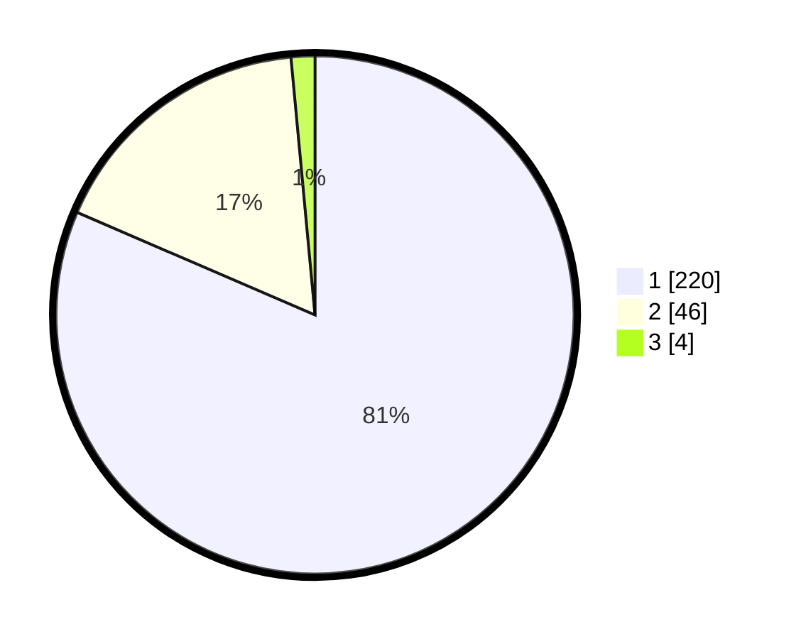

# Hasil

## Grafik

## Tabel

| No. | Nama Paslon    | Suara | Suara (raw) | Persentase |
|:--- |:-------------- | -----:| -----------:| ----------:|
| 1   | ANIES MUHAIMIN | 220   | [220][p-1]  | 81,48      |
| 2   | PRABOWO GIBRAN | 46    | [46][p-2]   | 17,04      |
| 3   | GANJAR MAHFUD  | 4     | [4][p-3]    | 1,48       |

[p-1]: https://github.com/gigit-pemilu/pemilu-2024-61-kalimantan-barat/blob/main/pilpres/hitung-suara/sub/61-kalimantan-barat/sub/12-kubu-raya/sub/03-sungai-ambawang/sub/2007-durian/sub/005-tps/sub/paslon-1.txt
[p-2]: https://github.com/gigit-pemilu/pemilu-2024-61-kalimantan-barat/blob/main/pilpres/hitung-suara/sub/61-kalimantan-barat/sub/12-kubu-raya/sub/03-sungai-ambawang/sub/2007-durian/sub/005-tps/sub/paslon-2.txt
[p-3]: https://github.com/gigit-pemilu/pemilu-2024-61-kalimantan-barat/blob/main/pilpres/hitung-suara/sub/61-kalimantan-barat/sub/12-kubu-raya/sub/03-sungai-ambawang/sub/2007-durian/sub/005-tps/sub/paslon-3.txt

## Foto C Plano

https://sirekap-obj-formc.kpu.go.id/2aa0/pemilu/ppwp/61/12/03/20/07/6112032007005-20240215-001948--be852afc-8182-40f6-8634-9d49bd363a82.jpg

https://sirekap-obj-formc.kpu.go.id/2aa0/pemilu/ppwp/61/12/03/20/07/6112032007005-20240215-002100--8afc10c4-62ae-455c-95e8-101b19483a28.jpg

https://sirekap-obj-formc.kpu.go.id/2aa0/pemilu/ppwp/61/12/03/20/07/6112032007005-20240215-002203--1283df6b-bcac-4e8b-b256-7fd94d1836ae.jpg

## Metadata

| Key        | Value               |
| ---------- | ------------------- |
| Time Stamp | 2024-02-15 12:00:28 |

