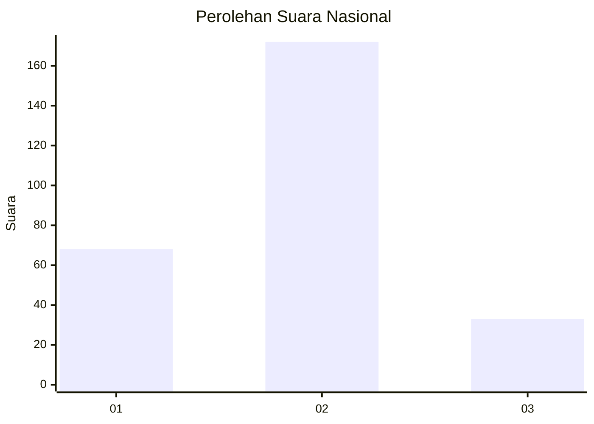
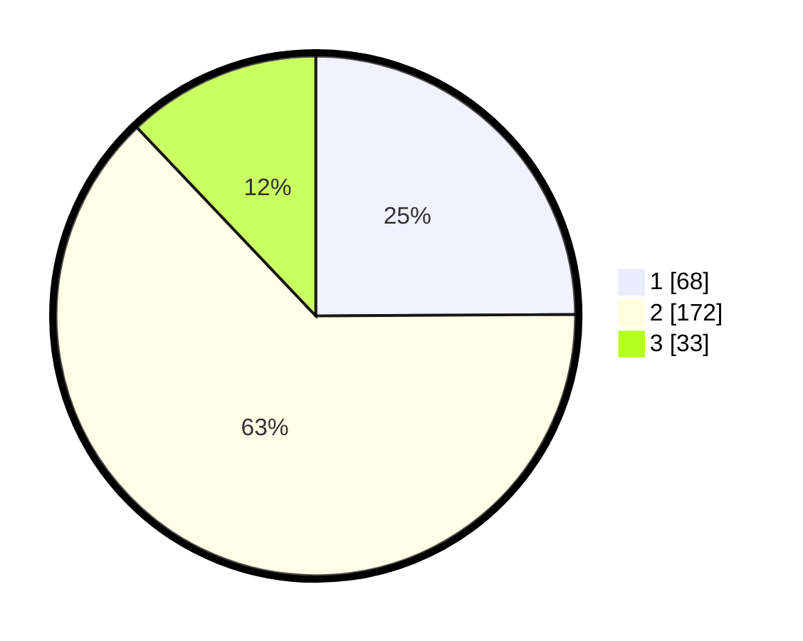

# Hasil

## Grafik

## Tabel

| No. | Nama Paslon    | Suara | Suara (raw) | Persentase |
|:--- |:-------------- | -----:| -----------:| ----------:|
| 1   | ANIES MUHAIMIN | 68    | [68][p-1]   | 24,91      |
| 2   | PRABOWO GIBRAN | 172   | [172][p-2]  | 63,00      |
| 3   | GANJAR MAHFUD  | 33    | [33][p-3]   | 12,09      |

[p-1]: https://github.com/gigit-pemilu/pemilu-2024/blob/main/pilpres/hitung-suara/sub/61-kalimantan-barat/sub/12-kubu-raya/sub/03-sungai-ambawang/sub/2007-durian/sub/011-tps/sub/paslon-1.txt
[p-2]: https://github.com/gigit-pemilu/pemilu-2024/blob/main/pilpres/hitung-suara/sub/61-kalimantan-barat/sub/12-kubu-raya/sub/03-sungai-ambawang/sub/2007-durian/sub/011-tps/sub/paslon-2.txt
[p-3]: https://github.com/gigit-pemilu/pemilu-2024/blob/main/pilpres/hitung-suara/sub/61-kalimantan-barat/sub/12-kubu-raya/sub/03-sungai-ambawang/sub/2007-durian/sub/011-tps/sub/paslon-3.txt

## Foto C Plano

https://sirekap-obj-formc.kpu.go.id/6d3f/pemilu/ppwp/61/12/03/20/07/6112032007011-20240215-025347--5d1907eb-9ef4-4086-a810-e307f65a1d6a.jpg

https://sirekap-obj-formc.kpu.go.id/6d3f/pemilu/ppwp/61/12/03/20/07/6112032007011-20240215-025507--600b1d0f-66fe-469f-b18b-6b87aa1cbb92.jpg

https://sirekap-obj-formc.kpu.go.id/6d3f/pemilu/ppwp/61/12/03/20/07/6112032007011-20240215-025605--e107d6e0-d074-4453-a684-f88e3602a688.jpg

## Metadata

| Key        | Value               |
| ---------- | ------------------- |
| Time Stamp | 2024-02-15 12:00:28 |

