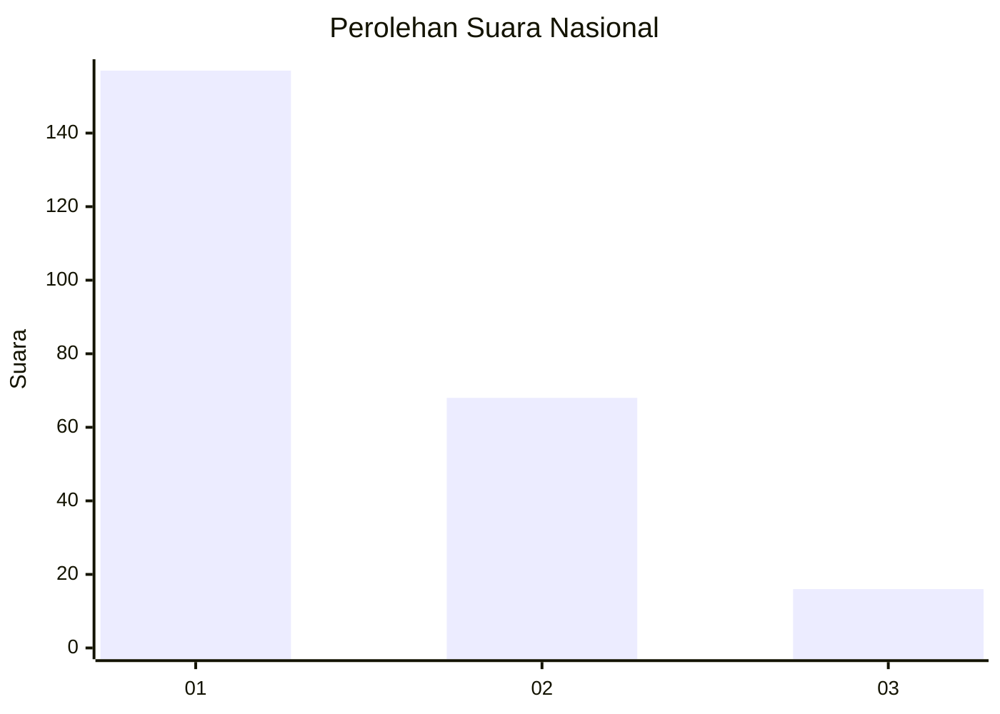
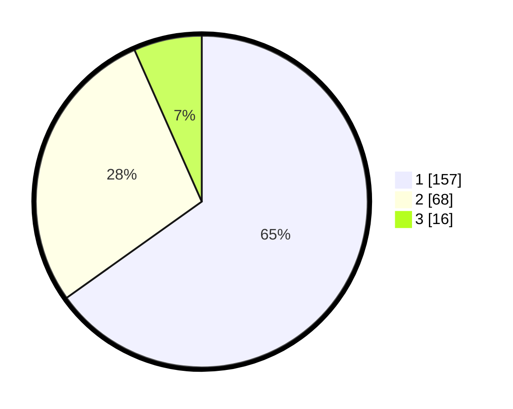

# Hasil

## Grafik

## Tabel

| No. | Nama Paslon    | Suara | Suara (raw) | Persentase |
|:--- |:-------------- | -----:| -----------:| ----------:|
| 1   | ANIES MUHAIMIN | 157   | [157][p-1]  | 65,15      |
| 2   | PRABOWO GIBRAN | 68    | [68][p-2]   | 28,22      |
| 3   | GANJAR MAHFUD  | 16    | [16][p-3]   | 6,64       |

[p-1]: https://github.com/gigit-pemilu/pemilu-2024/blob/main/pilpres/hitung-suara/sub/61-kalimantan-barat/sub/12-kubu-raya/sub/03-sungai-ambawang/sub/2007-durian/sub/013-tps/sub/paslon-1.txt
[p-2]: https://github.com/gigit-pemilu/pemilu-2024/blob/main/pilpres/hitung-suara/sub/61-kalimantan-barat/sub/12-kubu-raya/sub/03-sungai-ambawang/sub/2007-durian/sub/013-tps/sub/paslon-2.txt
[p-3]: https://github.com/gigit-pemilu/pemilu-2024/blob/main/pilpres/hitung-suara/sub/61-kalimantan-barat/sub/12-kubu-raya/sub/03-sungai-ambawang/sub/2007-durian/sub/013-tps/sub/paslon-3.txt

## Foto C Plano

https://sirekap-obj-formc.kpu.go.id/ee6a/pemilu/ppwp/61/12/03/20/07/6112032007013-20240215-043752--644a6d8d-46e9-4c9f-88cf-0b6422b3d7c8.jpg

https://sirekap-obj-formc.kpu.go.id/ee6a/pemilu/ppwp/61/12/03/20/07/6112032007013-20240215-044348--4282df53-3e79-44f0-aa39-bd9cc21ce164.jpg

https://sirekap-obj-formc.kpu.go.id/ee6a/pemilu/ppwp/61/12/03/20/07/6112032007013-20240215-044054--e58da8f2-2093-4a0e-be16-5be817f81cd1.jpg

## Metadata

| Key        | Value               |
| ---------- | ------------------- |
| Time Stamp | 2024-02-15 16:00:26 |

