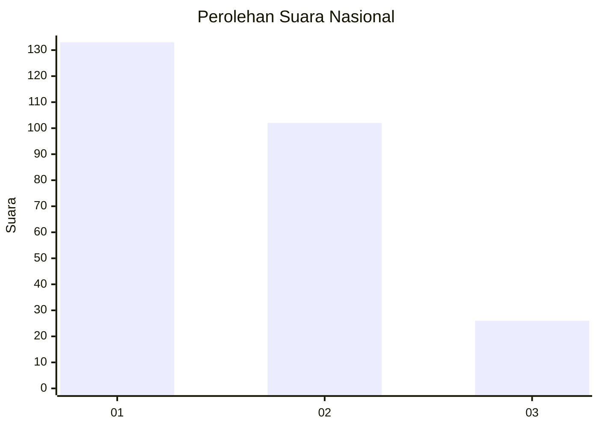
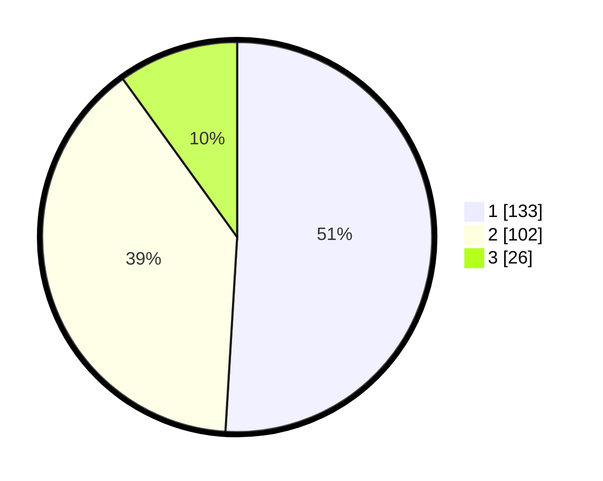

# Hasil

## Grafik

## Tabel

| No. | Nama Paslon    | Suara | Suara (raw) | Persentase |
|:--- |:-------------- | -----:| -----------:| ----------:|
| 1   | ANIES MUHAIMIN | 133   | [133][p-1]  | 50,96      |
| 2   | PRABOWO GIBRAN | 102   | [102][p-2]  | 39,08      |
| 3   | GANJAR MAHFUD  | 26    | [26][p-3]   | 9,96       |

[p-1]: https://github.com/gigit-pemilu/pemilu-2024/blob/main/pilpres/hitung-suara/sub/61-kalimantan-barat/sub/12-kubu-raya/sub/03-sungai-ambawang/sub/2007-durian/sub/014-tps/sub/paslon-1.txt
[p-2]: https://github.com/gigit-pemilu/pemilu-2024/blob/main/pilpres/hitung-suara/sub/61-kalimantan-barat/sub/12-kubu-raya/sub/03-sungai-ambawang/sub/2007-durian/sub/014-tps/sub/paslon-2.txt
[p-3]: https://github.com/gigit-pemilu/pemilu-2024/blob/main/pilpres/hitung-suara/sub/61-kalimantan-barat/sub/12-kubu-raya/sub/03-sungai-ambawang/sub/2007-durian/sub/014-tps/sub/paslon-3.txt

## Foto C Plano

https://sirekap-obj-formc.kpu.go.id/2f9f/pemilu/ppwp/61/12/03/20/07/6112032007014-20240215-001703--ca5c6d3c-b794-4c93-8e72-0adaffaeeb14.jpg

https://sirekap-obj-formc.kpu.go.id/2f9f/pemilu/ppwp/61/12/03/20/07/6112032007014-20240216-133403--fceeba38-644d-44da-92d9-1b47efc9de6f.jpg

https://sirekap-obj-formc.kpu.go.id/2f9f/pemilu/ppwp/61/12/03/20/07/6112032007014-20240216-133402--4f8d8f9e-adbe-497d-9aef-f322995112e4.jpg

## Metadata

| Key        | Value               |
| ---------- | ------------------- |
| Time Stamp | 2024-02-16 16:25:10 |

