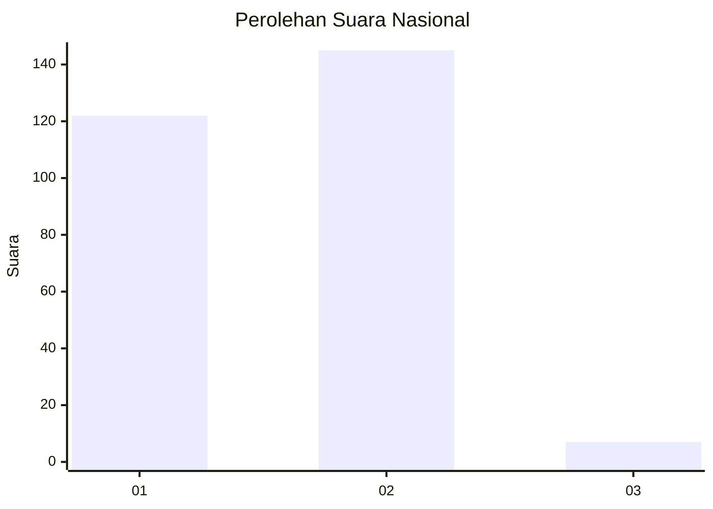
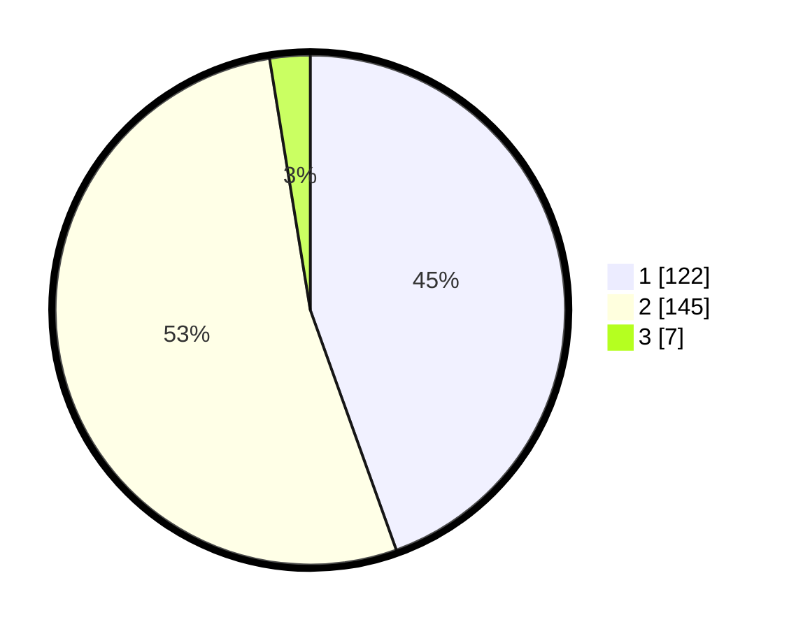

# Hasil

## Grafik

## Tabel

| No. | Nama Paslon    | Suara | Suara (raw) | Persentase |
|:--- |:-------------- | -----:| -----------:| ----------:|
| 1   | ANIES MUHAIMIN | 122   | [122][p-1]  | 44,53      |
| 2   | PRABOWO GIBRAN | 145   | [145][p-2]  | 52,92      |
| 3   | GANJAR MAHFUD  | 7     | [7][p-3]    | 2,55       |

[p-1]: https://github.com/gigit-pemilu/pemilu-2024/blob/main/pilpres/hitung-suara/sub/61-kalimantan-barat/sub/12-kubu-raya/sub/03-sungai-ambawang/sub/2007-durian/sub/015-tps/sub/paslon-1.txt
[p-2]: https://github.com/gigit-pemilu/pemilu-2024/blob/main/pilpres/hitung-suara/sub/61-kalimantan-barat/sub/12-kubu-raya/sub/03-sungai-ambawang/sub/2007-durian/sub/015-tps/sub/paslon-2.txt
[p-3]: https://github.com/gigit-pemilu/pemilu-2024/blob/main/pilpres/hitung-suara/sub/61-kalimantan-barat/sub/12-kubu-raya/sub/03-sungai-ambawang/sub/2007-durian/sub/015-tps/sub/paslon-3.txt

## Foto C Plano

https://sirekap-obj-formc.kpu.go.id/a32e/pemilu/ppwp/61/12/03/20/07/6112032007015-20240215-011619--02f9a1dd-701a-4ba1-849f-8f6781465ca9.jpg

https://sirekap-obj-formc.kpu.go.id/a32e/pemilu/ppwp/61/12/03/20/07/6112032007015-20240215-012155--fcf4f625-85e4-438b-9d69-02242f7e1624.jpg

https://sirekap-obj-formc.kpu.go.id/a32e/pemilu/ppwp/61/12/03/20/07/6112032007015-20240215-100222--3fa8f79b-fcc1-44f9-864f-8392afc3d444.jpg

## Metadata

| Key        | Value               |
| ---------- | ------------------- |
| Time Stamp | 2024-02-15 15:30:25 |

