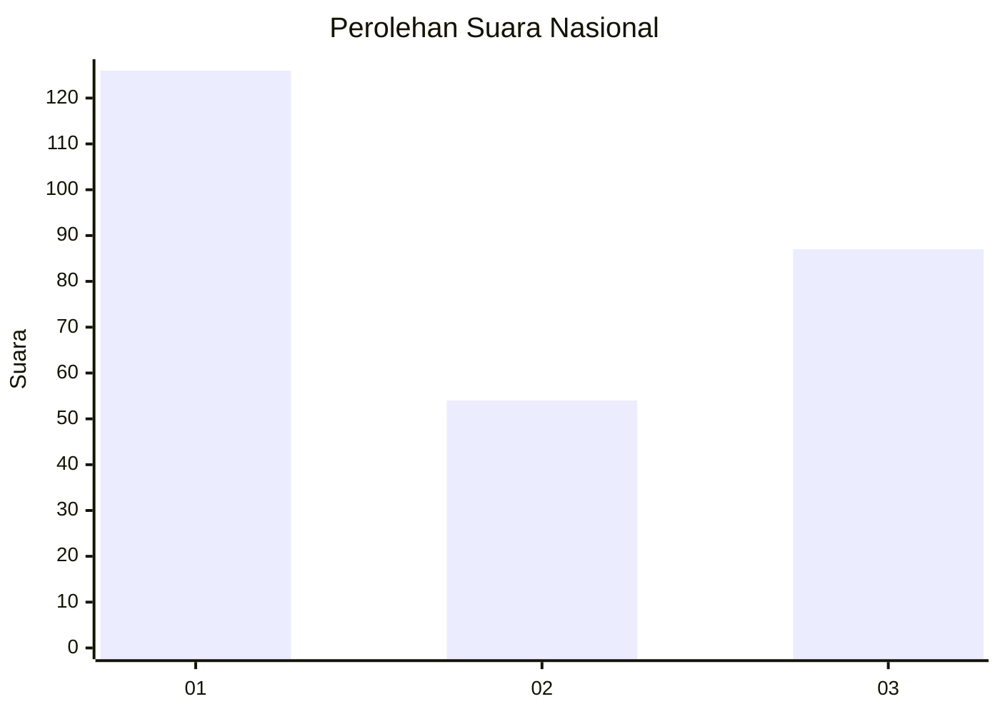
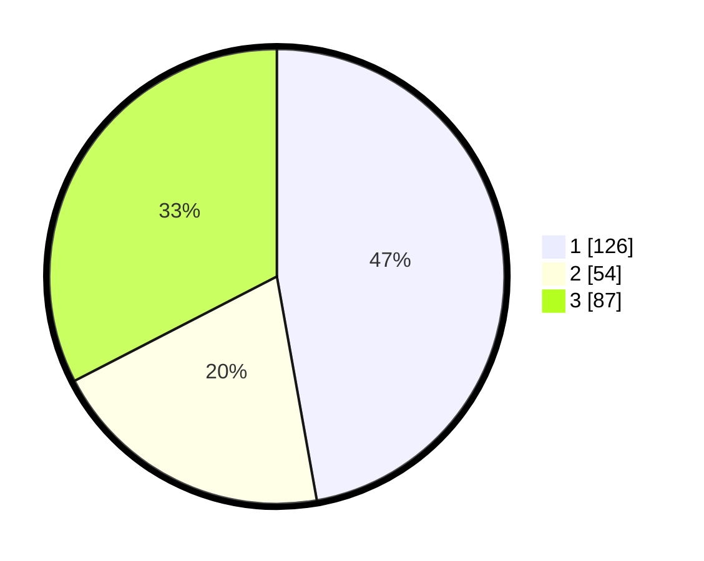

# Hasil

## Grafik

## Tabel

| No. | Nama Paslon    | Suara | Suara (raw) | Persentase |
|:--- |:-------------- | -----:| -----------:| ----------:|
| 1   | ANIES MUHAIMIN | 126   | [126][p-1]  | 47,19      |
| 2   | PRABOWO GIBRAN | 54    | [54][p-2]   | 20,22      |
| 3   | GANJAR MAHFUD  | 87    | [87][p-3]   | 32,58      |

[p-1]: https://github.com/gigit-pemilu/pemilu-2024/blob/main/pilpres/hitung-suara/sub/61-kalimantan-barat/sub/12-kubu-raya/sub/03-sungai-ambawang/sub/2007-durian/sub/019-tps/sub/paslon-1.txt
[p-2]: https://github.com/gigit-pemilu/pemilu-2024/blob/main/pilpres/hitung-suara/sub/61-kalimantan-barat/sub/12-kubu-raya/sub/03-sungai-ambawang/sub/2007-durian/sub/019-tps/sub/paslon-2.txt
[p-3]: https://github.com/gigit-pemilu/pemilu-2024/blob/main/pilpres/hitung-suara/sub/61-kalimantan-barat/sub/12-kubu-raya/sub/03-sungai-ambawang/sub/2007-durian/sub/019-tps/sub/paslon-3.txt

## Foto C Plano

https://sirekap-obj-formc.kpu.go.id/1050/pemilu/ppwp/61/12/03/20/07/6112032007019-20240229-195917--5d371cba-d65a-45c5-ad21-206db1ae7b72.jpg

https://sirekap-obj-formc.kpu.go.id/1050/pemilu/ppwp/61/12/03/20/07/6112032007019-20240229-200016--54f27ac4-0c40-46df-b98b-ce63dfbb7904.jpg

https://sirekap-obj-formc.kpu.go.id/1050/pemilu/ppwp/61/12/03/20/07/6112032007019-20240229-200128--1ce89252-1908-42f7-8ac8-dfe9b112a767.jpg

## Metadata

| Key        | Value               |
| ---------- | ------------------- |
| Time Stamp | 2024-02-29 21:00:00 |

## DATA PEMILIH TETAP

Jumlah pemilih dalam DPT: **842**.
 * L: **944**.
 * P: **28**.

## DATA PENGGUNA HAK PILIH

Jumlah pengguna hak pilih dalam DPT: **142**.
 * L: **104**.
 * P: **888**.

Jumlah pengguna hak pilih dalam DPTb: **808**.
 * L: **5**.
 * P: **0**.

Jumlah pengguna hak pilih dalam DPK: **1**.
 * L: **81**.
 * P: **0**.

Jumlah pengguna hak pilih: **193**.
 * L: **105**.
 * P: **888**.

## JUMLAH SUARA SAH DAN TIDAK SAH

JUMLAH SELURUH SUARA SAH: **924**.

JUMLAH SUARA TIDAK SAH: **6**.

JUMLAH SELURUH SUARA SAH DAN SUARA TIDAK SAH: **192**.

