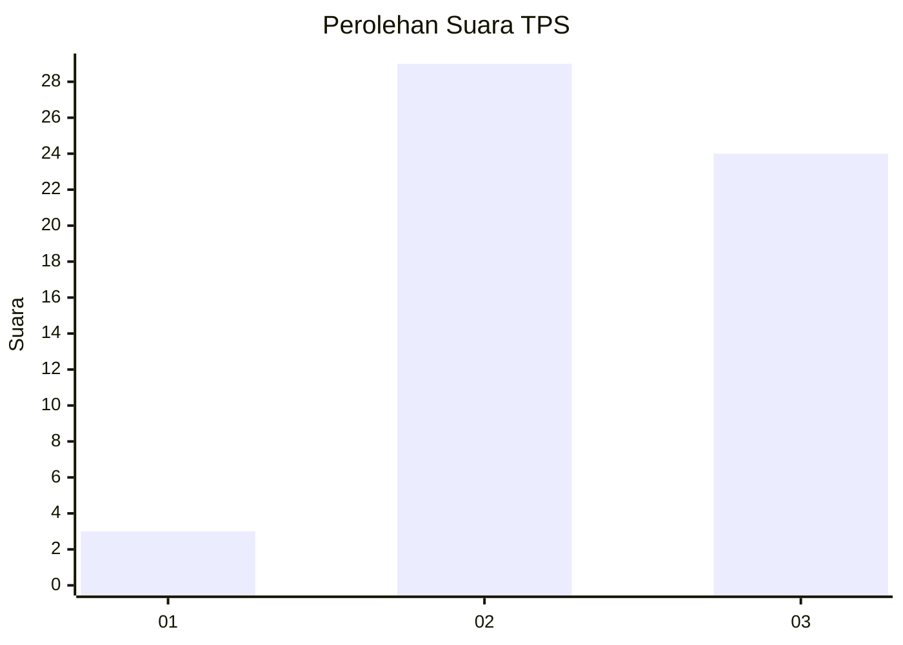
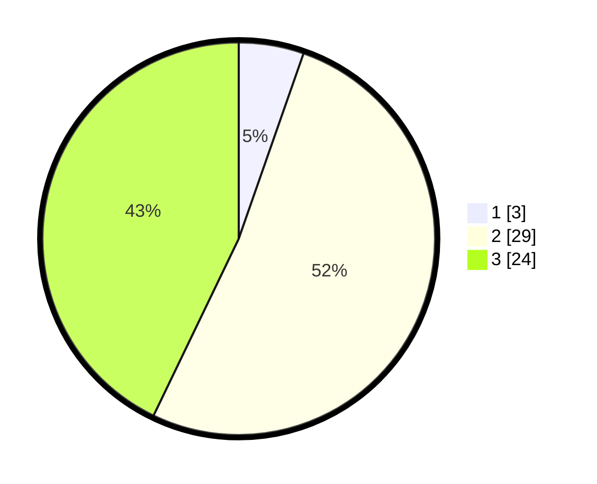

# Hasil

## Grafik

## Tabel

| No. | Nama Paslon    | Suara | Suara (raw) | Persentase |
|:--- |:-------------- | -----:| -----------:| ----------:|
| 1   | ANIES MUHAIMIN | 3     | [3][p-1]    | 5,36       |
| 2   | PRABOWO GIBRAN | 29    | [29][p-2]   | 51,79      |
| 3   | GANJAR MAHFUD  | 24    | [24][p-3]   | 42,86      |

[p-1]: https://github.com/gigit-pemilu/pemilu-2024-61-kalimantan-barat/blob/main/pilpres/hitung-suara/sub/61-kalimantan-barat/sub/12-kubu-raya/sub/03-sungai-ambawang/sub/2008-pancaroba/sub/011-tps/sub/paslon-1.txt
[p-2]: https://github.com/gigit-pemilu/pemilu-2024-61-kalimantan-barat/blob/main/pilpres/hitung-suara/sub/61-kalimantan-barat/sub/12-kubu-raya/sub/03-sungai-ambawang/sub/2008-pancaroba/sub/011-tps/sub/paslon-2.txt
[p-3]: https://github.com/gigit-pemilu/pemilu-2024-61-kalimantan-barat/blob/main/pilpres/hitung-suara/sub/61-kalimantan-barat/sub/12-kubu-raya/sub/03-sungai-ambawang/sub/2008-pancaroba/sub/011-tps/sub/paslon-3.txt

## Foto C Plano

https://sirekap-obj-formc.kpu.go.id/e3f2/pemilu/ppwp/61/12/03/20/08/6112032008011-20240229-132423--fbe95d4e-44f2-4d8f-be2f-a237f51e4fe4.jpg

https://sirekap-obj-formc.kpu.go.id/e3f2/pemilu/ppwp/61/12/03/20/08/6112032008011-20240214-235104--d2725464-60e2-4f52-9705-449194489d64.jpg

https://sirekap-obj-formc.kpu.go.id/e3f2/pemilu/ppwp/61/12/03/20/08/6112032008011-20240214-235103--d8c639fe-f164-4061-833b-f026cc5347a5.jpg

## Metadata

| Key        | Value               |
| ---------- | ------------------- |
| Time Stamp | 2024-02-29 14:00:00 |

