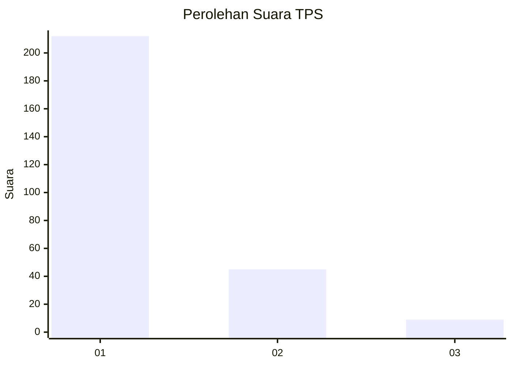
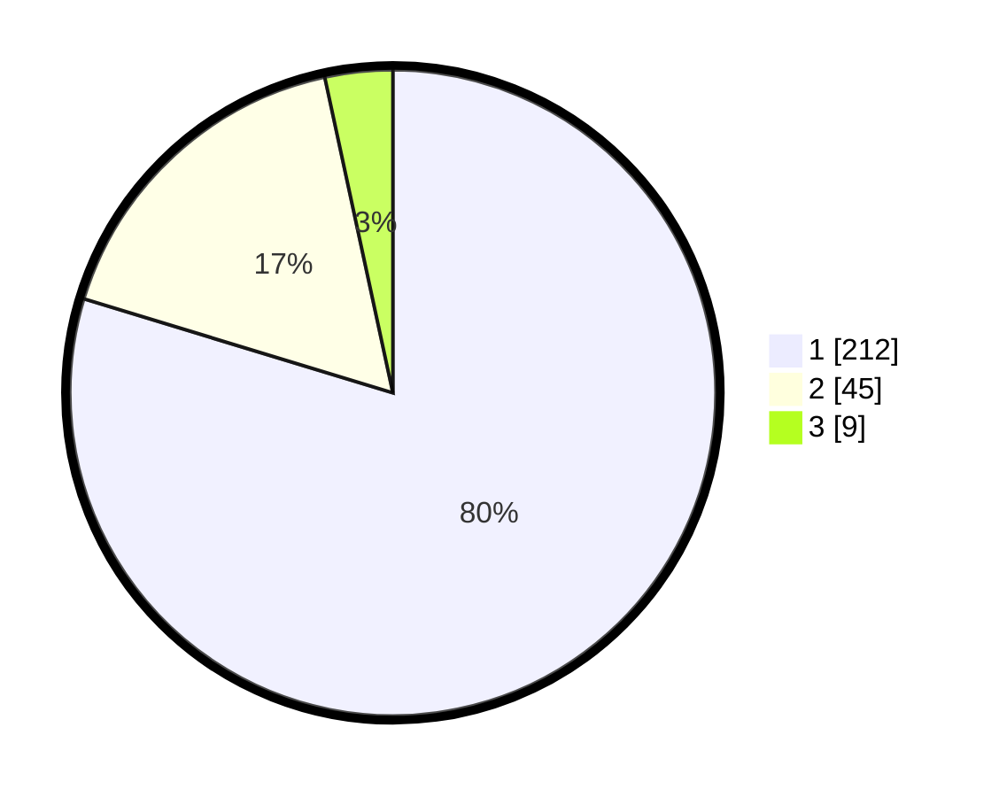

# Hasil

## Grafik

## Tabel

| No. | Nama Paslon    | Suara | Suara (raw) | Persentase |
|:--- |:-------------- | -----:| -----------:| ----------:|
| 1   | ANIES MUHAIMIN | 212   | [212][p-1]  | 79,70      |
| 2   | PRABOWO GIBRAN | 45    | [45][p-2]   | 16,92      |
| 3   | GANJAR MAHFUD  | 9     | [9][p-3]    | 3,38       |

[p-1]: https://github.com/gigit-pemilu/pemilu-2024-61-kalimantan-barat/blob/main/pilpres/hitung-suara/sub/61-kalimantan-barat/sub/12-kubu-raya/sub/03-sungai-ambawang/sub/2008-pancaroba/sub/013-tps/sub/paslon-1.txt
[p-2]: https://github.com/gigit-pemilu/pemilu-2024-61-kalimantan-barat/blob/main/pilpres/hitung-suara/sub/61-kalimantan-barat/sub/12-kubu-raya/sub/03-sungai-ambawang/sub/2008-pancaroba/sub/013-tps/sub/paslon-2.txt
[p-3]: https://github.com/gigit-pemilu/pemilu-2024-61-kalimantan-barat/blob/main/pilpres/hitung-suara/sub/61-kalimantan-barat/sub/12-kubu-raya/sub/03-sungai-ambawang/sub/2008-pancaroba/sub/013-tps/sub/paslon-3.txt

## Foto C Plano

https://sirekap-obj-formc.kpu.go.id/d8b2/pemilu/ppwp/61/12/03/20/08/6112032008013-20240215-162717--912ae29d-037d-4339-ab26-0d1362a7ab36.jpg

https://sirekap-obj-formc.kpu.go.id/d8b2/pemilu/ppwp/61/12/03/20/08/6112032008013-20240215-165445--8690cf9f-80f1-43d4-bb04-926c48bb4dc0.jpg

https://sirekap-obj-formc.kpu.go.id/d8b2/pemilu/ppwp/61/12/03/20/08/6112032008013-20240215-011805--12e44f59-7f3b-4c60-9eb2-0c53b9485d49.jpg

## Metadata

| Key        | Value               |
| ---------- | ------------------- |
| Time Stamp | 2024-02-15 23:29:50 |

