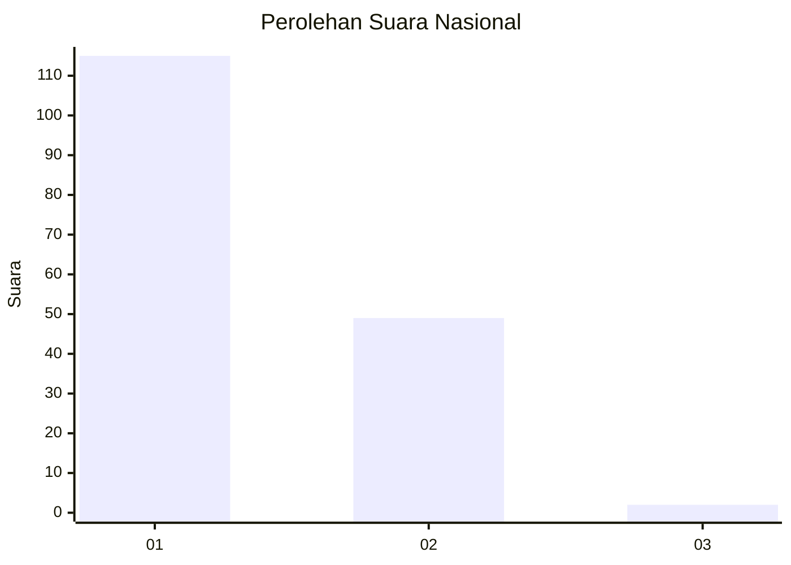
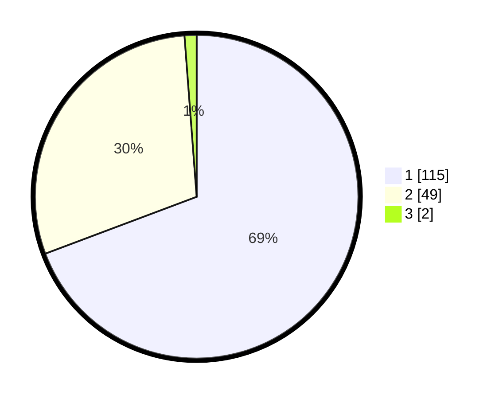

# Hasil

## Grafik

## Tabel

| No. | Nama Paslon    | Suara | Suara (raw) | Persentase |
|:--- |:-------------- | -----:| -----------:| ----------:|
| 1   | ANIES MUHAIMIN | 115   | [115][p-1]  | 69,28      |
| 2   | PRABOWO GIBRAN | 49    | [49][p-2]   | 29,52      |
| 3   | GANJAR MAHFUD  | 2     | [2][p-3]    | 1,20       |

[p-1]: https://github.com/gigit-pemilu/pemilu-2024/blob/main/pilpres/hitung-suara/sub/61-kalimantan-barat/sub/12-kubu-raya/sub/03-sungai-ambawang/sub/2009-puguk/sub/003-tps/sub/paslon-1.txt
[p-2]: https://github.com/gigit-pemilu/pemilu-2024/blob/main/pilpres/hitung-suara/sub/61-kalimantan-barat/sub/12-kubu-raya/sub/03-sungai-ambawang/sub/2009-puguk/sub/003-tps/sub/paslon-2.txt
[p-3]: https://github.com/gigit-pemilu/pemilu-2024/blob/main/pilpres/hitung-suara/sub/61-kalimantan-barat/sub/12-kubu-raya/sub/03-sungai-ambawang/sub/2009-puguk/sub/003-tps/sub/paslon-3.txt

## Foto C Plano

https://sirekap-obj-formc.kpu.go.id/fff9/pemilu/ppwp/61/12/03/20/09/6112032009003-20240215-083218--cfc4314c-0a76-4e1c-87b8-dbfb768c1b48.jpg

https://sirekap-obj-formc.kpu.go.id/fff9/pemilu/ppwp/61/12/03/20/09/6112032009003-20240215-083411--a37923ea-64f0-407d-ac2f-d1144fe77728.jpg

https://sirekap-obj-formc.kpu.go.id/fff9/pemilu/ppwp/61/12/03/20/09/6112032009003-20240215-083536--33c2e04e-156f-4982-a778-67240465e3b8.jpg

## Metadata

| Key        | Value               |
| ---------- | ------------------- |
| Time Stamp | 2024-02-19 11:00:00 |

