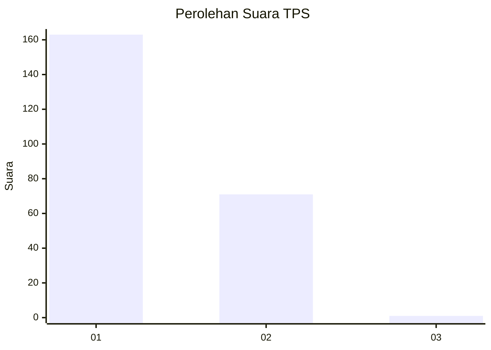
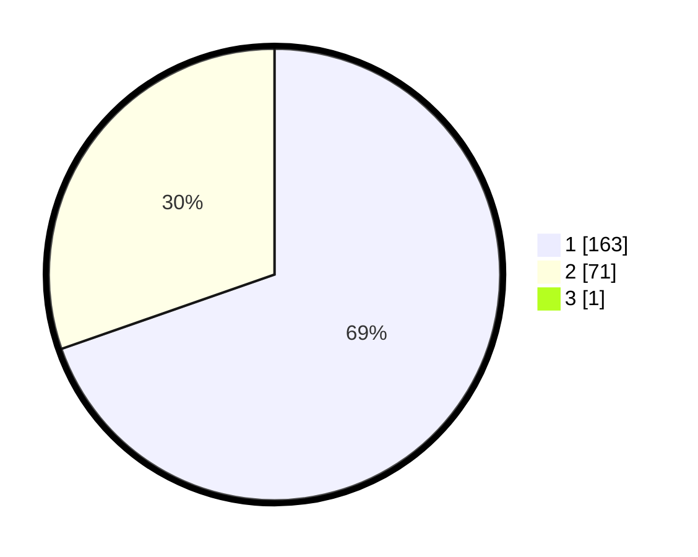

# Hasil

## Grafik

## Tabel

| No. | Nama Paslon    | Suara | Suara (raw) | Persentase |
|:--- |:-------------- | -----:| -----------:| ----------:|
| 1   | ANIES MUHAIMIN | 163   | [163][p-1]  | 69,36      |
| 2   | PRABOWO GIBRAN | 71    | [71][p-2]   | 30,21      |
| 3   | GANJAR MAHFUD  | 1     | [1][p-3]    | 0,43       |

[p-1]: https://github.com/gigit-pemilu/pemilu-2024-61-kalimantan-barat/blob/main/pilpres/hitung-suara/sub/61-kalimantan-barat/sub/12-kubu-raya/sub/03-sungai-ambawang/sub/2009-puguk/sub/009-tps/sub/paslon-1.txt
[p-2]: https://github.com/gigit-pemilu/pemilu-2024-61-kalimantan-barat/blob/main/pilpres/hitung-suara/sub/61-kalimantan-barat/sub/12-kubu-raya/sub/03-sungai-ambawang/sub/2009-puguk/sub/009-tps/sub/paslon-2.txt
[p-3]: https://github.com/gigit-pemilu/pemilu-2024-61-kalimantan-barat/blob/main/pilpres/hitung-suara/sub/61-kalimantan-barat/sub/12-kubu-raya/sub/03-sungai-ambawang/sub/2009-puguk/sub/009-tps/sub/paslon-3.txt

## Foto C Plano

https://sirekap-obj-formc.kpu.go.id/64c1/pemilu/ppwp/61/12/03/20/09/6112032009009-20240214-233729--5436703e-b69c-4f5a-a363-43a3ffc2216e.jpg

https://sirekap-obj-formc.kpu.go.id/64c1/pemilu/ppwp/61/12/03/20/09/6112032009009-20240215-065113--ade3fecf-e7e6-4940-bf80-feab3881f9cc.jpg

https://sirekap-obj-formc.kpu.go.id/64c1/pemilu/ppwp/61/12/03/20/09/6112032009009-20240215-065447--23b639bd-c014-4784-82ef-26f13f93bc25.jpg

## Metadata

| Key        | Value               |
| ---------- | ------------------- |
| Time Stamp | 2024-02-15 22:40:13 |

