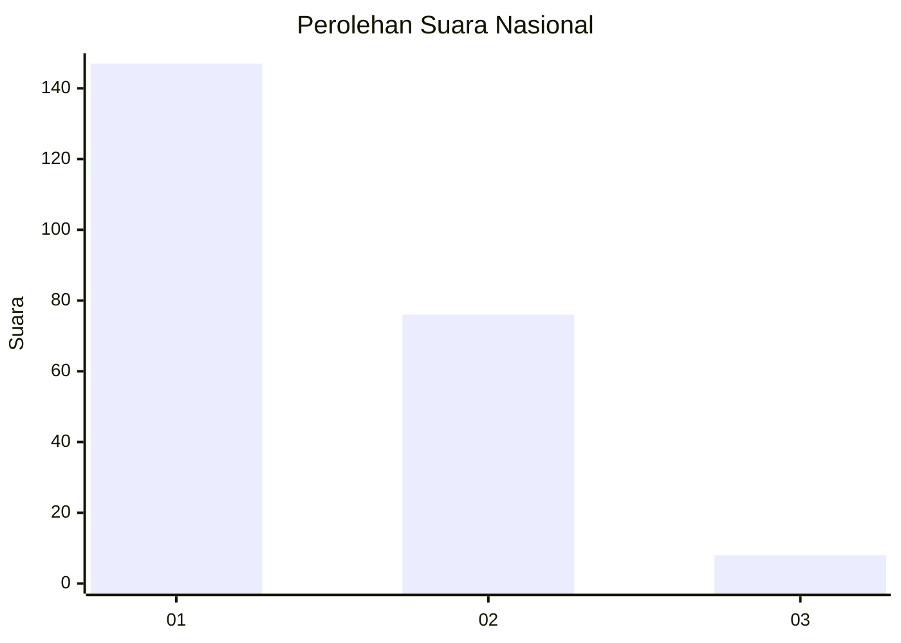
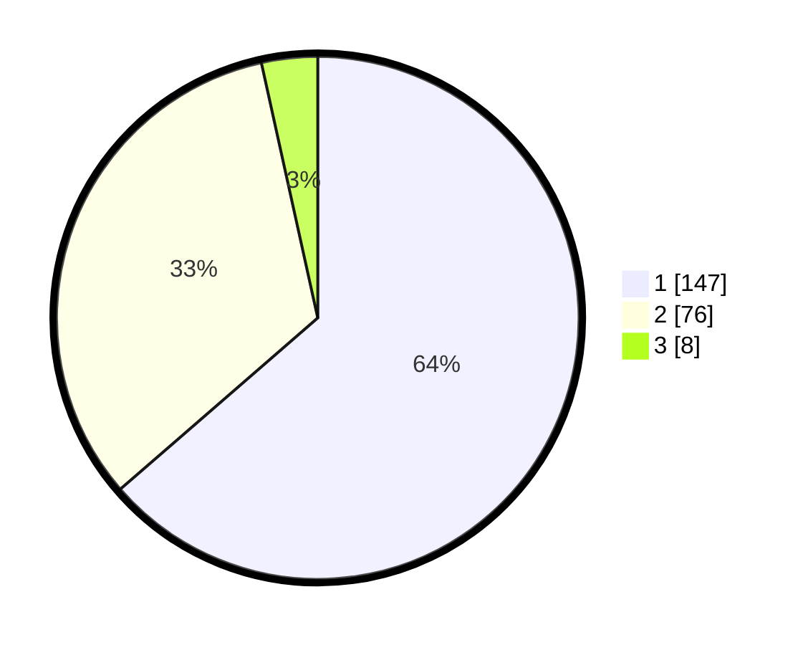

# Hasil

## Grafik

## Tabel

| No. | Nama Paslon    | Suara | Suara (raw) | Persentase |
|:--- |:-------------- | -----:| -----------:| ----------:|
| 1   | ANIES MUHAIMIN | 147   | [147][p-1]  | 63,64      |
| 2   | PRABOWO GIBRAN | 76    | [76][p-2]   | 32,90      |
| 3   | GANJAR MAHFUD  | 8     | [8][p-3]    | 3,46       |

[p-1]: https://github.com/gigit-pemilu/pemilu-2024/blob/main/pilpres/hitung-suara/sub/61-kalimantan-barat/sub/12-kubu-raya/sub/03-sungai-ambawang/sub/2009-puguk/sub/012-tps/sub/paslon-1.txt
[p-2]: https://github.com/gigit-pemilu/pemilu-2024/blob/main/pilpres/hitung-suara/sub/61-kalimantan-barat/sub/12-kubu-raya/sub/03-sungai-ambawang/sub/2009-puguk/sub/012-tps/sub/paslon-2.txt
[p-3]: https://github.com/gigit-pemilu/pemilu-2024/blob/main/pilpres/hitung-suara/sub/61-kalimantan-barat/sub/12-kubu-raya/sub/03-sungai-ambawang/sub/2009-puguk/sub/012-tps/sub/paslon-3.txt

## Foto C Plano

https://sirekap-obj-formc.kpu.go.id/23a9/pemilu/ppwp/61/12/03/20/09/6112032009012-20240215-051546--a0642d42-9f3b-4a1e-a308-7b076fae5925.jpg

https://sirekap-obj-formc.kpu.go.id/23a9/pemilu/ppwp/61/12/03/20/09/6112032009012-20240215-051553--85ba89e4-e071-499a-a2e7-8d0643a59fbb.jpg

https://sirekap-obj-formc.kpu.go.id/23a9/pemilu/ppwp/61/12/03/20/09/6112032009012-20240215-051538--049e6369-9d69-4f6e-b188-e0754d070569.jpg

## Metadata

| Key        | Value               |
| ---------- | ------------------- |
| Time Stamp | 2024-02-15 17:00:25 |

