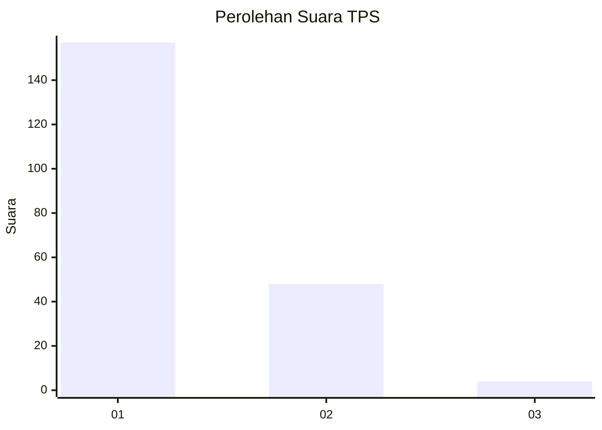
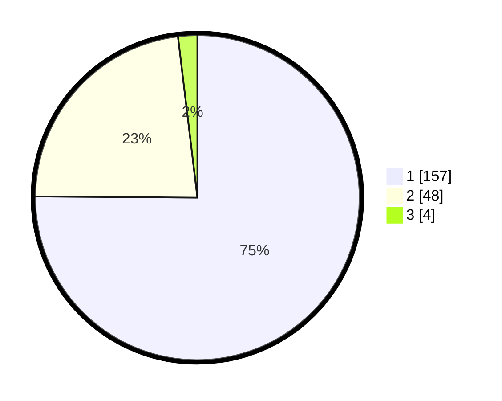

# Hasil

## Grafik

## Tabel

| No. | Nama Paslon    | Suara | Suara (raw) | Persentase |
|:--- |:-------------- | -----:| -----------:| ----------:|
| 1   | ANIES MUHAIMIN | 157   | [157][p-1]  | 75,12      |
| 2   | PRABOWO GIBRAN | 48    | [48][p-2]   | 22,97      |
| 3   | GANJAR MAHFUD  | 4     | [4][p-3]    | 1,91       |

[p-1]: https://github.com/gigit-pemilu/pemilu-2024-61-kalimantan-barat/blob/main/pilpres/hitung-suara/sub/61-kalimantan-barat/sub/12-kubu-raya/sub/03-sungai-ambawang/sub/2011-pasak/sub/002-tps/sub/paslon-1.txt
[p-2]: https://github.com/gigit-pemilu/pemilu-2024-61-kalimantan-barat/blob/main/pilpres/hitung-suara/sub/61-kalimantan-barat/sub/12-kubu-raya/sub/03-sungai-ambawang/sub/2011-pasak/sub/002-tps/sub/paslon-2.txt
[p-3]: https://github.com/gigit-pemilu/pemilu-2024-61-kalimantan-barat/blob/main/pilpres/hitung-suara/sub/61-kalimantan-barat/sub/12-kubu-raya/sub/03-sungai-ambawang/sub/2011-pasak/sub/002-tps/sub/paslon-3.txt

## Foto C Plano

https://sirekap-obj-formc.kpu.go.id/77bd/pemilu/ppwp/61/12/03/20/11/6112032011002-20240215-012715--224329ae-c4e5-4cb8-bbcc-ea5b4658a00c.jpg

https://sirekap-obj-formc.kpu.go.id/77bd/pemilu/ppwp/61/12/03/20/11/6112032011002-20240215-012822--7d2ac94b-abc7-472c-80af-52a622ea3938.jpg

https://sirekap-obj-formc.kpu.go.id/77bd/pemilu/ppwp/61/12/03/20/11/6112032011002-20240215-012909--d67aab50-0113-493a-a7f8-4b86f91fb851.jpg

## Metadata

| Key        | Value               |
| ---------- | ------------------- |
| Time Stamp | 2024-02-15 23:29:50 |

