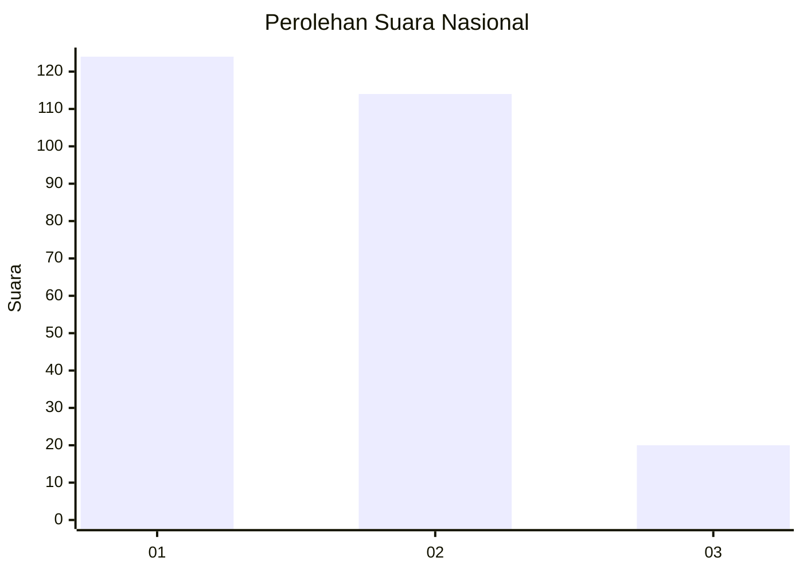
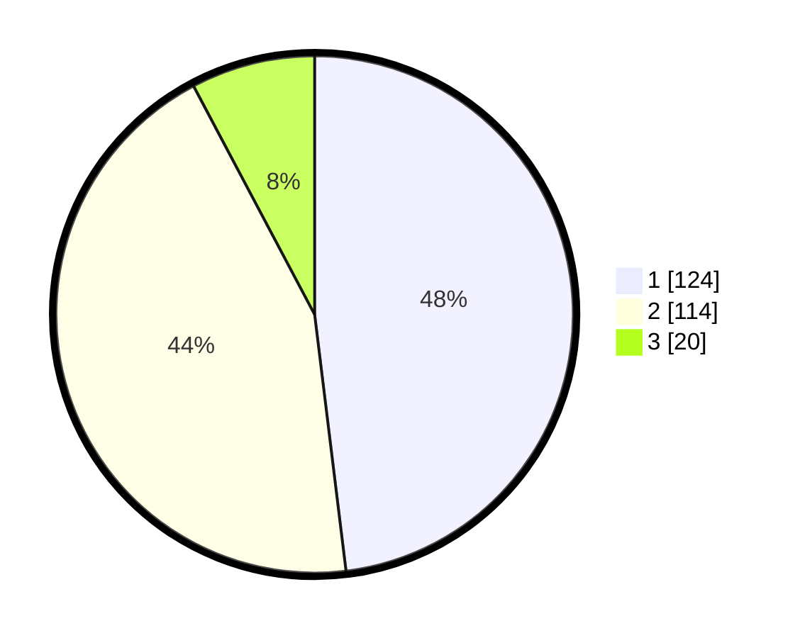

# Hasil

## Grafik

## Tabel

| No. | Nama Paslon    | Suara | Suara (raw) | Persentase |
|:--- |:-------------- | -----:| -----------:| ----------:|
| 1   | ANIES MUHAIMIN | 124   | [124][p-1]  | 48,06      |
| 2   | PRABOWO GIBRAN | 114   | [114][p-2]  | 44,19      |
| 3   | GANJAR MAHFUD  | 20    | [20][p-3]   | 7,75       |

[p-1]: https://github.com/gigit-pemilu/pemilu-2024/blob/main/pilpres/hitung-suara/sub/61-kalimantan-barat/sub/12-kubu-raya/sub/03-sungai-ambawang/sub/2011-pasak/sub/004-tps/sub/paslon-1.txt
[p-2]: https://github.com/gigit-pemilu/pemilu-2024/blob/main/pilpres/hitung-suara/sub/61-kalimantan-barat/sub/12-kubu-raya/sub/03-sungai-ambawang/sub/2011-pasak/sub/004-tps/sub/paslon-2.txt
[p-3]: https://github.com/gigit-pemilu/pemilu-2024/blob/main/pilpres/hitung-suara/sub/61-kalimantan-barat/sub/12-kubu-raya/sub/03-sungai-ambawang/sub/2011-pasak/sub/004-tps/sub/paslon-3.txt

## Foto C Plano

https://sirekap-obj-formc.kpu.go.id/b0f0/pemilu/ppwp/61/12/03/20/11/6112032011004-20240215-091222--9b786fc7-4e68-4a02-bd21-5c6d0dbd9f6a.jpg

https://sirekap-obj-formc.kpu.go.id/b0f0/pemilu/ppwp/61/12/03/20/11/6112032011004-20240215-091312--b176f11a-ac97-42b0-a225-2ec7bb759928.jpg

https://sirekap-obj-formc.kpu.go.id/b0f0/pemilu/ppwp/61/12/03/20/11/6112032011004-20240215-090542--098291e2-3755-4222-a54e-87b6d4ef2dcc.jpg

## Metadata

| Key        | Value               |
| ---------- | ------------------- |
| Time Stamp | 2024-02-15 17:30:25 |

