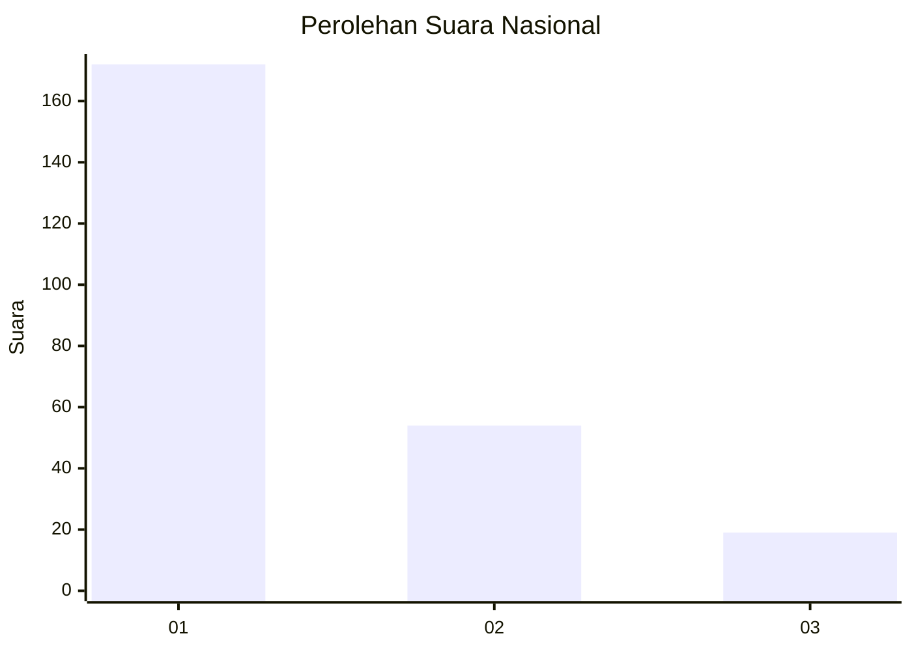
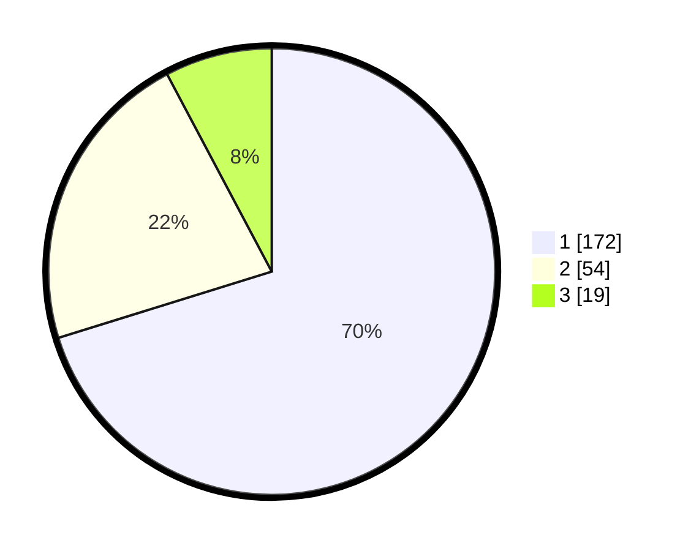

# Hasil

## Grafik

## Tabel

| No. | Nama Paslon    | Suara | Suara (raw) | Persentase |
|:--- |:-------------- | -----:| -----------:| ----------:|
| 1   | ANIES MUHAIMIN | 172   | [172][p-1]  | 70,20      |
| 2   | PRABOWO GIBRAN | 54    | [54][p-2]   | 22,04      |
| 3   | GANJAR MAHFUD  | 19    | [19][p-3]   | 7,76       |

[p-1]: https://github.com/gigit-pemilu/pemilu-2024/blob/main/pilpres/hitung-suara/sub/61-kalimantan-barat/sub/12-kubu-raya/sub/03-sungai-ambawang/sub/2011-pasak/sub/006-tps/sub/paslon-1.txt
[p-2]: https://github.com/gigit-pemilu/pemilu-2024/blob/main/pilpres/hitung-suara/sub/61-kalimantan-barat/sub/12-kubu-raya/sub/03-sungai-ambawang/sub/2011-pasak/sub/006-tps/sub/paslon-2.txt
[p-3]: https://github.com/gigit-pemilu/pemilu-2024/blob/main/pilpres/hitung-suara/sub/61-kalimantan-barat/sub/12-kubu-raya/sub/03-sungai-ambawang/sub/2011-pasak/sub/006-tps/sub/paslon-3.txt

## Foto C Plano

https://sirekap-obj-formc.kpu.go.id/6b48/pemilu/ppwp/61/12/03/20/11/6112032011006-20240215-030307--78a50b1c-b98f-4b59-aaee-168b76502504.jpg

https://sirekap-obj-formc.kpu.go.id/6b48/pemilu/ppwp/61/12/03/20/11/6112032011006-20240215-085715--3f843cf5-14eb-4f94-a584-649fc5830ec6.jpg

https://sirekap-obj-formc.kpu.go.id/6b48/pemilu/ppwp/61/12/03/20/11/6112032011006-20240215-085627--b1663061-a8a9-4697-8937-ff2ca1a3ecfe.jpg

## Metadata

| Key        | Value               |
| ---------- | ------------------- |
| Time Stamp | 2024-02-15 18:30:25 |

