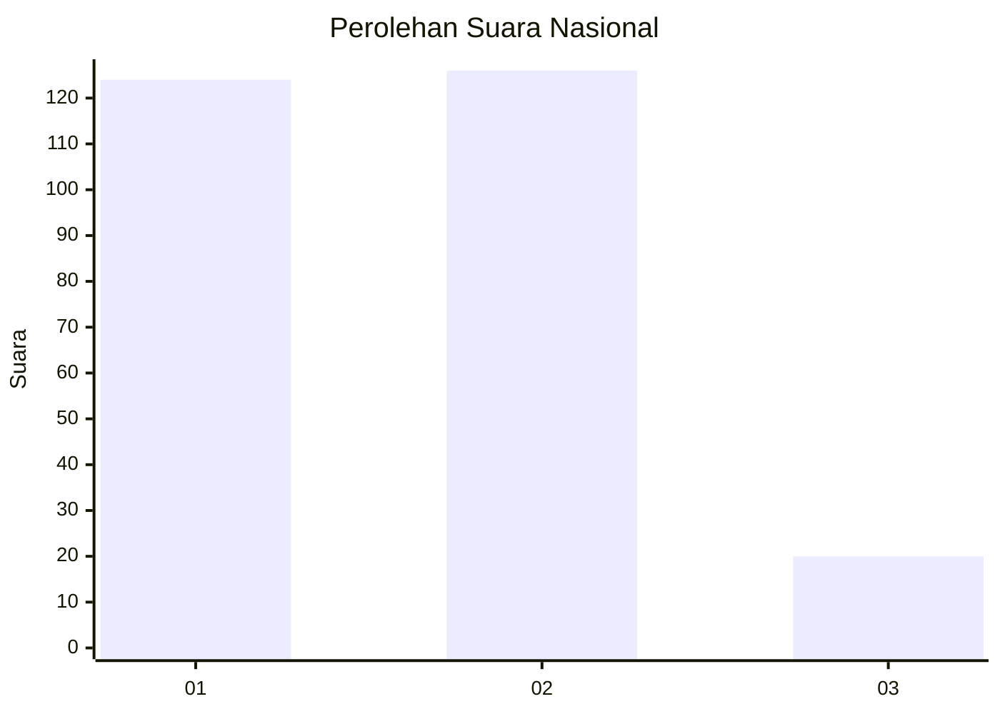
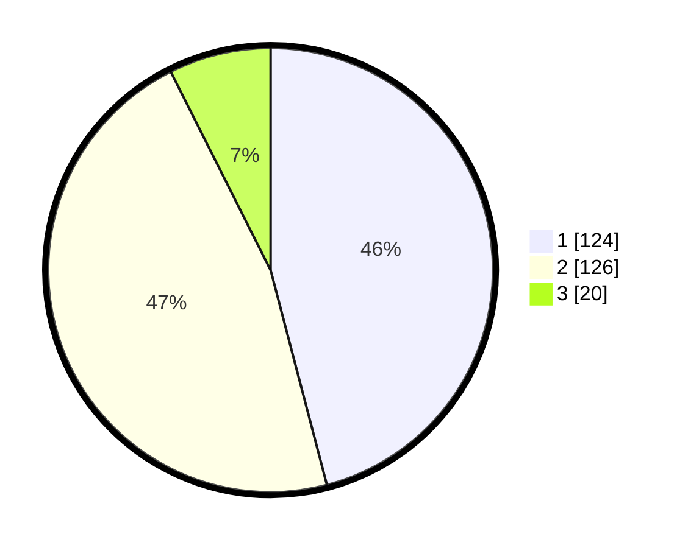

# Hasil

## Grafik

## Tabel

| No. | Nama Paslon    | Suara | Suara (raw) | Persentase |
|:--- |:-------------- | -----:| -----------:| ----------:|
| 1   | ANIES MUHAIMIN | 124   | [124][p-1]  | 45,93      |
| 2   | PRABOWO GIBRAN | 126   | [126][p-2]  | 46,67      |
| 3   | GANJAR MAHFUD  | 20    | [20][p-3]   | 7,41       |

[p-1]: https://github.com/gigit-pemilu/pemilu-2024/blob/main/pilpres/hitung-suara/sub/61-kalimantan-barat/sub/12-kubu-raya/sub/03-sungai-ambawang/sub/2012-pasak-piang/sub/002-tps/sub/paslon-1.txt
[p-2]: https://github.com/gigit-pemilu/pemilu-2024/blob/main/pilpres/hitung-suara/sub/61-kalimantan-barat/sub/12-kubu-raya/sub/03-sungai-ambawang/sub/2012-pasak-piang/sub/002-tps/sub/paslon-2.txt
[p-3]: https://github.com/gigit-pemilu/pemilu-2024/blob/main/pilpres/hitung-suara/sub/61-kalimantan-barat/sub/12-kubu-raya/sub/03-sungai-ambawang/sub/2012-pasak-piang/sub/002-tps/sub/paslon-3.txt

## Foto C Plano

https://sirekap-obj-formc.kpu.go.id/dea1/pemilu/ppwp/61/12/03/20/12/6112032012002-20240214-214047--b8fda6d6-f43b-405f-b889-8c416d70bd26.jpg

https://sirekap-obj-formc.kpu.go.id/dea1/pemilu/ppwp/61/12/03/20/12/6112032012002-20240214-214152--ee6a6ed5-b00d-4633-8255-71fea02160a6.jpg

https://sirekap-obj-formc.kpu.go.id/dea1/pemilu/ppwp/61/12/03/20/12/6112032012002-20240214-214321--86d48875-0d59-43ef-9c16-62c3fdf54175.jpg

## Metadata

| Key        | Value               |
| ---------- | ------------------- |
| Time Stamp | 2024-02-15 17:00:25 |

