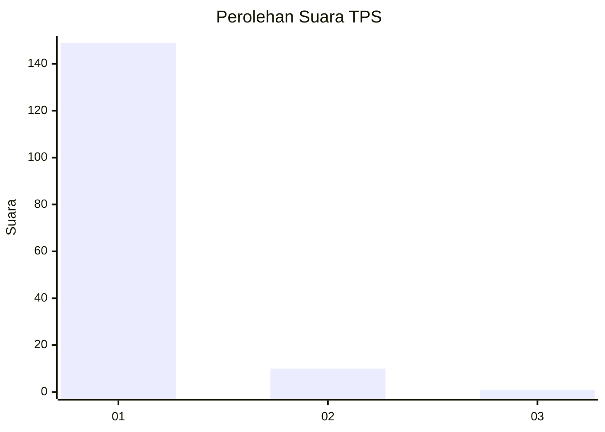
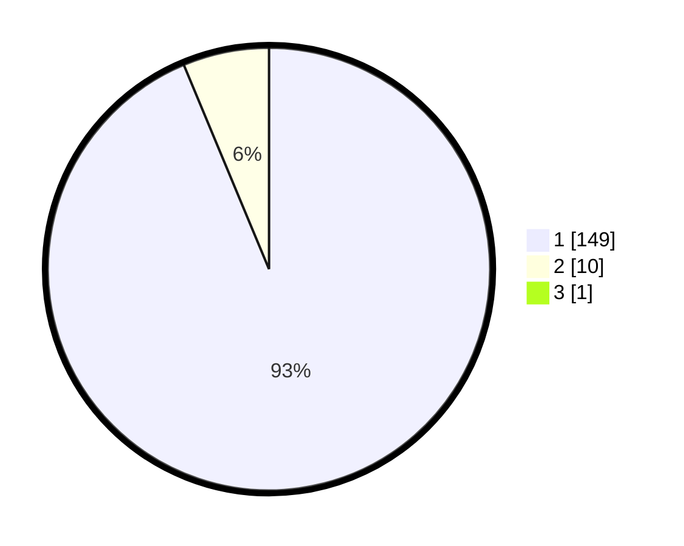

# Hasil

## Grafik

## Tabel

| No. | Nama Paslon    | Suara | Suara (raw) | Persentase |
|:--- |:-------------- | -----:| -----------:| ----------:|
| 1   | ANIES MUHAIMIN | 149   | [149][p-1]  | 93,13      |
| 2   | PRABOWO GIBRAN | 10    | [10][p-2]   | 6,25       |
| 3   | GANJAR MAHFUD  | 1     | [1][p-3]    | 0,63       |

[p-1]: https://github.com/gigit-pemilu/pemilu-2024-61-kalimantan-barat/blob/main/pilpres/hitung-suara/sub/61-kalimantan-barat/sub/12-kubu-raya/sub/03-sungai-ambawang/sub/2012-pasak-piang/sub/004-tps/sub/paslon-1.txt
[p-2]: https://github.com/gigit-pemilu/pemilu-2024-61-kalimantan-barat/blob/main/pilpres/hitung-suara/sub/61-kalimantan-barat/sub/12-kubu-raya/sub/03-sungai-ambawang/sub/2012-pasak-piang/sub/004-tps/sub/paslon-2.txt
[p-3]: https://github.com/gigit-pemilu/pemilu-2024-61-kalimantan-barat/blob/main/pilpres/hitung-suara/sub/61-kalimantan-barat/sub/12-kubu-raya/sub/03-sungai-ambawang/sub/2012-pasak-piang/sub/004-tps/sub/paslon-3.txt

## Foto C Plano

https://sirekap-obj-formc.kpu.go.id/84e7/pemilu/ppwp/61/12/03/20/12/6112032012004-20240214-234713--c2e463f0-eea9-4256-b586-e661ee9a251d.jpg

https://sirekap-obj-formc.kpu.go.id/84e7/pemilu/ppwp/61/12/03/20/12/6112032012004-20240215-034848--4a90c6ca-21ac-409e-bada-063fccfa98fc.jpg

https://sirekap-obj-formc.kpu.go.id/84e7/pemilu/ppwp/61/12/03/20/12/6112032012004-20240215-061640--4af461ad-2ce0-4669-9d07-dcfb305da32f.jpg

## Metadata

| Key        | Value               |
| ---------- | ------------------- |
| Time Stamp | 2024-02-15 23:29:50 |

