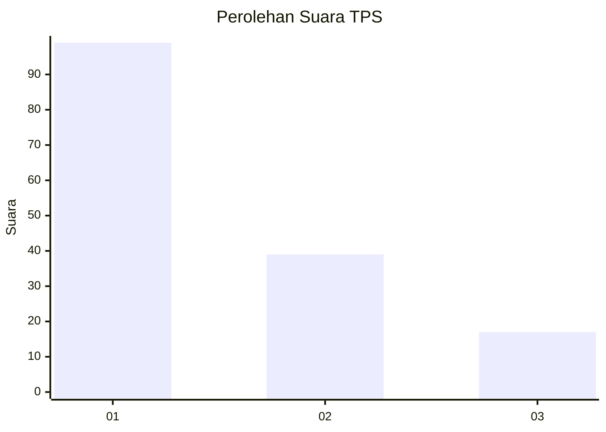
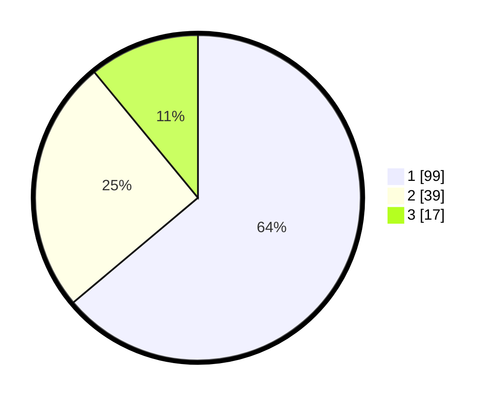

# Hasil

## Grafik

## Tabel

| No. | Nama Paslon    | Suara | Suara (raw) | Persentase |
|:--- |:-------------- | -----:| -----------:| ----------:|
| 1   | ANIES MUHAIMIN | 99    | [99][p-1]   | 63,87      |
| 2   | PRABOWO GIBRAN | 39    | [39][p-2]   | 25,16      |
| 3   | GANJAR MAHFUD  | 17    | [17][p-3]   | 10,97      |

[p-1]: https://github.com/gigit-pemilu/pemilu-2024-61-kalimantan-barat/blob/main/pilpres/hitung-suara/sub/61-kalimantan-barat/sub/12-kubu-raya/sub/03-sungai-ambawang/sub/2012-pasak-piang/sub/005-tps/sub/paslon-1.txt
[p-2]: https://github.com/gigit-pemilu/pemilu-2024-61-kalimantan-barat/blob/main/pilpres/hitung-suara/sub/61-kalimantan-barat/sub/12-kubu-raya/sub/03-sungai-ambawang/sub/2012-pasak-piang/sub/005-tps/sub/paslon-2.txt
[p-3]: https://github.com/gigit-pemilu/pemilu-2024-61-kalimantan-barat/blob/main/pilpres/hitung-suara/sub/61-kalimantan-barat/sub/12-kubu-raya/sub/03-sungai-ambawang/sub/2012-pasak-piang/sub/005-tps/sub/paslon-3.txt

## Foto C Plano

https://sirekap-obj-formc.kpu.go.id/7368/pemilu/ppwp/61/12/03/20/12/6112032012005-20240214-220643--765fc153-25ae-4fa1-b31d-d7bdbd068c7c.jpg

https://sirekap-obj-formc.kpu.go.id/7368/pemilu/ppwp/61/12/03/20/12/6112032012005-20240214-223451--c0ff99ab-a72a-4285-97c7-812449b2e170.jpg

https://sirekap-obj-formc.kpu.go.id/7368/pemilu/ppwp/61/12/03/20/12/6112032012005-20240214-211152--32f334b7-dfe3-45d8-8fd1-ab4332d21da5.jpg

## Metadata

| Key        | Value               |
| ---------- | ------------------- |
| Time Stamp | 2024-02-15 09:00:24 |

