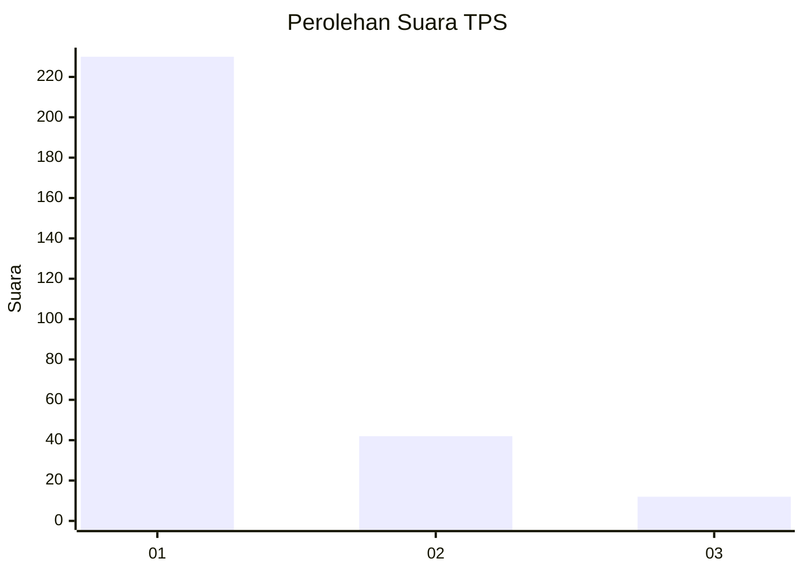
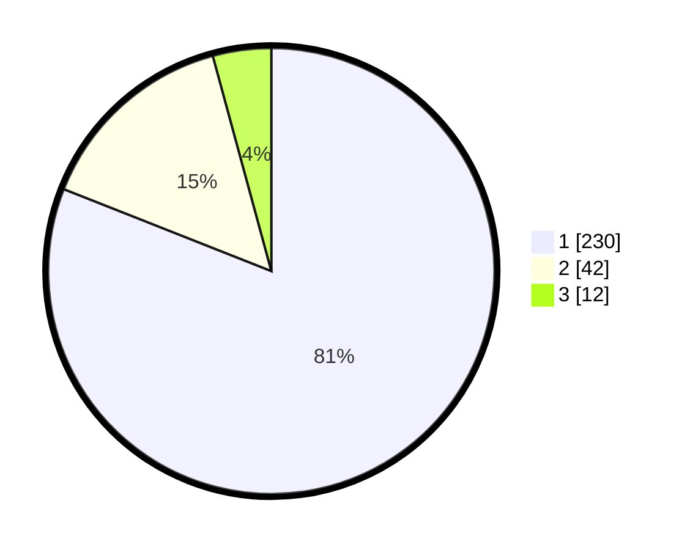

# Hasil

## Grafik

## Tabel

| No. | Nama Paslon    | Suara | Suara (raw) | Persentase |
|:--- |:-------------- | -----:| -----------:| ----------:|
| 1   | ANIES MUHAIMIN | 230   | [230][p-1]  | 80,99      |
| 2   | PRABOWO GIBRAN | 42    | [42][p-2]   | 14,79      |
| 3   | GANJAR MAHFUD  | 12    | [12][p-3]   | 4,23       |

[p-1]: https://github.com/gigit-pemilu/pemilu-2024-61-kalimantan-barat/blob/main/pilpres/hitung-suara/sub/61-kalimantan-barat/sub/12-kubu-raya/sub/03-sungai-ambawang/sub/2012-pasak-piang/sub/006-tps/sub/paslon-1.txt
[p-2]: https://github.com/gigit-pemilu/pemilu-2024-61-kalimantan-barat/blob/main/pilpres/hitung-suara/sub/61-kalimantan-barat/sub/12-kubu-raya/sub/03-sungai-ambawang/sub/2012-pasak-piang/sub/006-tps/sub/paslon-2.txt
[p-3]: https://github.com/gigit-pemilu/pemilu-2024-61-kalimantan-barat/blob/main/pilpres/hitung-suara/sub/61-kalimantan-barat/sub/12-kubu-raya/sub/03-sungai-ambawang/sub/2012-pasak-piang/sub/006-tps/sub/paslon-3.txt

## Foto C Plano

https://sirekap-obj-formc.kpu.go.id/4a38/pemilu/ppwp/61/12/03/20/12/6112032012006-20240215-004726--7a67a137-be6e-41fd-8fec-a2b2e0ec70f9.jpg

https://sirekap-obj-formc.kpu.go.id/4a38/pemilu/ppwp/61/12/03/20/12/6112032012006-20240215-003954--98d1143c-f686-4d21-812f-2effcc2b6bfe.jpg

https://sirekap-obj-formc.kpu.go.id/4a38/pemilu/ppwp/61/12/03/20/12/6112032012006-20240215-004219--26b62214-2fc5-4546-b507-ded9cebadcfd.jpg

## Metadata

| Key        | Value               |
| ---------- | ------------------- |
| Time Stamp | 2024-02-15 15:00:29 |

