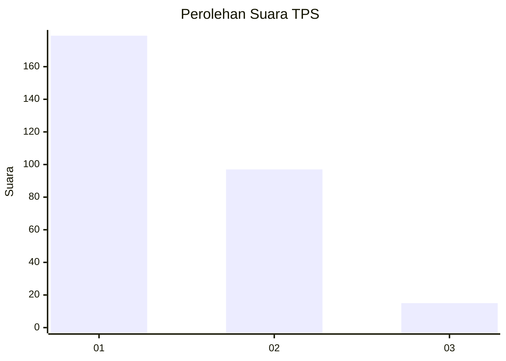
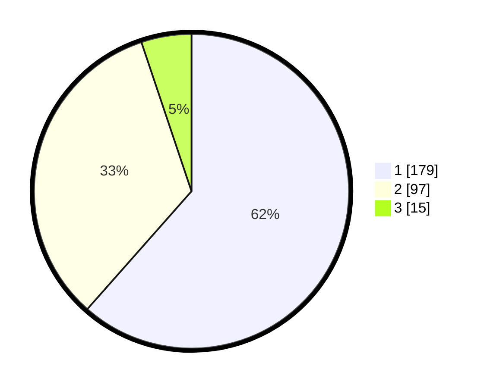

# Hasil

## Grafik

## Tabel

| No. | Nama Paslon    | Suara | Suara (raw) | Persentase |
|:--- |:-------------- | -----:| -----------:| ----------:|
| 1   | ANIES MUHAIMIN | 179   | [179][p-1]  | 61,51      |
| 2   | PRABOWO GIBRAN | 97    | [97][p-2]   | 33,33      |
| 3   | GANJAR MAHFUD  | 15    | [15][p-3]   | 5,15       |

[p-1]: https://github.com/gigit-pemilu/pemilu-2024-61-kalimantan-barat/blob/main/pilpres/hitung-suara/sub/61-kalimantan-barat/sub/12-kubu-raya/sub/03-sungai-ambawang/sub/2012-pasak-piang/sub/007-tps/sub/paslon-1.txt
[p-2]: https://github.com/gigit-pemilu/pemilu-2024-61-kalimantan-barat/blob/main/pilpres/hitung-suara/sub/61-kalimantan-barat/sub/12-kubu-raya/sub/03-sungai-ambawang/sub/2012-pasak-piang/sub/007-tps/sub/paslon-2.txt
[p-3]: https://github.com/gigit-pemilu/pemilu-2024-61-kalimantan-barat/blob/main/pilpres/hitung-suara/sub/61-kalimantan-barat/sub/12-kubu-raya/sub/03-sungai-ambawang/sub/2012-pasak-piang/sub/007-tps/sub/paslon-3.txt

## Foto C Plano

https://sirekap-obj-formc.kpu.go.id/1c20/pemilu/ppwp/61/12/03/20/12/6112032012007-20240215-021825--7656b4b0-8f14-494d-91c6-7f3fb7f5cfb6.jpg

https://sirekap-obj-formc.kpu.go.id/1c20/pemilu/ppwp/61/12/03/20/12/6112032012007-20240215-022045--559150c1-cc28-49b4-9264-ded30920729c.jpg

https://sirekap-obj-formc.kpu.go.id/1c20/pemilu/ppwp/61/12/03/20/12/6112032012007-20240215-022229--a6727b9f-9098-4634-97e2-83b2d93d41d5.jpg

## Metadata

| Key        | Value               |
| ---------- | ------------------- |
| Time Stamp | 2024-02-15 15:00:29 |

