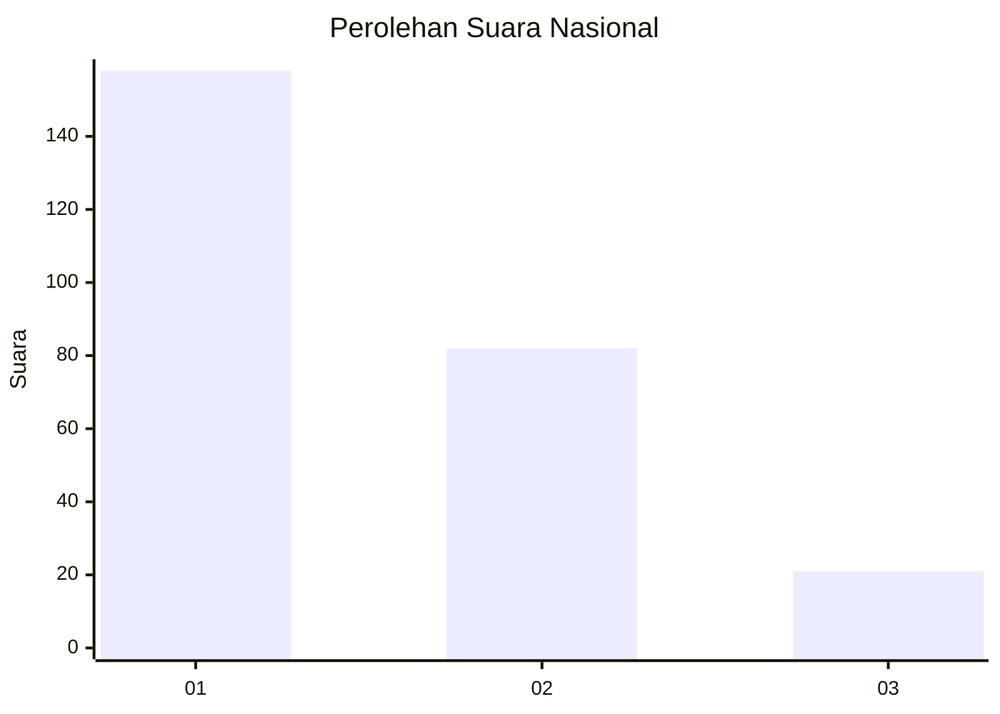
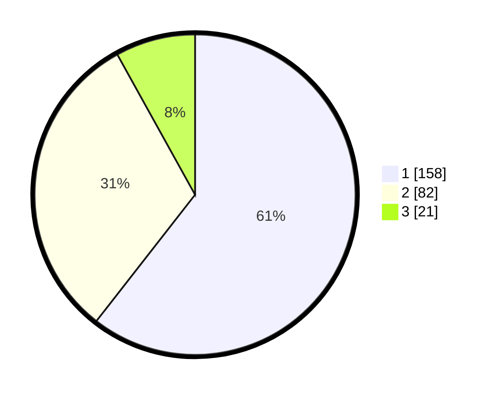

# Hasil

## Grafik

## Tabel

| No. | Nama Paslon    | Suara | Suara (raw) | Persentase |
|:--- |:-------------- | -----:| -----------:| ----------:|
| 1   | ANIES MUHAIMIN | 158   | [158][p-1]  | 60,54      |
| 2   | PRABOWO GIBRAN | 82    | [82][p-2]   | 31,42      |
| 3   | GANJAR MAHFUD  | 21    | [21][p-3]   | 8,05       |

[p-1]: https://github.com/gigit-pemilu/pemilu-2024/blob/main/pilpres/hitung-suara/sub/61-kalimantan-barat/sub/12-kubu-raya/sub/03-sungai-ambawang/sub/2015-sungai-malaya/sub/005-tps/sub/paslon-1.txt
[p-2]: https://github.com/gigit-pemilu/pemilu-2024/blob/main/pilpres/hitung-suara/sub/61-kalimantan-barat/sub/12-kubu-raya/sub/03-sungai-ambawang/sub/2015-sungai-malaya/sub/005-tps/sub/paslon-2.txt
[p-3]: https://github.com/gigit-pemilu/pemilu-2024/blob/main/pilpres/hitung-suara/sub/61-kalimantan-barat/sub/12-kubu-raya/sub/03-sungai-ambawang/sub/2015-sungai-malaya/sub/005-tps/sub/paslon-3.txt

## Foto C Plano

https://sirekap-obj-formc.kpu.go.id/6ecc/pemilu/ppwp/61/12/03/20/15/6112032015005-20240215-090108--7082ae6d-6671-411a-9ee5-2b0af0dada51.jpg

https://sirekap-obj-formc.kpu.go.id/6ecc/pemilu/ppwp/61/12/03/20/15/6112032015005-20240215-090236--325962a2-1ca6-4488-9bf1-2d9697c62eba.jpg

https://sirekap-obj-formc.kpu.go.id/6ecc/pemilu/ppwp/61/12/03/20/15/6112032015005-20240215-090354--ad024e1e-6cf8-4c8a-a15e-2c1439d865fc.jpg

## Metadata

| Key        | Value               |
| ---------- | ------------------- |
| Time Stamp | 2024-02-15 15:00:29 |

