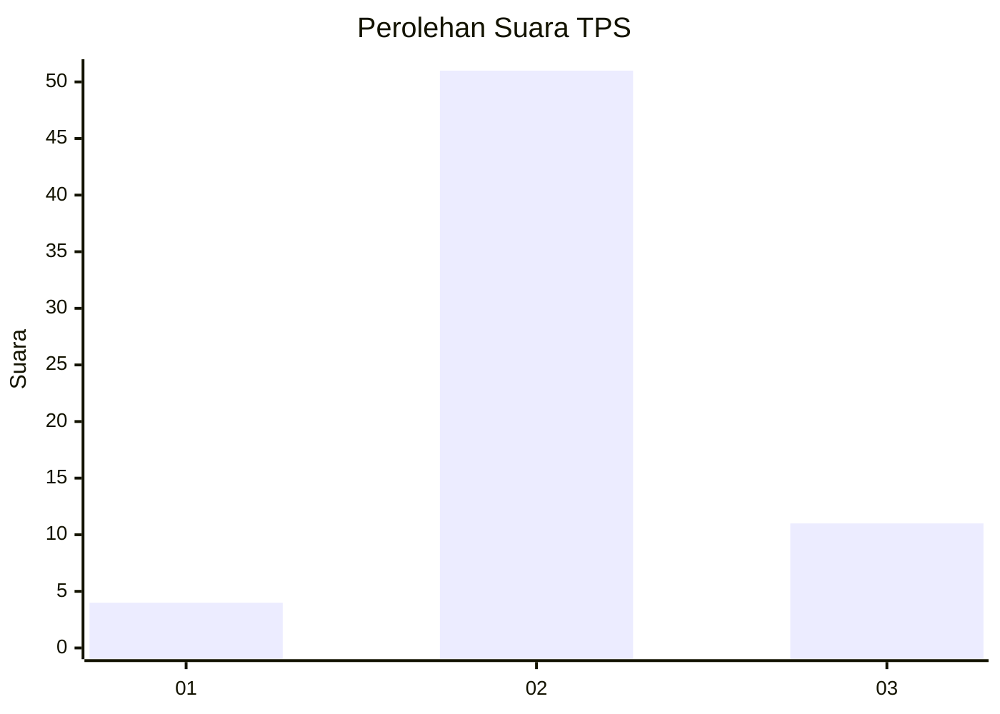
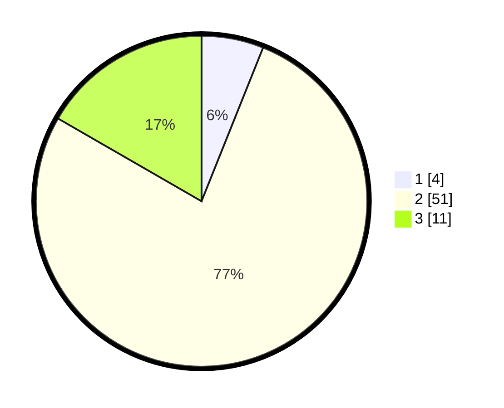

# Hasil

## Grafik

## Tabel

| No. | Nama Paslon    | Suara | Suara (raw) | Persentase |
|:--- |:-------------- | -----:| -----------:| ----------:|
| 1   | ANIES MUHAIMIN | 4     | [4][p-1]    | 6,06       |
| 2   | PRABOWO GIBRAN | 51    | [51][p-2]   | 77,27      |
| 3   | GANJAR MAHFUD  | 11    | [11][p-3]   | 16,67      |

[p-1]: https://github.com/gigit-pemilu/pemilu-2024-61-kalimantan-barat/blob/main/pilpres/hitung-suara/sub/61-kalimantan-barat/sub/12-kubu-raya/sub/05-batu-ampar/sub/2001-tanjung-beringin/sub/003-tps/sub/paslon-1.txt
[p-2]: https://github.com/gigit-pemilu/pemilu-2024-61-kalimantan-barat/blob/main/pilpres/hitung-suara/sub/61-kalimantan-barat/sub/12-kubu-raya/sub/05-batu-ampar/sub/2001-tanjung-beringin/sub/003-tps/sub/paslon-2.txt
[p-3]: https://github.com/gigit-pemilu/pemilu-2024-61-kalimantan-barat/blob/main/pilpres/hitung-suara/sub/61-kalimantan-barat/sub/12-kubu-raya/sub/05-batu-ampar/sub/2001-tanjung-beringin/sub/003-tps/sub/paslon-3.txt

## Foto C Plano

https://sirekap-obj-formc.kpu.go.id/939a/pemilu/ppwp/61/12/05/20/01/6112052001003-20240226-212200--2cb9fed8-b109-44f0-8cec-9aba2c17d8ed.jpg

https://sirekap-obj-formc.kpu.go.id/939a/pemilu/ppwp/61/12/05/20/01/6112052001003-20240226-212551--6a1b3b14-82b6-4558-8978-1a7e9ac8670b.jpg

https://sirekap-obj-formc.kpu.go.id/939a/pemilu/ppwp/61/12/05/20/01/6112052001003-20240226-212550--84eb0d11-243c-4664-9855-e4f9e61ca2a7.jpg

## Metadata

| Key        | Value               |
| ---------- | ------------------- |
| Time Stamp | 2024-02-27 23:00:00 |

## DATA PEMILIH TETAP

Jumlah pemilih dalam DPT: **77**.
 * L: **44**.
 * P: **33**.

## DATA PENGGUNA HAK PILIH

Jumlah pengguna hak pilih dalam DPT: **67**.
 * L: **35**.
 * P: **22**.

Jumlah pengguna hak pilih dalam DPTb: **505**.
 * L: **0**.
 * P: **5**.

Jumlah pengguna hak pilih dalam DPK: **1**.
 * L: **1**.
 * P: **0**.

Jumlah pengguna hak pilih: **68**.
 * L: **36**.
 * P: **32**.

## JUMLAH SUARA SAH DAN TIDAK SAH

JUMLAH SELURUH SUARA SAH: **66**.

JUMLAH SUARA TIDAK SAH: **2**.

JUMLAH SELURUH SUARA SAH DAN SUARA TIDAK SAH: **68**.

