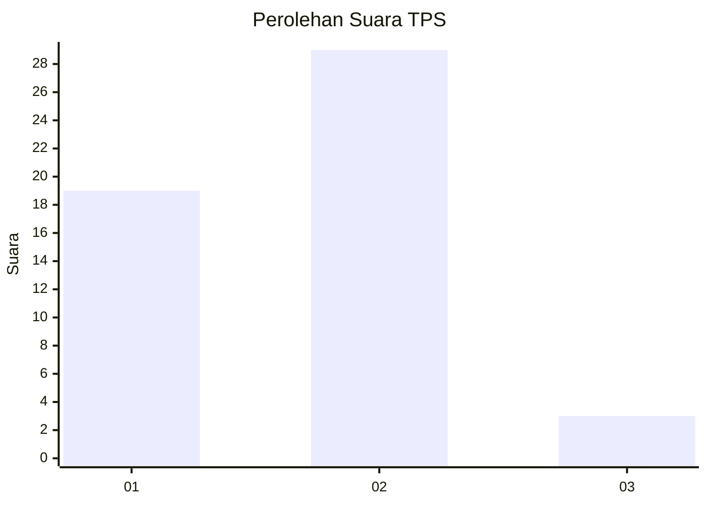
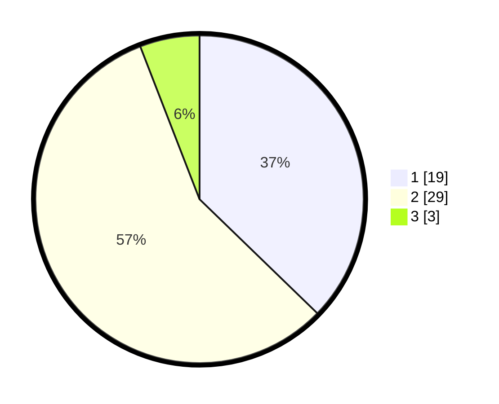

# Hasil

## Grafik

## Tabel

| No. | Nama Paslon    | Suara | Suara (raw) | Persentase |
|:--- |:-------------- | -----:| -----------:| ----------:|
| 1   | ANIES MUHAIMIN | 19    | [19][p-1]   | 37,25      |
| 2   | PRABOWO GIBRAN | 29    | [29][p-2]   | 56,86      |
| 3   | GANJAR MAHFUD  | 3     | [3][p-3]    | 5,88       |

[p-1]: https://github.com/gigit-pemilu/pemilu-2024-61-kalimantan-barat/blob/main/pilpres/hitung-suara/sub/61-kalimantan-barat/sub/12-kubu-raya/sub/05-batu-ampar/sub/2011-tanjung-harapan/sub/003-tps/sub/paslon-1.txt
[p-2]: https://github.com/gigit-pemilu/pemilu-2024-61-kalimantan-barat/blob/main/pilpres/hitung-suara/sub/61-kalimantan-barat/sub/12-kubu-raya/sub/05-batu-ampar/sub/2011-tanjung-harapan/sub/003-tps/sub/paslon-2.txt
[p-3]: https://github.com/gigit-pemilu/pemilu-2024-61-kalimantan-barat/blob/main/pilpres/hitung-suara/sub/61-kalimantan-barat/sub/12-kubu-raya/sub/05-batu-ampar/sub/2011-tanjung-harapan/sub/003-tps/sub/paslon-3.txt

## Foto C Plano

https://sirekap-obj-formc.kpu.go.id/d454/pemilu/ppwp/61/12/05/20/11/6112052011003-20240215-092846--44ed6ea8-f41a-4477-b885-d59f38b0d1b3.jpg

https://sirekap-obj-formc.kpu.go.id/d454/pemilu/ppwp/61/12/05/20/11/6112052011003-20240215-092900--73d5f866-be77-42e0-a63a-e58bda8e4ec5.jpg

https://sirekap-obj-formc.kpu.go.id/d454/pemilu/ppwp/61/12/05/20/11/6112052011003-20240214-194617--18727e33-4bbc-4486-89e2-657cb7aa2e45.jpg

## Metadata

| Key        | Value               |
| ---------- | ------------------- |
| Time Stamp | 2024-02-17 09:00:02 |

