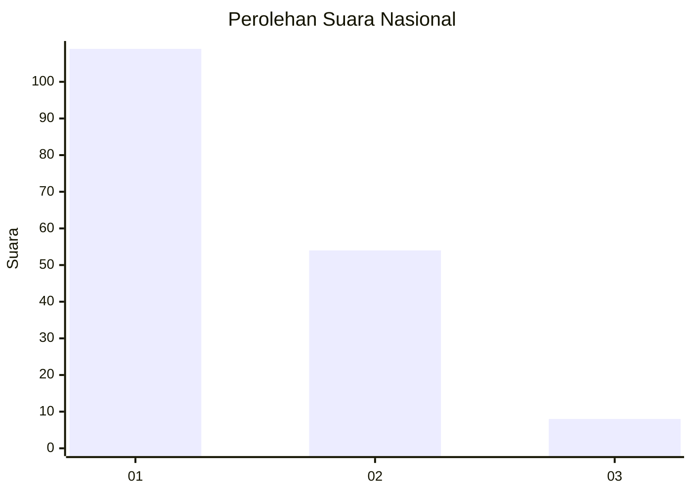
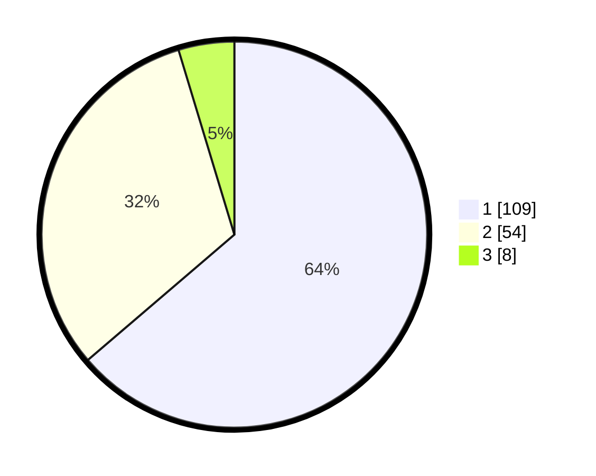

# Hasil

## Grafik

## Tabel

| No. | Nama Paslon    | Suara | Suara (raw) | Persentase |
|:--- |:-------------- | -----:| -----------:| ----------:|
| 1   | ANIES MUHAIMIN | 109   | [109][p-1]  | 63,74      |
| 2   | PRABOWO GIBRAN | 54    | [54][p-2]   | 31,58      |
| 3   | GANJAR MAHFUD  | 8     | [8][p-3]    | 4,68       |

[p-1]: https://github.com/gigit-pemilu/pemilu-2024/blob/main/pilpres/hitung-suara/sub/61-kalimantan-barat/sub/12-kubu-raya/sub/06-kubu/sub/2004-sungai-bemban/sub/005-tps/sub/paslon-1.txt
[p-2]: https://github.com/gigit-pemilu/pemilu-2024/blob/main/pilpres/hitung-suara/sub/61-kalimantan-barat/sub/12-kubu-raya/sub/06-kubu/sub/2004-sungai-bemban/sub/005-tps/sub/paslon-2.txt
[p-3]: https://github.com/gigit-pemilu/pemilu-2024/blob/main/pilpres/hitung-suara/sub/61-kalimantan-barat/sub/12-kubu-raya/sub/06-kubu/sub/2004-sungai-bemban/sub/005-tps/sub/paslon-3.txt

## Foto C Plano

https://sirekap-obj-formc.kpu.go.id/0859/pemilu/ppwp/61/12/06/20/04/6112062004005-20240214-234001--9b2e72f2-50a4-44bd-8c7c-2e455aa0f143.jpg

https://sirekap-obj-formc.kpu.go.id/0859/pemilu/ppwp/61/12/06/20/04/6112062004005-20240214-233534--b59751f8-14c6-4a25-a9da-0d0aa3aeddd9.jpg

https://sirekap-obj-formc.kpu.go.id/0859/pemilu/ppwp/61/12/06/20/04/6112062004005-20240214-233708--78e732e0-9676-496d-8be8-d60c46f7c3bf.jpg

## Metadata

| Key        | Value               |
| ---------- | ------------------- |
| Time Stamp | 2024-02-15 16:30:25 |

