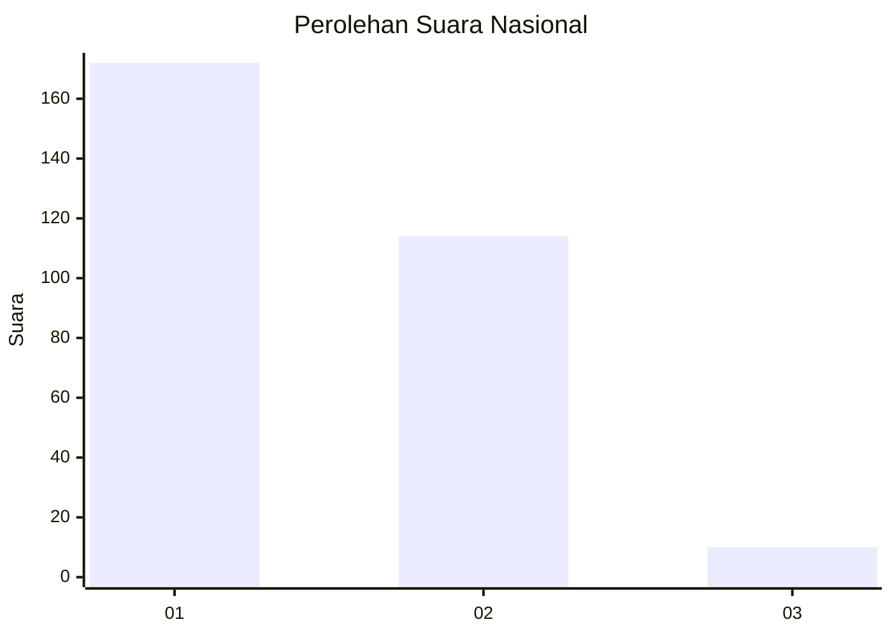
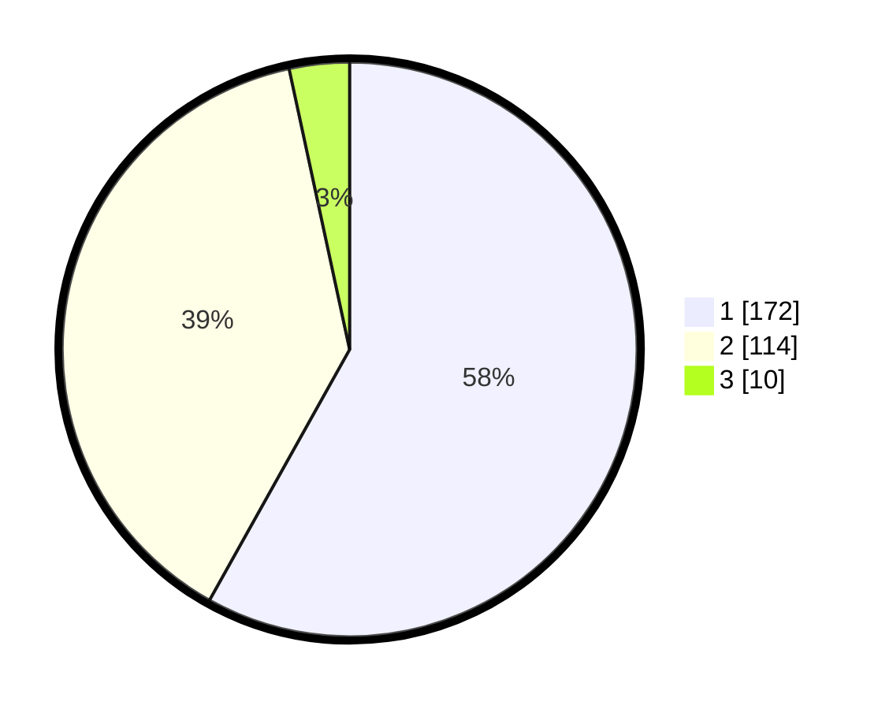

# Hasil

## Grafik

## Tabel

| No. | Nama Paslon    | Suara | Suara (raw) | Persentase |
|:--- |:-------------- | -----:| -----------:| ----------:|
| 1   | ANIES MUHAIMIN | 172   | [172][p-1]  | 58,11      |
| 2   | PRABOWO GIBRAN | 114   | [114][p-2]  | 38,51      |
| 3   | GANJAR MAHFUD  | 10    | [10][p-3]   | 3,38       |

[p-1]: https://github.com/gigit-pemilu/pemilu-2024/blob/main/pilpres/hitung-suara/sub/61-kalimantan-barat/sub/12-kubu-raya/sub/06-kubu/sub/2007-seruat-tiga/sub/001-tps/sub/paslon-1.txt
[p-2]: https://github.com/gigit-pemilu/pemilu-2024/blob/main/pilpres/hitung-suara/sub/61-kalimantan-barat/sub/12-kubu-raya/sub/06-kubu/sub/2007-seruat-tiga/sub/001-tps/sub/paslon-2.txt
[p-3]: https://github.com/gigit-pemilu/pemilu-2024/blob/main/pilpres/hitung-suara/sub/61-kalimantan-barat/sub/12-kubu-raya/sub/06-kubu/sub/2007-seruat-tiga/sub/001-tps/sub/paslon-3.txt

## Foto C Plano

https://sirekap-obj-formc.kpu.go.id/548d/pemilu/ppwp/61/12/06/20/07/6112062007001-20240222-180030--234c55ca-5b32-483c-a1d1-e599df53003a.jpg

https://sirekap-obj-formc.kpu.go.id/548d/pemilu/ppwp/61/12/06/20/07/6112062007001-20240222-175629--7c6250e3-1650-4ff1-982a-4b401fdbd10a.jpg

https://sirekap-obj-formc.kpu.go.id/548d/pemilu/ppwp/61/12/06/20/07/6112062007001-20240222-175735--c755bae7-3ba8-4008-9ed7-fa6072dd6b94.jpg

## Metadata

| Key        | Value               |
| ---------- | ------------------- |
| Time Stamp | 2024-02-24 22:31:28 |

