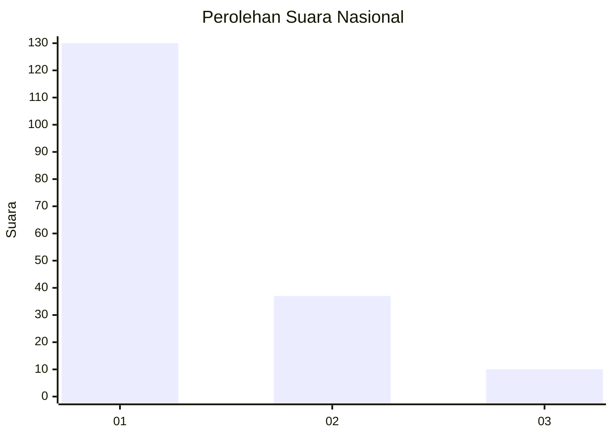
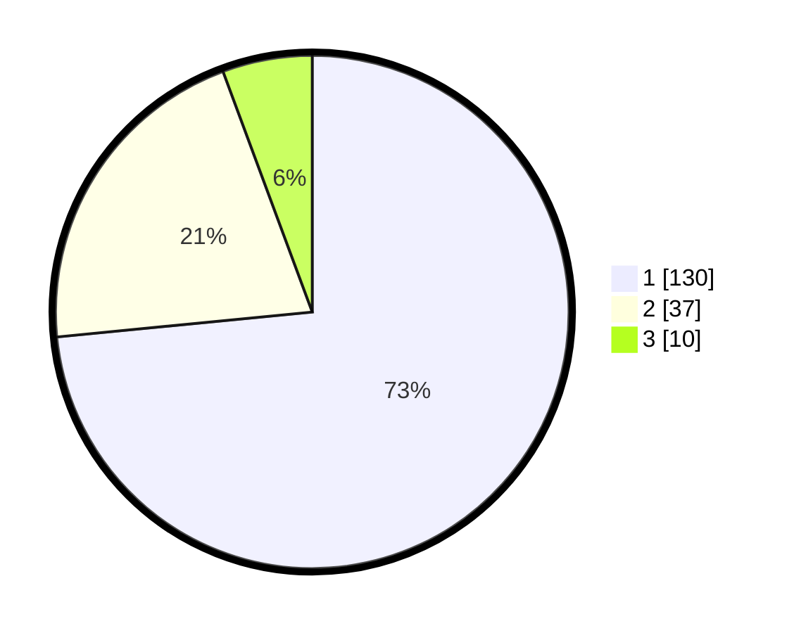

# Hasil

## Grafik

## Tabel

| No. | Nama Paslon    | Suara | Suara (raw) | Persentase |
|:--- |:-------------- | -----:| -----------:| ----------:|
| 1   | ANIES MUHAIMIN | 130   | [130][p-1]  | 73,45      |
| 2   | PRABOWO GIBRAN | 37    | [37][p-2]   | 20,90      |
| 3   | GANJAR MAHFUD  | 10    | [10][p-3]   | 5,65       |

[p-1]: https://github.com/gigit-pemilu/pemilu-2024/blob/main/pilpres/hitung-suara/sub/61-kalimantan-barat/sub/12-kubu-raya/sub/06-kubu/sub/2007-seruat-tiga/sub/005-tps/sub/paslon-1.txt
[p-2]: https://github.com/gigit-pemilu/pemilu-2024/blob/main/pilpres/hitung-suara/sub/61-kalimantan-barat/sub/12-kubu-raya/sub/06-kubu/sub/2007-seruat-tiga/sub/005-tps/sub/paslon-2.txt
[p-3]: https://github.com/gigit-pemilu/pemilu-2024/blob/main/pilpres/hitung-suara/sub/61-kalimantan-barat/sub/12-kubu-raya/sub/06-kubu/sub/2007-seruat-tiga/sub/005-tps/sub/paslon-3.txt

## Foto C Plano

https://sirekap-obj-formc.kpu.go.id/4f9c/pemilu/ppwp/61/12/06/20/07/6112062007005-20240214-214739--b4702e37-647b-48e1-a8c8-314e1d03e5cd.jpg

https://sirekap-obj-formc.kpu.go.id/4f9c/pemilu/ppwp/61/12/06/20/07/6112062007005-20240214-214855--c4aa5264-18d7-4fd4-9be8-384ef71dc700.jpg

https://sirekap-obj-formc.kpu.go.id/4f9c/pemilu/ppwp/61/12/06/20/07/6112062007005-20240214-214947--2ed30113-983e-4f85-8560-da41d741019f.jpg

## Metadata

| Key        | Value               |
| ---------- | ------------------- |
| Time Stamp | 2024-02-15 16:30:25 |

