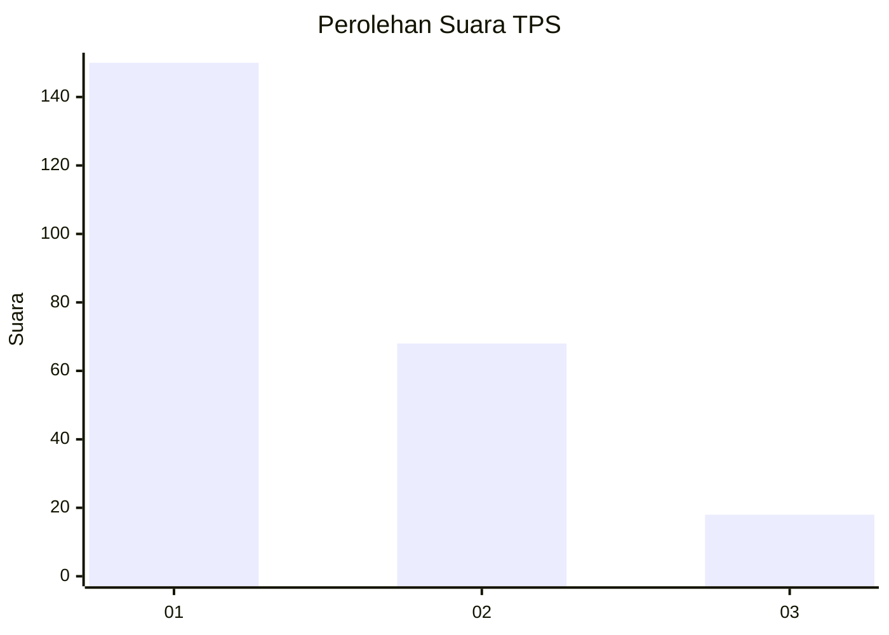
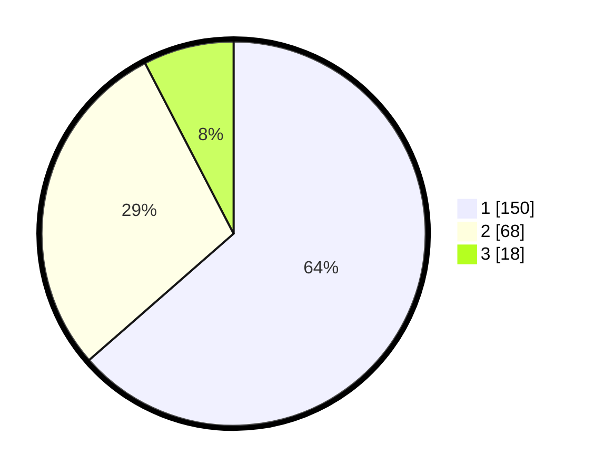

# Hasil

## Grafik

## Tabel

| No. | Nama Paslon    | Suara | Suara (raw) | Persentase |
|:--- |:-------------- | -----:| -----------:| ----------:|
| 1   | ANIES MUHAIMIN | 150   | [150][p-1]  | 63,56      |
| 2   | PRABOWO GIBRAN | 68    | [68][p-2]   | 28,81      |
| 3   | GANJAR MAHFUD  | 18    | [18][p-3]   | 7,63       |

[p-1]: https://github.com/gigit-pemilu/pemilu-2024-61-kalimantan-barat/blob/main/pilpres/hitung-suara/sub/61-kalimantan-barat/sub/12-kubu-raya/sub/06-kubu/sub/2010-sepakat-baru/sub/001-tps/sub/paslon-1.txt
[p-2]: https://github.com/gigit-pemilu/pemilu-2024-61-kalimantan-barat/blob/main/pilpres/hitung-suara/sub/61-kalimantan-barat/sub/12-kubu-raya/sub/06-kubu/sub/2010-sepakat-baru/sub/001-tps/sub/paslon-2.txt
[p-3]: https://github.com/gigit-pemilu/pemilu-2024-61-kalimantan-barat/blob/main/pilpres/hitung-suara/sub/61-kalimantan-barat/sub/12-kubu-raya/sub/06-kubu/sub/2010-sepakat-baru/sub/001-tps/sub/paslon-3.txt

## Foto C Plano

https://sirekap-obj-formc.kpu.go.id/1016/pemilu/ppwp/61/12/06/20/10/6112062010001-20240215-100748--251f6fa7-c64f-41cc-b34b-6fc741aff752.jpg

https://sirekap-obj-formc.kpu.go.id/1016/pemilu/ppwp/61/12/06/20/10/6112062010001-20240215-125002--496513e0-9cf5-49f7-911d-cd6a8226e5bd.jpg

https://sirekap-obj-formc.kpu.go.id/1016/pemilu/ppwp/61/12/06/20/10/6112062010001-20240215-125119--f315c77f-48f7-49d7-a2a0-075c423c1159.jpg

## Metadata

| Key        | Value               |
| ---------- | ------------------- |
| Time Stamp | 2024-02-16 21:01:00 |

