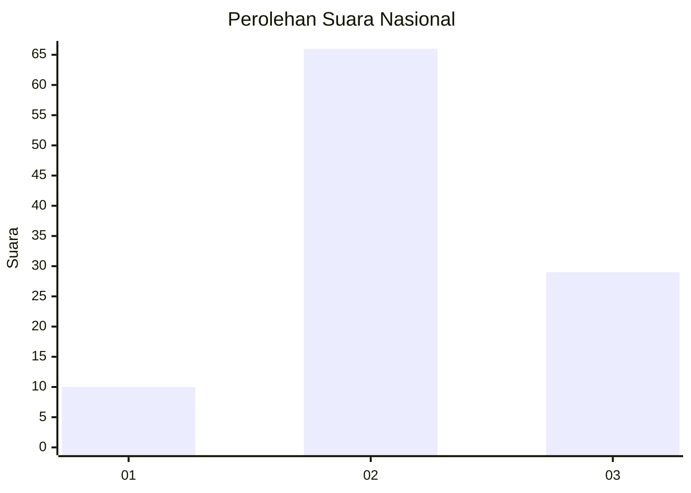
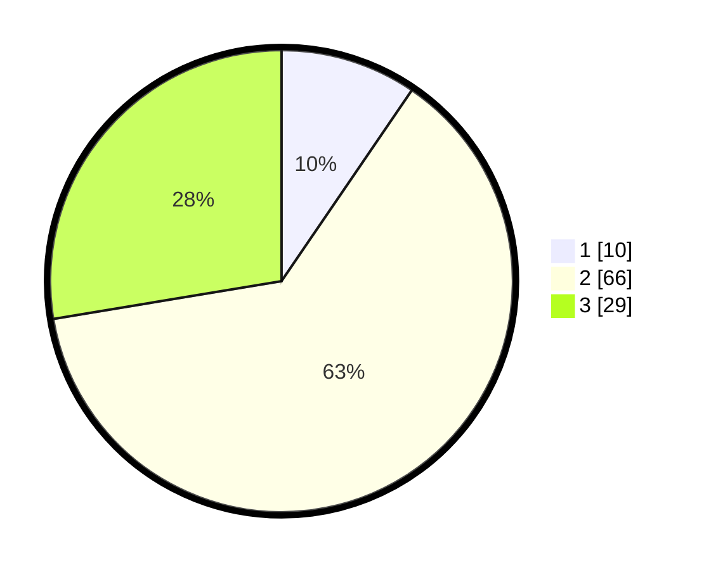

# Hasil

## Grafik

## Tabel

| No. | Nama Paslon    | Suara | Suara (raw) | Persentase |
|:--- |:-------------- | -----:| -----------:| ----------:|
| 1   | ANIES MUHAIMIN | 10    | [10][p-1]   | 9,52       |
| 2   | PRABOWO GIBRAN | 66    | [66][p-2]   | 62,86      |
| 3   | GANJAR MAHFUD  | 29    | [29][p-3]   | 27,62      |

[p-1]: https://github.com/gigit-pemilu/pemilu-2024/blob/main/pilpres/hitung-suara/sub/61-kalimantan-barat/sub/12-kubu-raya/sub/06-kubu/sub/2013-teluk-nangka/sub/008-tps/sub/paslon-1.txt
[p-2]: https://github.com/gigit-pemilu/pemilu-2024/blob/main/pilpres/hitung-suara/sub/61-kalimantan-barat/sub/12-kubu-raya/sub/06-kubu/sub/2013-teluk-nangka/sub/008-tps/sub/paslon-2.txt
[p-3]: https://github.com/gigit-pemilu/pemilu-2024/blob/main/pilpres/hitung-suara/sub/61-kalimantan-barat/sub/12-kubu-raya/sub/06-kubu/sub/2013-teluk-nangka/sub/008-tps/sub/paslon-3.txt

## Foto C Plano

https://sirekap-obj-formc.kpu.go.id/f688/pemilu/ppwp/61/12/06/20/13/6112062013008-20240215-012212--e7e525af-8639-410b-ad65-e131fbc6d5aa.jpg

https://sirekap-obj-formc.kpu.go.id/f688/pemilu/ppwp/61/12/06/20/13/6112062013008-20240215-012437--19199a6a-f7cb-4809-8611-9d0dd26b0f13.jpg

https://sirekap-obj-formc.kpu.go.id/f688/pemilu/ppwp/61/12/06/20/13/6112062013008-20240215-012516--0d5557cf-6c28-455b-940b-2ef449ba8ae3.jpg

## Metadata

| Key        | Value               |
| ---------- | ------------------- |
| Time Stamp | 2024-02-15 16:00:26 |

