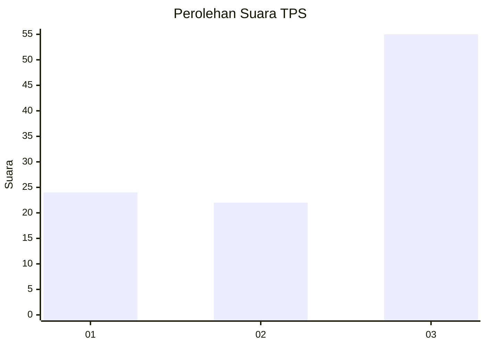
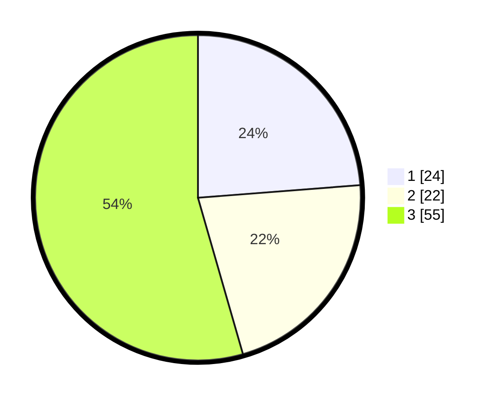

# Hasil

## Grafik

## Tabel

| No. | Nama Paslon    | Suara | Suara (raw) | Persentase |
|:--- |:-------------- | -----:| -----------:| ----------:|
| 1   | ANIES MUHAIMIN | 24    | [24][p-1]   | 23,76      |
| 2   | PRABOWO GIBRAN | 22    | [22][p-2]   | 21,78      |
| 3   | GANJAR MAHFUD  | 55    | [55][p-3]   | 54,46      |

[p-1]: https://github.com/gigit-pemilu/pemilu-2024-61-kalimantan-barat/blob/main/pilpres/hitung-suara/sub/61-kalimantan-barat/sub/12-kubu-raya/sub/06-kubu/sub/2016-pinang-dalam/sub/005-tps/sub/paslon-1.txt
[p-2]: https://github.com/gigit-pemilu/pemilu-2024-61-kalimantan-barat/blob/main/pilpres/hitung-suara/sub/61-kalimantan-barat/sub/12-kubu-raya/sub/06-kubu/sub/2016-pinang-dalam/sub/005-tps/sub/paslon-2.txt
[p-3]: https://github.com/gigit-pemilu/pemilu-2024-61-kalimantan-barat/blob/main/pilpres/hitung-suara/sub/61-kalimantan-barat/sub/12-kubu-raya/sub/06-kubu/sub/2016-pinang-dalam/sub/005-tps/sub/paslon-3.txt

## Foto C Plano

https://sirekap-obj-formc.kpu.go.id/4ed8/pemilu/ppwp/61/12/06/20/16/6112062016005-20240220-081600--11ab5cb2-b587-41bf-86b0-8a03b7f21241.jpg

https://sirekap-obj-formc.kpu.go.id/4ed8/pemilu/ppwp/61/12/06/20/16/6112062016005-20240220-080630--c9c49859-a9f1-4f58-9391-508fc65ee974.jpg

https://sirekap-obj-formc.kpu.go.id/4ed8/pemilu/ppwp/61/12/06/20/16/6112062016005-20240220-081238--712e5b05-8bf3-4367-9455-6b1841a9daff.jpg

## Metadata

| Key        | Value               |
| ---------- | ------------------- |
| Time Stamp | 2024-02-20 09:00:00 |

