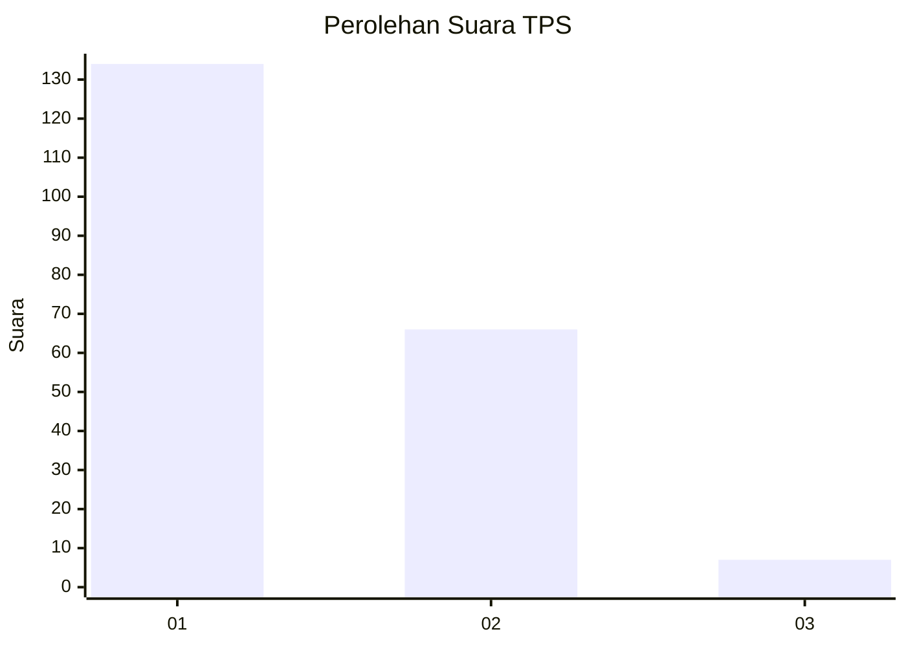
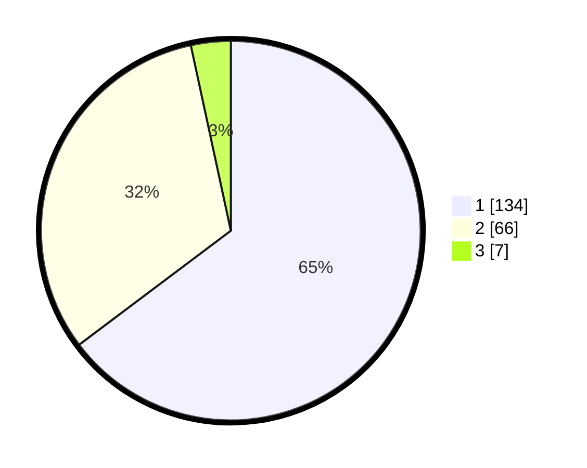

# Hasil

## Grafik

## Tabel

| No. | Nama Paslon    | Suara | Suara (raw) | Persentase |
|:--- |:-------------- | -----:| -----------:| ----------:|
| 1   | ANIES MUHAIMIN | 134   | [134][p-1]  | 64,73      |
| 2   | PRABOWO GIBRAN | 66    | [66][p-2]   | 31,88      |
| 3   | GANJAR MAHFUD  | 7     | [7][p-3]    | 3,38       |

[p-1]: https://github.com/gigit-pemilu/pemilu-2024-61-kalimantan-barat/blob/main/pilpres/hitung-suara/sub/61-kalimantan-barat/sub/12-kubu-raya/sub/06-kubu/sub/2020-mengkalang-jambu/sub/002-tps/sub/paslon-1.txt
[p-2]: https://github.com/gigit-pemilu/pemilu-2024-61-kalimantan-barat/blob/main/pilpres/hitung-suara/sub/61-kalimantan-barat/sub/12-kubu-raya/sub/06-kubu/sub/2020-mengkalang-jambu/sub/002-tps/sub/paslon-2.txt
[p-3]: https://github.com/gigit-pemilu/pemilu-2024-61-kalimantan-barat/blob/main/pilpres/hitung-suara/sub/61-kalimantan-barat/sub/12-kubu-raya/sub/06-kubu/sub/2020-mengkalang-jambu/sub/002-tps/sub/paslon-3.txt

## Foto C Plano

https://sirekap-obj-formc.kpu.go.id/035a/pemilu/ppwp/61/12/06/20/20/6112062020002-20240214-204330--06537bf3-a848-46ee-a5d8-a6868245571a.jpg

https://sirekap-obj-formc.kpu.go.id/035a/pemilu/ppwp/61/12/06/20/20/6112062020002-20240214-205218--532078b1-b5a0-40b8-b6ec-de22105edf13.jpg

https://sirekap-obj-formc.kpu.go.id/035a/pemilu/ppwp/61/12/06/20/20/6112062020002-20240214-210010--539b308e-a736-4f81-b761-9baa64cae6f8.jpg

## Metadata

| Key        | Value               |
| ---------- | ------------------- |
| Time Stamp | 2024-02-15 15:30:25 |

