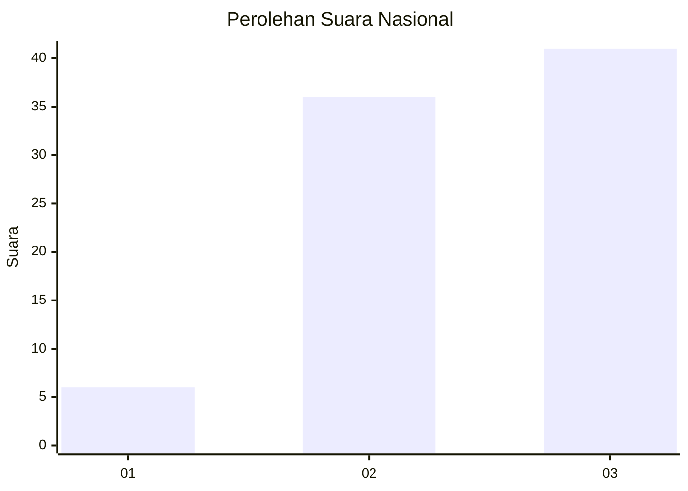
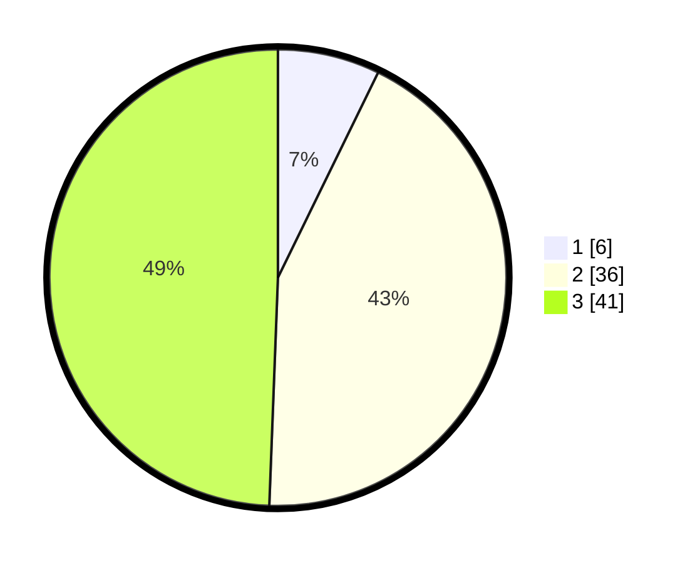

# Hasil

## Grafik

## Tabel

| No. | Nama Paslon    | Suara | Suara (raw) | Persentase |
|:--- |:-------------- | -----:| -----------:| ----------:|
| 1   | ANIES MUHAIMIN | 6     | [6][p-1]    | 7,23       |
| 2   | PRABOWO GIBRAN | 36    | [36][p-2]   | 43,37      |
| 3   | GANJAR MAHFUD  | 41    | [41][p-3]   | 49,40      |

[p-1]: https://github.com/gigit-pemilu/pemilu-2024/blob/main/pilpres/hitung-suara/sub/61-kalimantan-barat/sub/12-kubu-raya/sub/07-rasau-jaya/sub/2004-rasau-jaya-tiga/sub/002-tps/sub/paslon-1.txt
[p-2]: https://github.com/gigit-pemilu/pemilu-2024/blob/main/pilpres/hitung-suara/sub/61-kalimantan-barat/sub/12-kubu-raya/sub/07-rasau-jaya/sub/2004-rasau-jaya-tiga/sub/002-tps/sub/paslon-2.txt
[p-3]: https://github.com/gigit-pemilu/pemilu-2024/blob/main/pilpres/hitung-suara/sub/61-kalimantan-barat/sub/12-kubu-raya/sub/07-rasau-jaya/sub/2004-rasau-jaya-tiga/sub/002-tps/sub/paslon-3.txt

## Foto C Plano

https://sirekap-obj-formc.kpu.go.id/1b3b/pemilu/ppwp/61/12/07/20/04/6112072004002-20240216-142537--3b57b3e6-fc9b-4216-9bf9-0a131874c23a.jpg

https://sirekap-obj-formc.kpu.go.id/1b3b/pemilu/ppwp/61/12/07/20/04/6112072004002-20240216-142538--a45c8f2f-205f-4d46-b48d-aa0cf5a08090.jpg

https://sirekap-obj-formc.kpu.go.id/1b3b/pemilu/ppwp/61/12/07/20/04/6112072004002-20240216-142538--809b9ac4-f6fe-4479-9f95-df3663eca990.jpg

## Metadata

| Key        | Value               |
| ---------- | ------------------- |
| Time Stamp | 2024-02-16 21:01:00 |

## DATA PEMILIH TETAP

Jumlah pemilih dalam DPT: **91**.
 * L: **44**.
 * P: **47**.

## DATA PENGGUNA HAK PILIH

Jumlah pengguna hak pilih dalam DPT: **63**.
 * L: **31**.
 * P: **32**.

Jumlah pengguna hak pilih dalam DPTb: **1**.
 * L: **1**.
 * P: **0**.

Jumlah pengguna hak pilih dalam DPK: **23**.
 * L: **2**.
 * P: **21**.

Jumlah pengguna hak pilih: **87**.
 * L: **34**.
 * P: **53**.

## JUMLAH SUARA SAH DAN TIDAK SAH

JUMLAH SELURUH SUARA SAH: **83**.

JUMLAH SUARA TIDAK SAH: **4**.

JUMLAH SELURUH SUARA SAH DAN SUARA TIDAK SAH: **87**.

