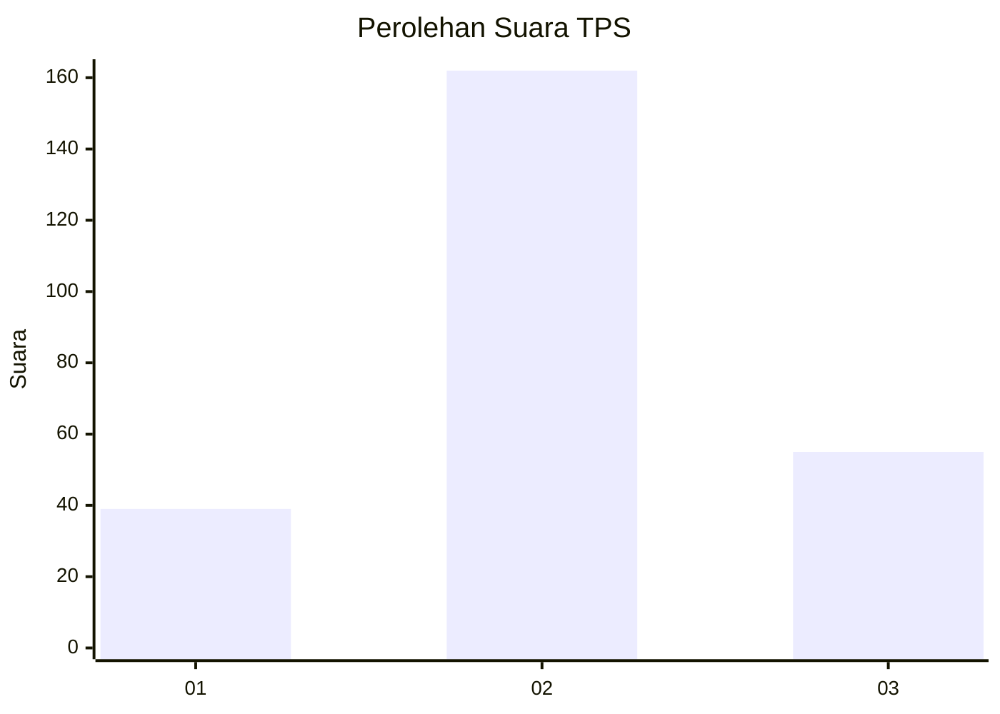
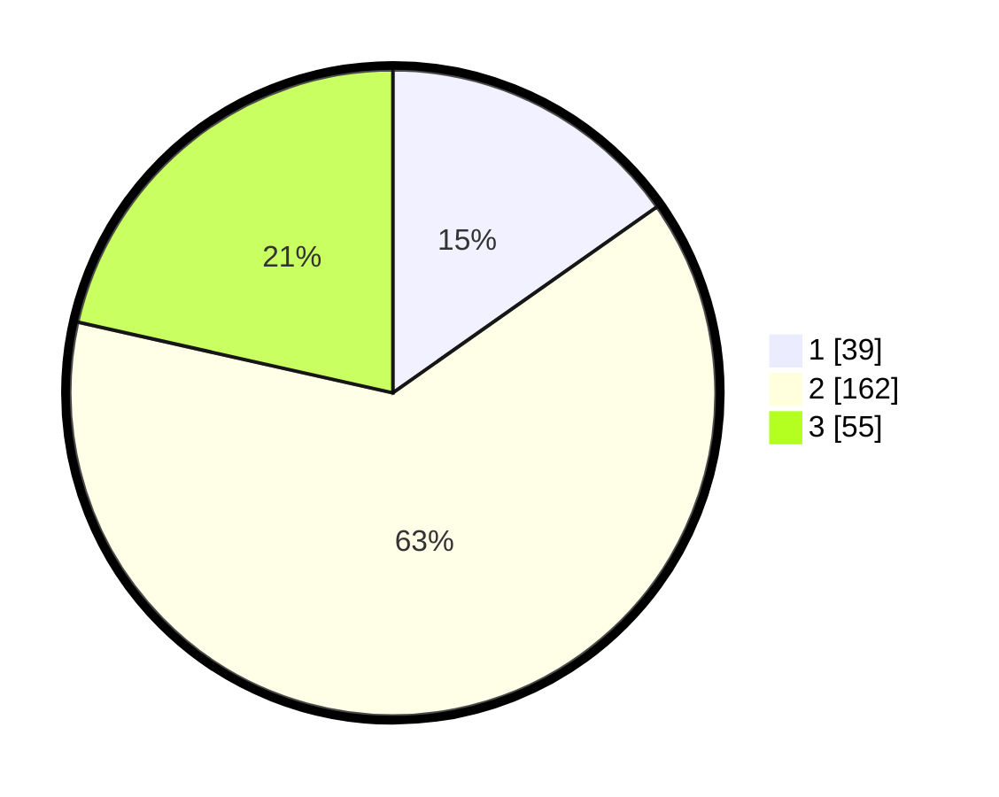

# Hasil

## Grafik

## Tabel

| No. | Nama Paslon    | Suara | Suara (raw) | Persentase |
|:--- |:-------------- | -----:| -----------:| ----------:|
| 1   | ANIES MUHAIMIN | 39    | [39][p-1]   | 15,23      |
| 2   | PRABOWO GIBRAN | 162   | [162][p-2]  | 63,28      |
| 3   | GANJAR MAHFUD  | 55    | [55][p-3]   | 21,48      |

[p-1]: https://github.com/gigit-pemilu/pemilu-2024-61-kalimantan-barat/blob/main/pilpres/hitung-suara/sub/61-kalimantan-barat/sub/12-kubu-raya/sub/07-rasau-jaya/sub/2004-rasau-jaya-tiga/sub/004-tps/sub/paslon-1.txt
[p-2]: https://github.com/gigit-pemilu/pemilu-2024-61-kalimantan-barat/blob/main/pilpres/hitung-suara/sub/61-kalimantan-barat/sub/12-kubu-raya/sub/07-rasau-jaya/sub/2004-rasau-jaya-tiga/sub/004-tps/sub/paslon-2.txt
[p-3]: https://github.com/gigit-pemilu/pemilu-2024-61-kalimantan-barat/blob/main/pilpres/hitung-suara/sub/61-kalimantan-barat/sub/12-kubu-raya/sub/07-rasau-jaya/sub/2004-rasau-jaya-tiga/sub/004-tps/sub/paslon-3.txt

## Foto C Plano

https://sirekap-obj-formc.kpu.go.id/fc40/pemilu/ppwp/61/12/07/20/04/6112072004004-20240214-215811--178e1b04-56f3-46ee-988e-171f460f7d20.jpg

https://sirekap-obj-formc.kpu.go.id/fc40/pemilu/ppwp/61/12/07/20/04/6112072004004-20240214-215945--fceb36a7-62a7-4da4-9564-4cb4572568cb.jpg

https://sirekap-obj-formc.kpu.go.id/fc40/pemilu/ppwp/61/12/07/20/04/6112072004004-20240214-220228--746df5f4-3899-4bb5-8726-1a07f891701b.jpg

## Metadata

| Key        | Value               |
| ---------- | ------------------- |
| Time Stamp | 2024-02-15 12:00:28 |

