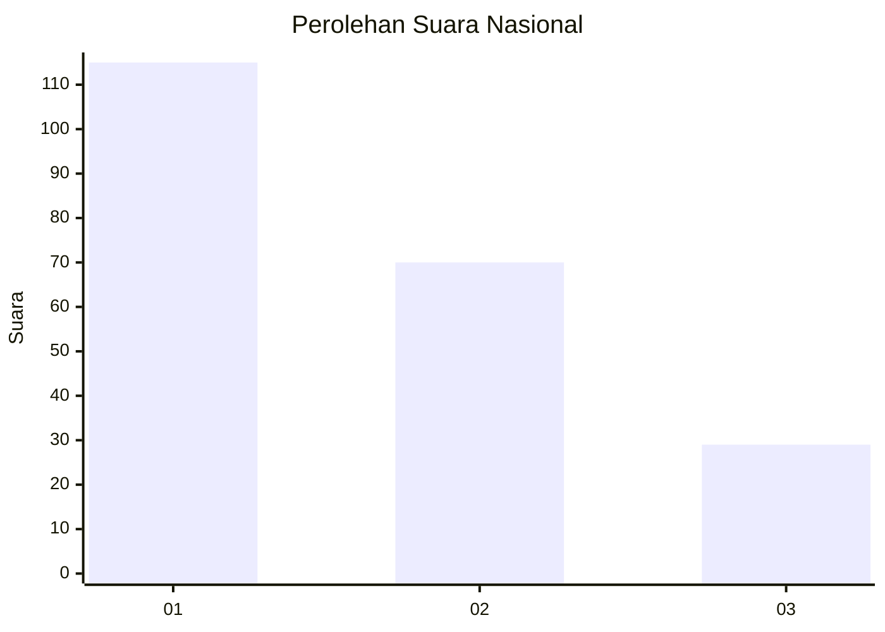
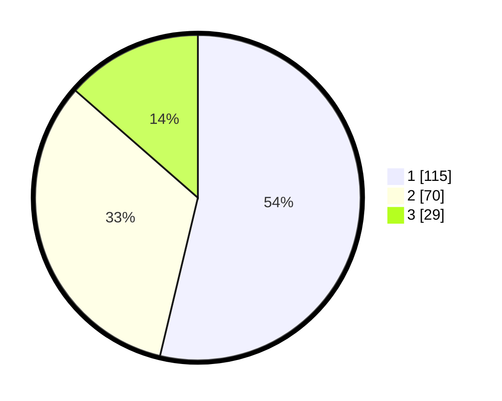

# Hasil

## Grafik

## Tabel

| No. | Nama Paslon    | Suara | Suara (raw) | Persentase |
|:--- |:-------------- | -----:| -----------:| ----------:|
| 1   | ANIES MUHAIMIN | 115   | [115][p-1]  | 53,74      |
| 2   | PRABOWO GIBRAN | 70    | [70][p-2]   | 32,71      |
| 3   | GANJAR MAHFUD  | 29    | [29][p-3]   | 13,55      |

[p-1]: https://github.com/gigit-pemilu/pemilu-2024/blob/main/pilpres/hitung-suara/sub/61-kalimantan-barat/sub/12-kubu-raya/sub/08-teluk-pakedai/sub/2001-teluk-pakedai-hulu/sub/006-tps/sub/paslon-1.txt
[p-2]: https://github.com/gigit-pemilu/pemilu-2024/blob/main/pilpres/hitung-suara/sub/61-kalimantan-barat/sub/12-kubu-raya/sub/08-teluk-pakedai/sub/2001-teluk-pakedai-hulu/sub/006-tps/sub/paslon-2.txt
[p-3]: https://github.com/gigit-pemilu/pemilu-2024/blob/main/pilpres/hitung-suara/sub/61-kalimantan-barat/sub/12-kubu-raya/sub/08-teluk-pakedai/sub/2001-teluk-pakedai-hulu/sub/006-tps/sub/paslon-3.txt

## Foto C Plano

https://sirekap-obj-formc.kpu.go.id/0061/pemilu/ppwp/61/12/08/20/01/6112082001006-20240214-215008--f1263779-0c7b-484b-8054-65172f3bf027.jpg

https://sirekap-obj-formc.kpu.go.id/0061/pemilu/ppwp/61/12/08/20/01/6112082001006-20240214-214336--45ddcf87-81c1-47b0-bef9-898d15ec3f7a.jpg

https://sirekap-obj-formc.kpu.go.id/0061/pemilu/ppwp/61/12/08/20/01/6112082001006-20240215-091357--67a1e25f-a819-493b-830f-64ac11dde4aa.jpg

## Metadata

| Key        | Value               |
| ---------- | ------------------- |
| Time Stamp | 2024-02-15 21:30:27 |

