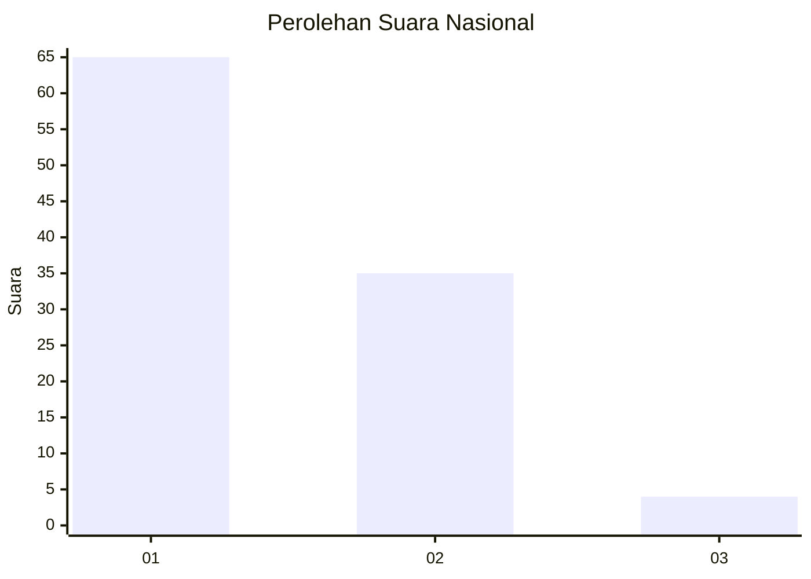
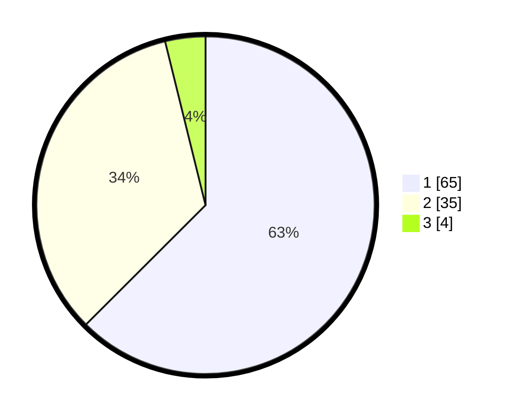

# Hasil

## Grafik

## Tabel

| No. | Nama Paslon    | Suara | Suara (raw) | Persentase |
|:--- |:-------------- | -----:| -----------:| ----------:|
| 1   | ANIES MUHAIMIN | 65    | [65][p-1]   | 62,50      |
| 2   | PRABOWO GIBRAN | 35    | [35][p-2]   | 33,65      |
| 3   | GANJAR MAHFUD  | 4     | [4][p-3]    | 3,85       |

[p-1]: https://github.com/gigit-pemilu/pemilu-2024/blob/main/pilpres/hitung-suara/sub/61-kalimantan-barat/sub/12-kubu-raya/sub/08-teluk-pakedai/sub/2003-teluk-pakedai-dua/sub/003-tps/sub/paslon-1.txt
[p-2]: https://github.com/gigit-pemilu/pemilu-2024/blob/main/pilpres/hitung-suara/sub/61-kalimantan-barat/sub/12-kubu-raya/sub/08-teluk-pakedai/sub/2003-teluk-pakedai-dua/sub/003-tps/sub/paslon-2.txt
[p-3]: https://github.com/gigit-pemilu/pemilu-2024/blob/main/pilpres/hitung-suara/sub/61-kalimantan-barat/sub/12-kubu-raya/sub/08-teluk-pakedai/sub/2003-teluk-pakedai-dua/sub/003-tps/sub/paslon-3.txt

## Foto C Plano

https://sirekap-obj-formc.kpu.go.id/daa7/pemilu/ppwp/61/12/08/20/03/6112082003003-20240215-022844--b09647b5-5e02-4f17-b0e9-1478f23630b0.jpg

https://sirekap-obj-formc.kpu.go.id/daa7/pemilu/ppwp/61/12/08/20/03/6112082003003-20240215-022934--a5d659d7-0b12-4f07-8edb-2304863eb362.jpg

https://sirekap-obj-formc.kpu.go.id/daa7/pemilu/ppwp/61/12/08/20/03/6112082003003-20240215-023004--75c01bc5-c7ee-49f3-9e9a-0de570c7a5be.jpg

## Metadata

| Key        | Value               |
| ---------- | ------------------- |
| Time Stamp | 2024-02-15 17:30:25 |

