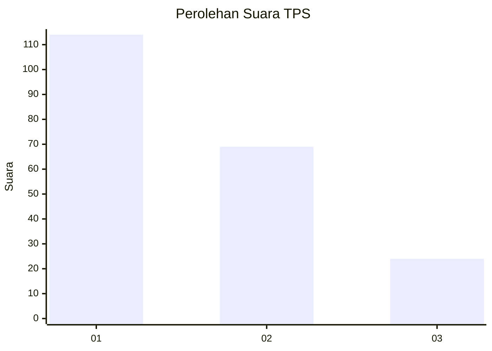
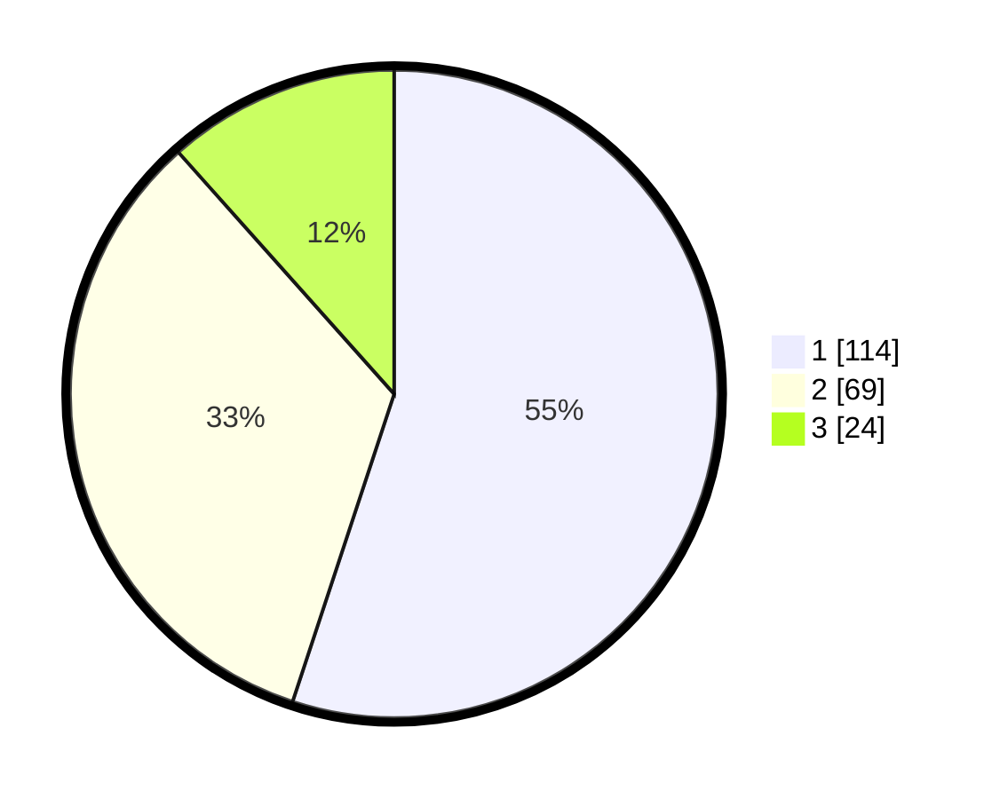

# Hasil

## Grafik

## Tabel

| No. | Nama Paslon    | Suara | Suara (raw) | Persentase |
|:--- |:-------------- | -----:| -----------:| ----------:|
| 1   | ANIES MUHAIMIN | 114   | [114][p-1]  | 55,07      |
| 2   | PRABOWO GIBRAN | 69    | [69][p-2]   | 33,33      |
| 3   | GANJAR MAHFUD  | 24    | [24][p-3]   | 11,59      |

[p-1]: https://github.com/gigit-pemilu/pemilu-2024-61-kalimantan-barat/blob/main/pilpres/hitung-suara/sub/61-kalimantan-barat/sub/12-kubu-raya/sub/09-sungai-kakap/sub/2006-pal-sembilan/sub/019-tps/sub/paslon-1.txt
[p-2]: https://github.com/gigit-pemilu/pemilu-2024-61-kalimantan-barat/blob/main/pilpres/hitung-suara/sub/61-kalimantan-barat/sub/12-kubu-raya/sub/09-sungai-kakap/sub/2006-pal-sembilan/sub/019-tps/sub/paslon-2.txt
[p-3]: https://github.com/gigit-pemilu/pemilu-2024-61-kalimantan-barat/blob/main/pilpres/hitung-suara/sub/61-kalimantan-barat/sub/12-kubu-raya/sub/09-sungai-kakap/sub/2006-pal-sembilan/sub/019-tps/sub/paslon-3.txt

## Foto C Plano

https://sirekap-obj-formc.kpu.go.id/31f3/pemilu/ppwp/61/12/09/20/06/6112092006019-20240215-105400--1f897cb1-23ba-45cf-b195-4662649280b1.jpg

https://sirekap-obj-formc.kpu.go.id/31f3/pemilu/ppwp/61/12/09/20/06/6112092006019-20240215-064208--40b412cb-e1a9-4ee9-a21d-3a2da8866813.jpg

https://sirekap-obj-formc.kpu.go.id/31f3/pemilu/ppwp/61/12/09/20/06/6112092006019-20240215-064413--140ec905-82df-421b-9b9b-8015ca0ca2cd.jpg

## Metadata

| Key        | Value               |
| ---------- | ------------------- |
| Time Stamp | 2024-02-24 22:31:28 |

