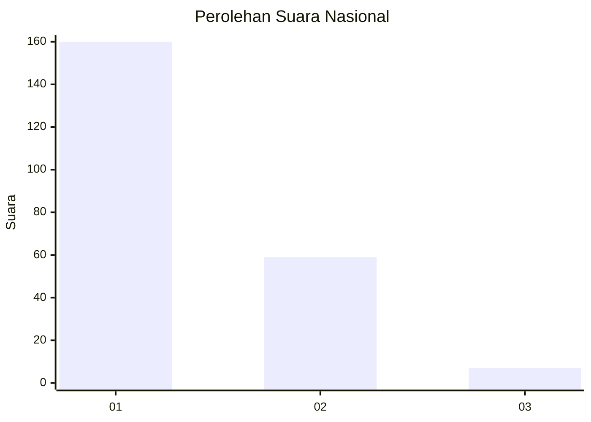
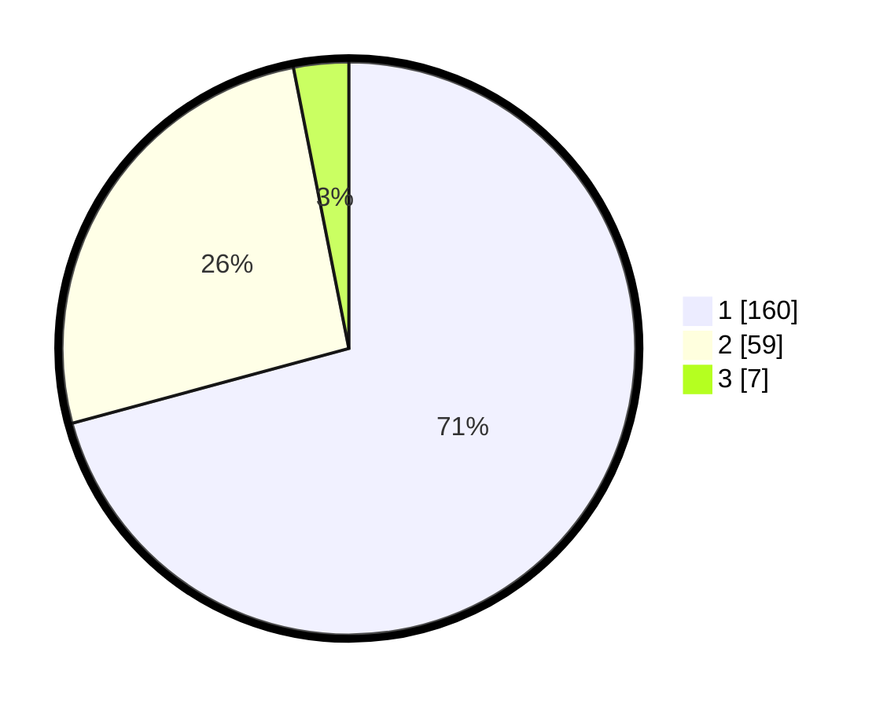

# Hasil

## Grafik

## Tabel

| No. | Nama Paslon    | Suara | Suara (raw) | Persentase |
|:--- |:-------------- | -----:| -----------:| ----------:|
| 1   | ANIES MUHAIMIN | 160   | [160][p-1]  | 70,80      |
| 2   | PRABOWO GIBRAN | 59    | [59][p-2]   | 26,11      |
| 3   | GANJAR MAHFUD  | 7     | [7][p-3]    | 3,10       |

[p-1]: https://github.com/gigit-pemilu/pemilu-2024/blob/main/pilpres/hitung-suara/sub/61-kalimantan-barat/sub/12-kubu-raya/sub/09-sungai-kakap/sub/2006-pal-sembilan/sub/029-tps/sub/paslon-1.txt
[p-2]: https://github.com/gigit-pemilu/pemilu-2024/blob/main/pilpres/hitung-suara/sub/61-kalimantan-barat/sub/12-kubu-raya/sub/09-sungai-kakap/sub/2006-pal-sembilan/sub/029-tps/sub/paslon-2.txt
[p-3]: https://github.com/gigit-pemilu/pemilu-2024/blob/main/pilpres/hitung-suara/sub/61-kalimantan-barat/sub/12-kubu-raya/sub/09-sungai-kakap/sub/2006-pal-sembilan/sub/029-tps/sub/paslon-3.txt

## Foto C Plano

https://sirekap-obj-formc.kpu.go.id/363a/pemilu/ppwp/61/12/09/20/06/6112092006029-20240215-010035--4dd2b7bd-b3b0-4ffd-965a-443c37122a9b.jpg

https://sirekap-obj-formc.kpu.go.id/363a/pemilu/ppwp/61/12/09/20/06/6112092006029-20240215-010138--145fbb2b-1973-4227-b081-ed839e799a13.jpg

https://sirekap-obj-formc.kpu.go.id/363a/pemilu/ppwp/61/12/09/20/06/6112092006029-20240215-010209--543949d3-c4e5-44bf-a7d4-569164ea24c9.jpg

## Metadata

| Key        | Value               |
| ---------- | ------------------- |
| Time Stamp | 2024-02-24 22:31:28 |

