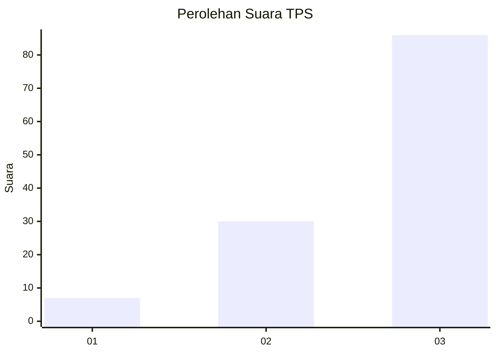
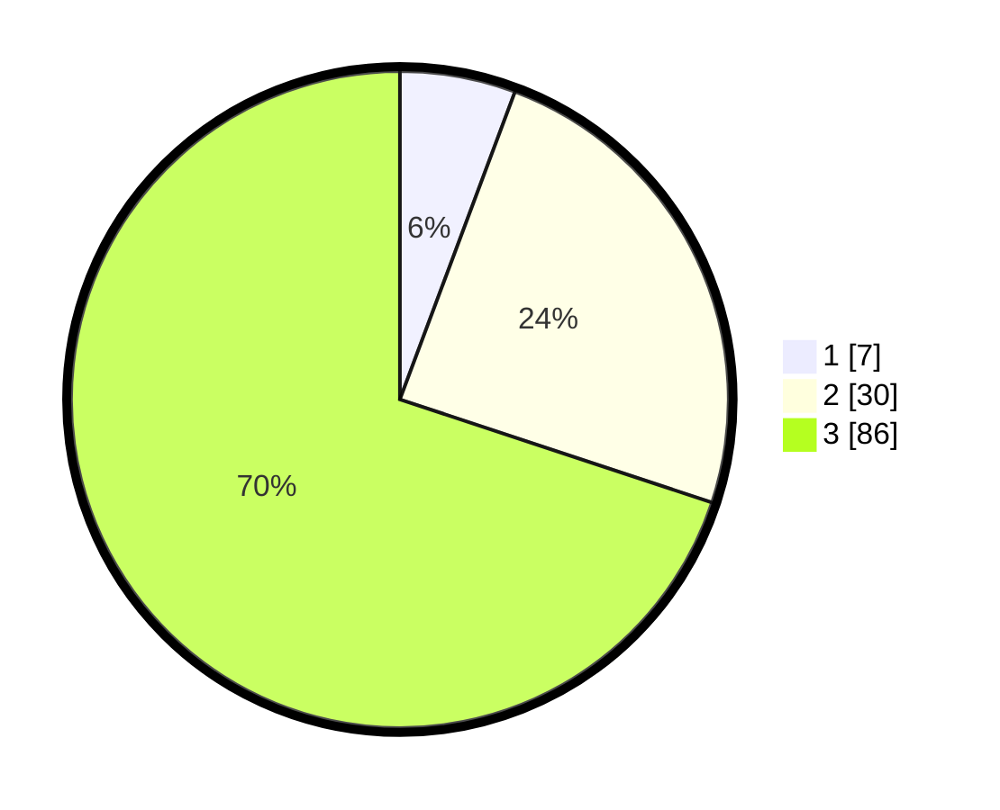

# Hasil

## Grafik

## Tabel

| No. | Nama Paslon    | Suara | Suara (raw) | Persentase |
|:--- |:-------------- | -----:| -----------:| ----------:|
| 1   | ANIES MUHAIMIN | 7     | [7][p-1]    | 5,69       |
| 2   | PRABOWO GIBRAN | 30    | [30][p-2]   | 24,39      |
| 3   | GANJAR MAHFUD  | 86    | [86][p-3]   | 69,92      |

[p-1]: https://github.com/gigit-pemilu/pemilu-2024-61-kalimantan-barat/blob/main/pilpres/hitung-suara/sub/61-kalimantan-barat/sub/12-kubu-raya/sub/09-sungai-kakap/sub/2008-kalimas/sub/019-tps/sub/paslon-1.txt
[p-2]: https://github.com/gigit-pemilu/pemilu-2024-61-kalimantan-barat/blob/main/pilpres/hitung-suara/sub/61-kalimantan-barat/sub/12-kubu-raya/sub/09-sungai-kakap/sub/2008-kalimas/sub/019-tps/sub/paslon-2.txt
[p-3]: https://github.com/gigit-pemilu/pemilu-2024-61-kalimantan-barat/blob/main/pilpres/hitung-suara/sub/61-kalimantan-barat/sub/12-kubu-raya/sub/09-sungai-kakap/sub/2008-kalimas/sub/019-tps/sub/paslon-3.txt

## Foto C Plano

https://sirekap-obj-formc.kpu.go.id/f2da/pemilu/ppwp/61/12/09/20/08/6112092008019-20240214-212722--7f95889e-09f6-4e94-b1bd-7fec7818d28d.jpg

https://sirekap-obj-formc.kpu.go.id/f2da/pemilu/ppwp/61/12/09/20/08/6112092008019-20240214-213248--ecbffb12-c1a8-4ccd-a9ba-534ffb60c09c.jpg

https://sirekap-obj-formc.kpu.go.id/f2da/pemilu/ppwp/61/12/09/20/08/6112092008019-20240214-213917--87e2ca0a-4364-4c83-bb19-e7d7d1ac762d.jpg

## Metadata

| Key        | Value               |
| ---------- | ------------------- |
| Time Stamp | 2024-02-15 12:00:28 |

