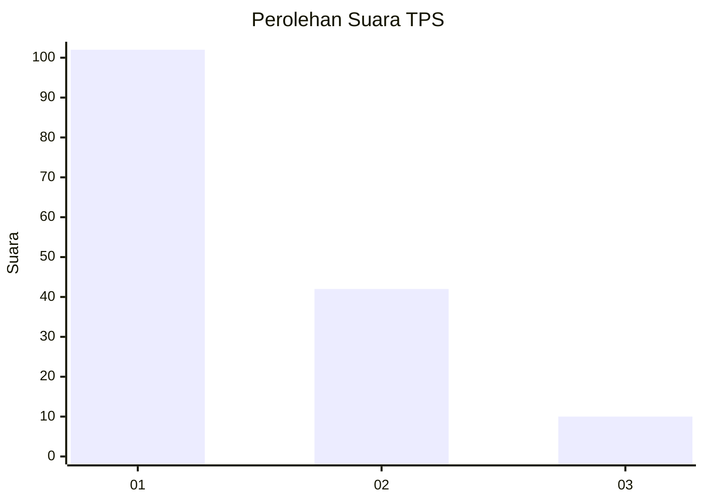
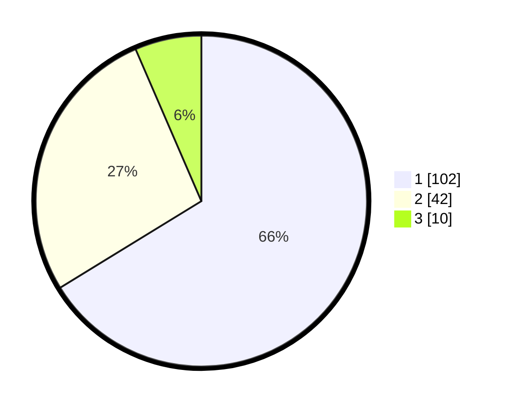

# Hasil

## Grafik

## Tabel

| No. | Nama Paslon    | Suara | Suara (raw) | Persentase |
|:--- |:-------------- | -----:| -----------:| ----------:|
| 1   | ANIES MUHAIMIN | 102   | [102][p-1]  | 66,23      |
| 2   | PRABOWO GIBRAN | 42    | [42][p-2]   | 27,27      |
| 3   | GANJAR MAHFUD  | 10    | [10][p-3]   | 6,49       |

[p-1]: https://github.com/gigit-pemilu/pemilu-2024-61-kalimantan-barat/blob/main/pilpres/hitung-suara/sub/61-kalimantan-barat/sub/12-kubu-raya/sub/09-sungai-kakap/sub/2011-tanjung-saleh/sub/014-tps/sub/paslon-1.txt
[p-2]: https://github.com/gigit-pemilu/pemilu-2024-61-kalimantan-barat/blob/main/pilpres/hitung-suara/sub/61-kalimantan-barat/sub/12-kubu-raya/sub/09-sungai-kakap/sub/2011-tanjung-saleh/sub/014-tps/sub/paslon-2.txt
[p-3]: https://github.com/gigit-pemilu/pemilu-2024-61-kalimantan-barat/blob/main/pilpres/hitung-suara/sub/61-kalimantan-barat/sub/12-kubu-raya/sub/09-sungai-kakap/sub/2011-tanjung-saleh/sub/014-tps/sub/paslon-3.txt

## Foto C Plano

https://sirekap-obj-formc.kpu.go.id/514b/pemilu/ppwp/61/12/09/20/11/6112092011014-20240215-120710--e1901242-cd3a-4e6a-b6f9-217d3a958c45.jpg

https://sirekap-obj-formc.kpu.go.id/514b/pemilu/ppwp/61/12/09/20/11/6112092011014-20240215-120818--019065d3-f9cd-422c-9967-5aabac4c606f.jpg

https://sirekap-obj-formc.kpu.go.id/514b/pemilu/ppwp/61/12/09/20/11/6112092011014-20240215-120915--72a9f3a4-1b4d-4d38-a3fd-9541aebe94e8.jpg

## Metadata

| Key        | Value               |
| ---------- | ------------------- |
| Time Stamp | 2024-02-15 15:00:29 |

