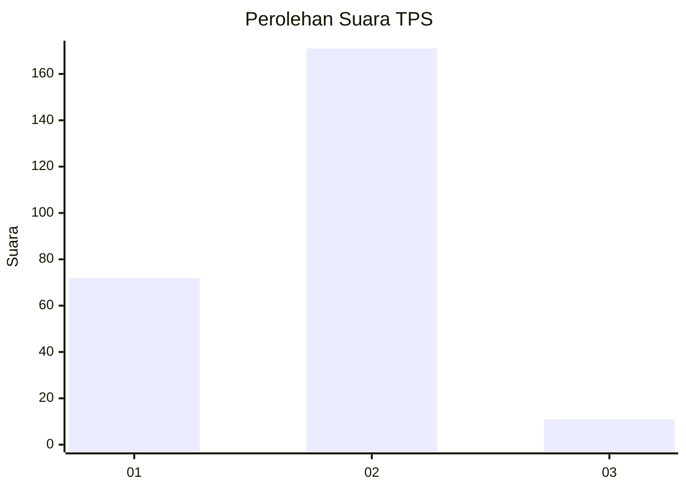
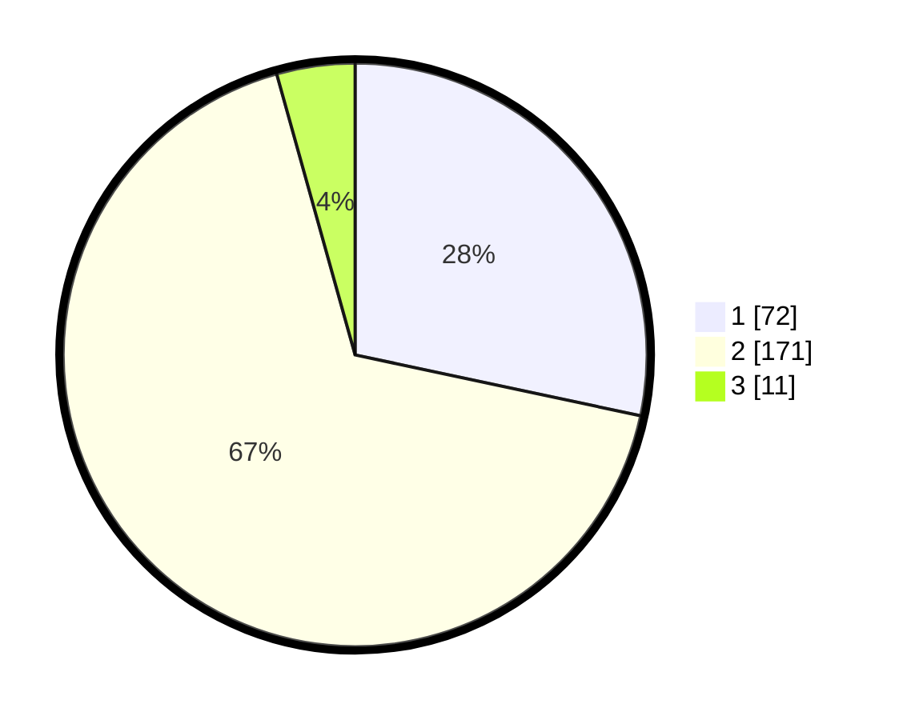

# Hasil

## Grafik

## Tabel

| No. | Nama Paslon    | Suara | Suara (raw) | Persentase |
|:--- |:-------------- | -----:| -----------:| ----------:|
| 1   | ANIES MUHAIMIN | 72    | [72][p-1]   | 28,35      |
| 2   | PRABOWO GIBRAN | 171   | [171][p-2]  | 67,32      |
| 3   | GANJAR MAHFUD  | 11    | [11][p-3]   | 4,33       |

[p-1]: https://github.com/gigit-pemilu/pemilu-2024-61-kalimantan-barat/blob/main/pilpres/hitung-suara/sub/61-kalimantan-barat/sub/12-kubu-raya/sub/09-sungai-kakap/sub/2015-parit-keladi/sub/001-tps/sub/paslon-1.txt
[p-2]: https://github.com/gigit-pemilu/pemilu-2024-61-kalimantan-barat/blob/main/pilpres/hitung-suara/sub/61-kalimantan-barat/sub/12-kubu-raya/sub/09-sungai-kakap/sub/2015-parit-keladi/sub/001-tps/sub/paslon-2.txt
[p-3]: https://github.com/gigit-pemilu/pemilu-2024-61-kalimantan-barat/blob/main/pilpres/hitung-suara/sub/61-kalimantan-barat/sub/12-kubu-raya/sub/09-sungai-kakap/sub/2015-parit-keladi/sub/001-tps/sub/paslon-3.txt

## Foto C Plano

https://sirekap-obj-formc.kpu.go.id/cdc8/pemilu/ppwp/61/12/09/20/15/6112092015001-20240214-185515--3c570ebc-740c-492e-b79c-19f0ef7dbfc1.jpg

https://sirekap-obj-formc.kpu.go.id/cdc8/pemilu/ppwp/61/12/09/20/15/6112092015001-20240214-201614--25f37d2b-647c-4fd4-b61d-ff5e1d5bd996.jpg

https://sirekap-obj-formc.kpu.go.id/cdc8/pemilu/ppwp/61/12/09/20/15/6112092015001-20240214-155341--394a12dc-b694-4e21-8971-5fe9a3a0c3c5.jpg

## Metadata

| Key        | Value               |
| ---------- | ------------------- |
| Time Stamp | 2024-02-15 15:00:29 |

