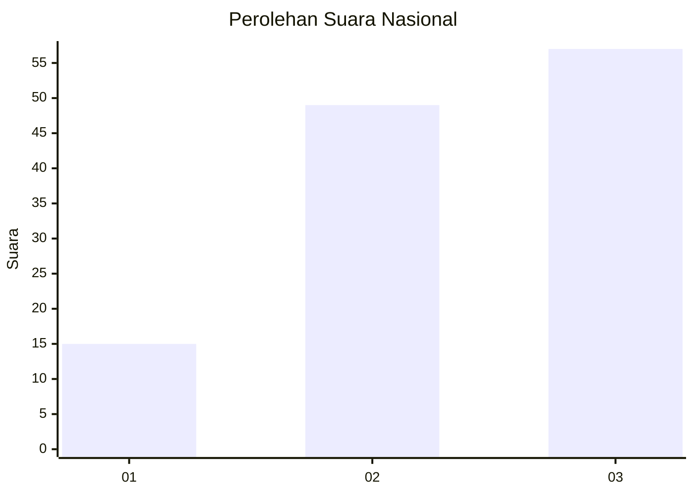
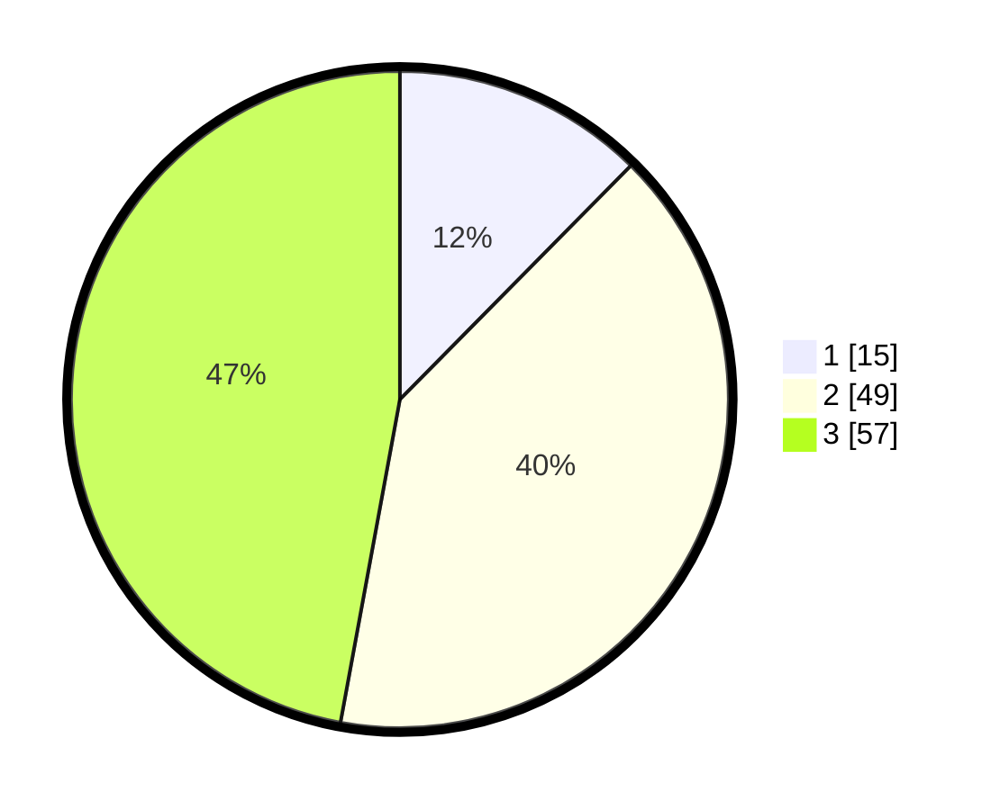

# Hasil

## Grafik

## Tabel

| No. | Nama Paslon    | Suara | Suara (raw) | Persentase |
|:--- |:-------------- | -----:| -----------:| ----------:|
| 1   | ANIES MUHAIMIN | 15    | [15][p-1]   | 12,40      |
| 2   | PRABOWO GIBRAN | 49    | [49][p-2]   | 40,50      |
| 3   | GANJAR MAHFUD  | 57    | [57][p-3]   | 47,11      |

[p-1]: https://github.com/gigit-pemilu/pemilu-2024/blob/main/pilpres/hitung-suara/sub/61-kalimantan-barat/sub/71-kota-pontianak/sub/01-pontianak-selatan/sub/1002-benuamelayu-laut/sub/002-tps/sub/paslon-1.txt
[p-2]: https://github.com/gigit-pemilu/pemilu-2024/blob/main/pilpres/hitung-suara/sub/61-kalimantan-barat/sub/71-kota-pontianak/sub/01-pontianak-selatan/sub/1002-benuamelayu-laut/sub/002-tps/sub/paslon-2.txt
[p-3]: https://github.com/gigit-pemilu/pemilu-2024/blob/main/pilpres/hitung-suara/sub/61-kalimantan-barat/sub/71-kota-pontianak/sub/01-pontianak-selatan/sub/1002-benuamelayu-laut/sub/002-tps/sub/paslon-3.txt

## Foto C Plano

https://sirekap-obj-formc.kpu.go.id/0034/pemilu/ppwp/61/71/01/10/02/6171011002002-20240214-211350--6d0be439-8321-462a-99f4-c06f28320afa.jpg

https://sirekap-obj-formc.kpu.go.id/0034/pemilu/ppwp/61/71/01/10/02/6171011002002-20240214-175642--1e425bc0-ab77-488b-9be6-a5d53e4bc5bd.jpg

https://sirekap-obj-formc.kpu.go.id/0034/pemilu/ppwp/61/71/01/10/02/6171011002002-20240214-154808--f239c015-3b4e-48de-bc52-e698d988e07f.jpg

## Metadata

| Key        | Value               |
| ---------- | ------------------- |
| Time Stamp | 2024-02-15 17:00:25 |

## DATA PEMILIH TETAP

Jumlah pemilih dalam DPT: **178**.
 * L: **87**.
 * P: **95**.

## DATA PENGGUNA HAK PILIH

Jumlah pengguna hak pilih dalam DPT: **118**.
 * L: **57**.
 * P: **61**.

Jumlah pengguna hak pilih dalam DPTb: **5**.
 * L: **2**.
 * P: **3**.

Jumlah pengguna hak pilih dalam DPK: **0**.
 * L: **0**.
 * P: **0**.

Jumlah pengguna hak pilih: **123**.
 * L: **59**.
 * P: **64**.

## JUMLAH SUARA SAH DAN TIDAK SAH

JUMLAH SELURUH SUARA SAH: **121**.

JUMLAH SUARA TIDAK SAH: **2**.

JUMLAH SELURUH SUARA SAH DAN SUARA TIDAK SAH: **123**.

