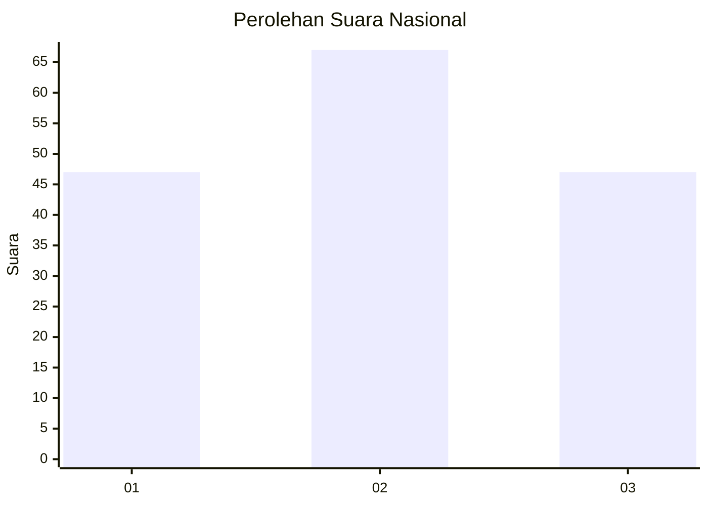
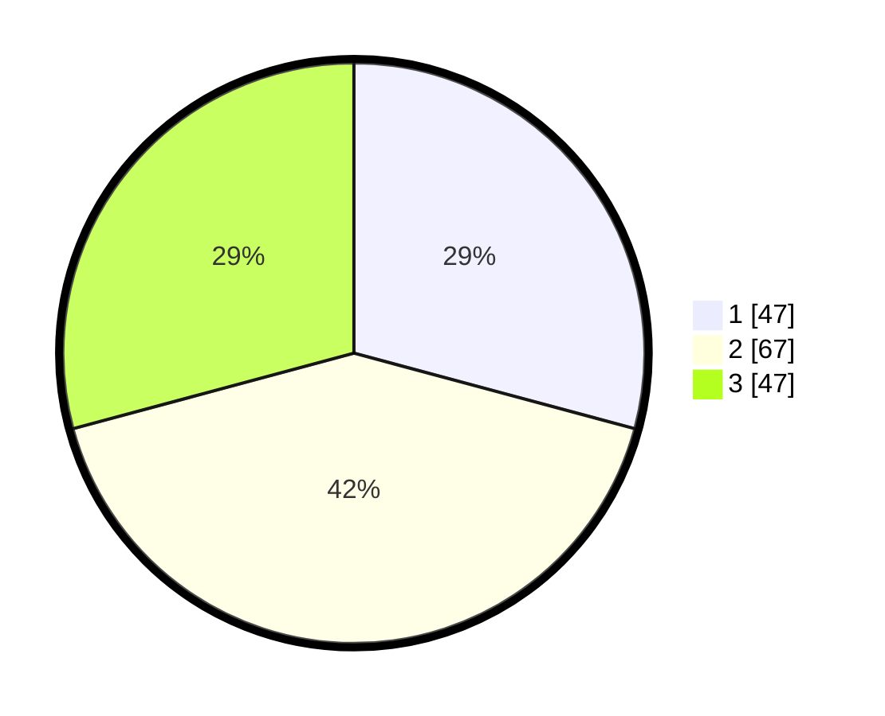

# Hasil

## Grafik

## Tabel

| No. | Nama Paslon    | Suara | Suara (raw) | Persentase |
|:--- |:-------------- | -----:| -----------:| ----------:|
| 1   | ANIES MUHAIMIN | 47    | [47][p-1]   | 29,19      |
| 2   | PRABOWO GIBRAN | 67    | [67][p-2]   | 41,61      |
| 3   | GANJAR MAHFUD  | 47    | [47][p-3]   | 29,19      |

[p-1]: https://github.com/gigit-pemilu/pemilu-2024/blob/main/pilpres/hitung-suara/sub/61-kalimantan-barat/sub/71-kota-pontianak/sub/01-pontianak-selatan/sub/1002-benuamelayu-laut/sub/004-tps/sub/paslon-1.txt
[p-2]: https://github.com/gigit-pemilu/pemilu-2024/blob/main/pilpres/hitung-suara/sub/61-kalimantan-barat/sub/71-kota-pontianak/sub/01-pontianak-selatan/sub/1002-benuamelayu-laut/sub/004-tps/sub/paslon-2.txt
[p-3]: https://github.com/gigit-pemilu/pemilu-2024/blob/main/pilpres/hitung-suara/sub/61-kalimantan-barat/sub/71-kota-pontianak/sub/01-pontianak-selatan/sub/1002-benuamelayu-laut/sub/004-tps/sub/paslon-3.txt

## Foto C Plano

https://sirekap-obj-formc.kpu.go.id/a40e/pemilu/ppwp/61/71/01/10/02/6171011002004-20240214-194144--cbc271b3-0db9-4719-a887-9de929b17762.jpg

https://sirekap-obj-formc.kpu.go.id/a40e/pemilu/ppwp/61/71/01/10/02/6171011002004-20240214-195451--47f7a364-124e-4671-8bd6-51106313cff2.jpg

## Metadata

| Key        | Value               |
| ---------- | ------------------- |
| Time Stamp | 2024-02-15 07:00:44 |

