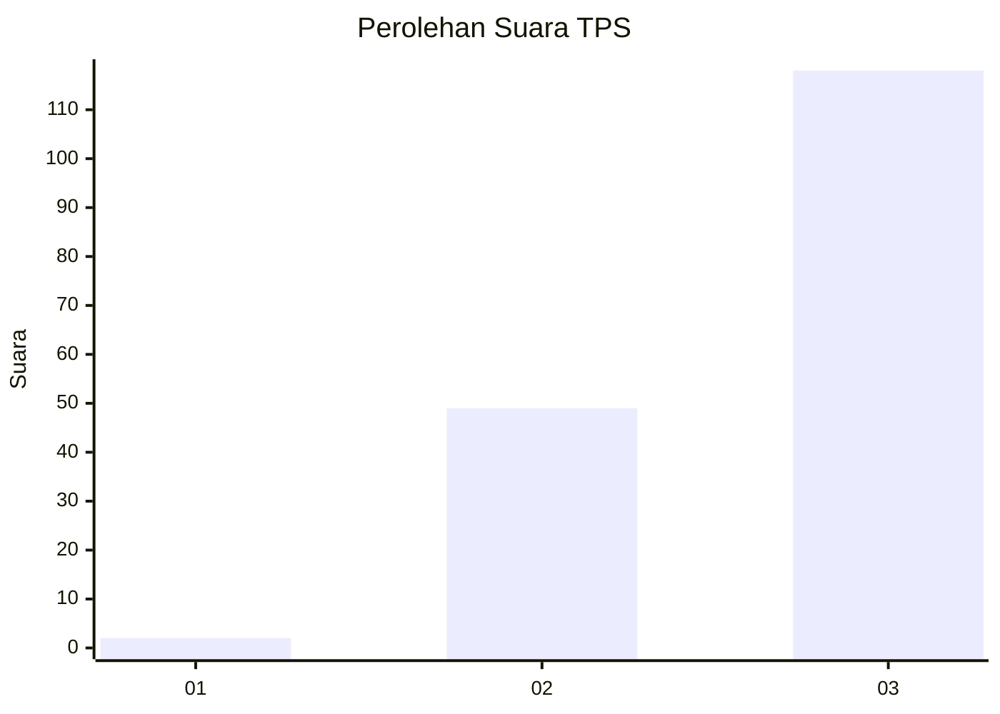
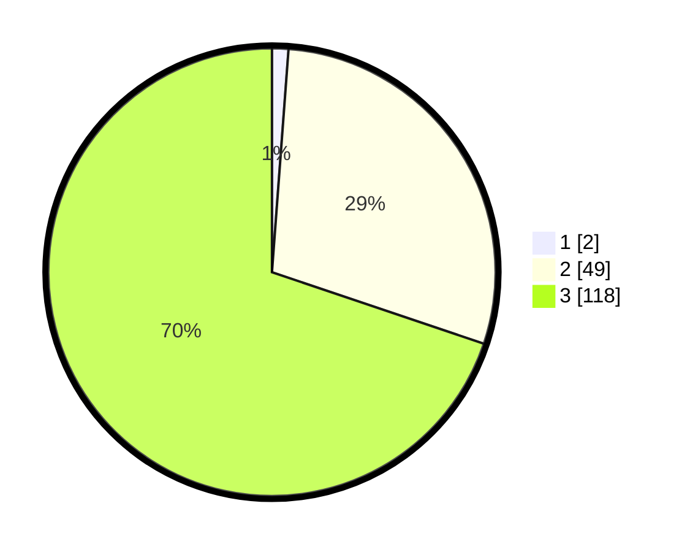

# Hasil

## Grafik

## Tabel

| No. | Nama Paslon    | Suara | Suara (raw) | Persentase |
|:--- |:-------------- | -----:| -----------:| ----------:|
| 1   | ANIES MUHAIMIN | 2     | [2][p-1]    | 1,18       |
| 2   | PRABOWO GIBRAN | 49    | [49][p-2]   | 28,99      |
| 3   | GANJAR MAHFUD  | 118   | [118][p-3]  | 69,82      |

[p-1]: https://github.com/gigit-pemilu/pemilu-2024-61-kalimantan-barat/blob/main/pilpres/hitung-suara/sub/61-kalimantan-barat/sub/71-kota-pontianak/sub/01-pontianak-selatan/sub/1003-benuamelayu-darat/sub/070-tps/sub/paslon-1.txt
[p-2]: https://github.com/gigit-pemilu/pemilu-2024-61-kalimantan-barat/blob/main/pilpres/hitung-suara/sub/61-kalimantan-barat/sub/71-kota-pontianak/sub/01-pontianak-selatan/sub/1003-benuamelayu-darat/sub/070-tps/sub/paslon-2.txt
[p-3]: https://github.com/gigit-pemilu/pemilu-2024-61-kalimantan-barat/blob/main/pilpres/hitung-suara/sub/61-kalimantan-barat/sub/71-kota-pontianak/sub/01-pontianak-selatan/sub/1003-benuamelayu-darat/sub/070-tps/sub/paslon-3.txt

## Foto C Plano

https://sirekap-obj-formc.kpu.go.id/36e5/pemilu/ppwp/61/71/01/10/03/6171011003070-20240214-203140--b2af133d-fc9d-4d6c-a090-8fdf9cf11004.jpg

https://sirekap-obj-formc.kpu.go.id/36e5/pemilu/ppwp/61/71/01/10/03/6171011003070-20240214-201828--c874ba5a-b7fe-418f-99a7-3a1ebce5af68.jpg

https://sirekap-obj-formc.kpu.go.id/36e5/pemilu/ppwp/61/71/01/10/03/6171011003070-20240214-201701--7f2a82b0-7ff8-4a62-b48e-07eeb37edc09.jpg

## Metadata

| Key        | Value               |
| ---------- | ------------------- |
| Time Stamp | 2024-02-16 00:30:27 |

