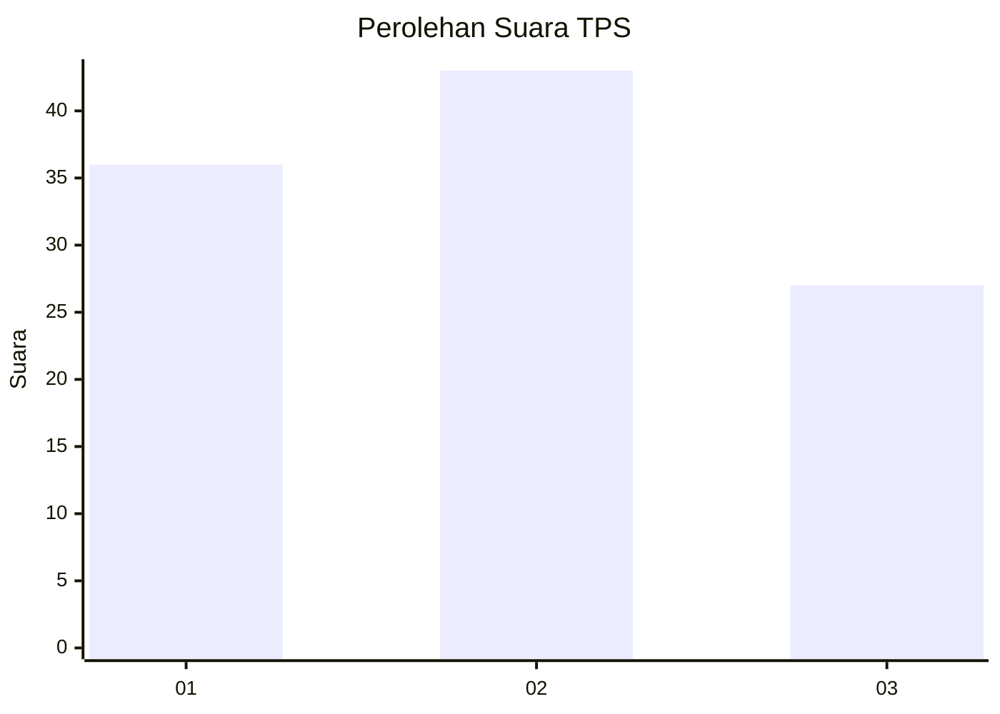
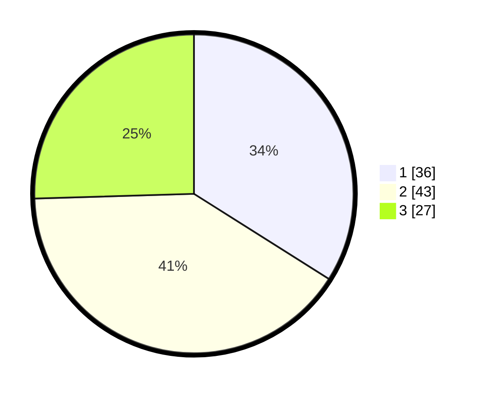

# Hasil

## Grafik

## Tabel

| No. | Nama Paslon    | Suara | Suara (raw) | Persentase |
|:--- |:-------------- | -----:| -----------:| ----------:|
| 1   | ANIES MUHAIMIN | 36    | [36][p-1]   | 33,96      |
| 2   | PRABOWO GIBRAN | 43    | [43][p-2]   | 40,57      |
| 3   | GANJAR MAHFUD  | 27    | [27][p-3]   | 25,47      |

[p-1]: https://github.com/gigit-pemilu/pemilu-2024-61-kalimantan-barat/blob/main/pilpres/hitung-suara/sub/61-kalimantan-barat/sub/71-kota-pontianak/sub/01-pontianak-selatan/sub/1004-parittokaya/sub/050-tps/sub/paslon-1.txt
[p-2]: https://github.com/gigit-pemilu/pemilu-2024-61-kalimantan-barat/blob/main/pilpres/hitung-suara/sub/61-kalimantan-barat/sub/71-kota-pontianak/sub/01-pontianak-selatan/sub/1004-parittokaya/sub/050-tps/sub/paslon-2.txt
[p-3]: https://github.com/gigit-pemilu/pemilu-2024-61-kalimantan-barat/blob/main/pilpres/hitung-suara/sub/61-kalimantan-barat/sub/71-kota-pontianak/sub/01-pontianak-selatan/sub/1004-parittokaya/sub/050-tps/sub/paslon-3.txt

## Foto C Plano

https://sirekap-obj-formc.kpu.go.id/479f/pemilu/ppwp/61/71/01/10/04/6171011004050-20240214-212214--7b3feeae-a50c-4499-81e5-9062bf082d65.jpg

https://sirekap-obj-formc.kpu.go.id/479f/pemilu/ppwp/61/71/01/10/04/6171011004050-20240214-212224--5fc82061-d095-4d70-adf9-c7d95132f2f1.jpg

https://sirekap-obj-formc.kpu.go.id/479f/pemilu/ppwp/61/71/01/10/04/6171011004050-20240214-212230--d2703f12-667e-4399-80f1-0b81e4a0cc5c.jpg

## Metadata

| Key        | Value               |
| ---------- | ------------------- |
| Time Stamp | 2024-02-16 01:00:27 |

