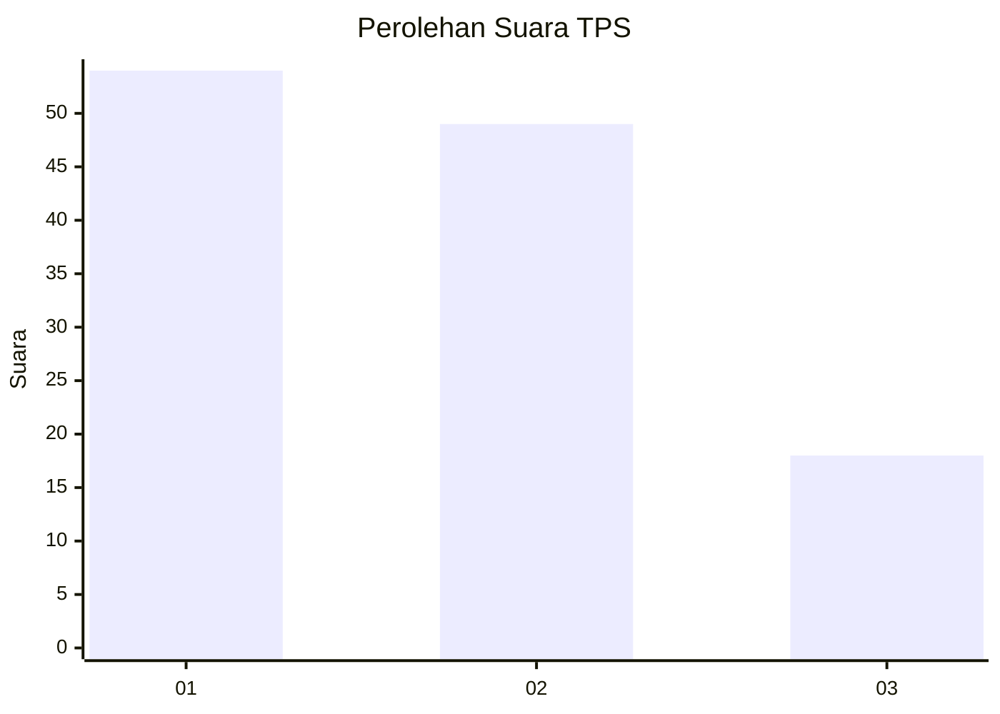
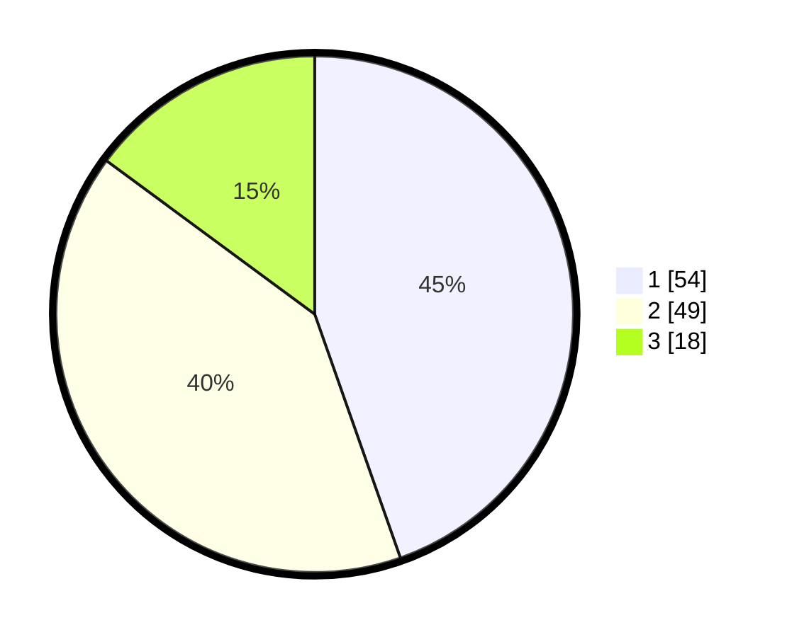

# Hasil

## Grafik

## Tabel

| No. | Nama Paslon    | Suara | Suara (raw) | Persentase |
|:--- |:-------------- | -----:| -----------:| ----------:|
| 1   | ANIES MUHAIMIN | 54    | [54][p-1]   | 44,63      |
| 2   | PRABOWO GIBRAN | 49    | [49][p-2]   | 40,50      |
| 3   | GANJAR MAHFUD  | 18    | [18][p-3]   | 14,88      |

[p-1]: https://github.com/gigit-pemilu/pemilu-2024-61-kalimantan-barat/blob/main/pilpres/hitung-suara/sub/61-kalimantan-barat/sub/71-kota-pontianak/sub/01-pontianak-selatan/sub/1005-kotabaru/sub/010-tps/sub/paslon-1.txt
[p-2]: https://github.com/gigit-pemilu/pemilu-2024-61-kalimantan-barat/blob/main/pilpres/hitung-suara/sub/61-kalimantan-barat/sub/71-kota-pontianak/sub/01-pontianak-selatan/sub/1005-kotabaru/sub/010-tps/sub/paslon-2.txt
[p-3]: https://github.com/gigit-pemilu/pemilu-2024-61-kalimantan-barat/blob/main/pilpres/hitung-suara/sub/61-kalimantan-barat/sub/71-kota-pontianak/sub/01-pontianak-selatan/sub/1005-kotabaru/sub/010-tps/sub/paslon-3.txt

## Foto C Plano

https://sirekap-obj-formc.kpu.go.id/0726/pemilu/ppwp/61/71/01/10/05/6171011005010-20240215-145912--23fb5d39-8d6f-4dee-bb33-6f9c5c3fbfab.jpg

https://sirekap-obj-formc.kpu.go.id/0726/pemilu/ppwp/61/71/01/10/05/6171011005010-20240215-145936--ad61f625-9970-40fc-9b24-b2cef57faf33.jpg

https://sirekap-obj-formc.kpu.go.id/0726/pemilu/ppwp/61/71/01/10/05/6171011005010-20240215-145944--3b926e4c-be05-4ffe-a36b-ca7b0ceef3bf.jpg

## Metadata

| Key        | Value               |
| ---------- | ------------------- |
| Time Stamp | 2024-02-15 22:30:27 |

