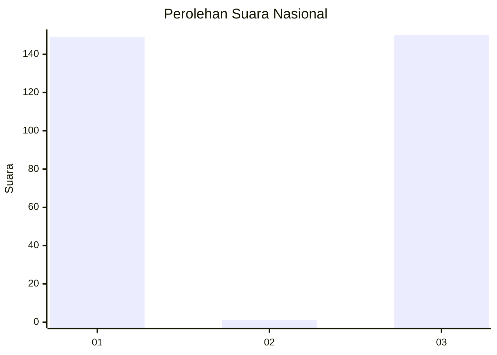
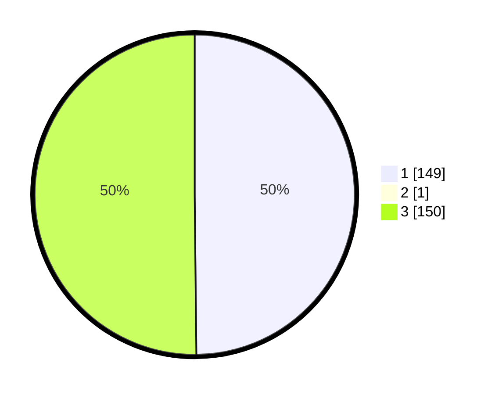

# Hasil

## Grafik

## Tabel

| No. | Nama Paslon    | Suara | Suara (raw) | Persentase |
|:--- |:-------------- | -----:| -----------:| ----------:|
| 1   | ANIES MUHAIMIN | 149   | [149][p-1]  | 49,67      |
| 2   | PRABOWO GIBRAN | 1     | [1][p-2]    | 0,33       |
| 3   | GANJAR MAHFUD  | 150   | [150][p-3]  | 50,00      |

[p-1]: https://github.com/gigit-pemilu/pemilu-2024/blob/main/pilpres/hitung-suara/sub/61-kalimantan-barat/sub/71-kota-pontianak/sub/01-pontianak-selatan/sub/1005-kotabaru/sub/021-tps/sub/paslon-1.txt
[p-2]: https://github.com/gigit-pemilu/pemilu-2024/blob/main/pilpres/hitung-suara/sub/61-kalimantan-barat/sub/71-kota-pontianak/sub/01-pontianak-selatan/sub/1005-kotabaru/sub/021-tps/sub/paslon-2.txt
[p-3]: https://github.com/gigit-pemilu/pemilu-2024/blob/main/pilpres/hitung-suara/sub/61-kalimantan-barat/sub/71-kota-pontianak/sub/01-pontianak-selatan/sub/1005-kotabaru/sub/021-tps/sub/paslon-3.txt

## Foto C Plano

https://sirekap-obj-formc.kpu.go.id/66b4/pemilu/ppwp/61/71/01/10/05/6171011005021-20240214-224605--855a6120-bd5c-46c9-aab2-8c36a0d574d4.jpg

https://sirekap-obj-formc.kpu.go.id/66b4/pemilu/ppwp/61/71/01/10/05/6171011005021-20240214-224706--f5dd74ac-d9c7-49b5-9bbd-f99848760a2f.jpg

https://sirekap-obj-formc.kpu.go.id/66b4/pemilu/ppwp/61/71/01/10/05/6171011005021-20240214-224851--59f5c041-e16c-4a48-a82d-33dd1aa4d45f.jpg

## Metadata

| Key        | Value               |
| ---------- | ------------------- |
| Time Stamp | 2024-02-24 22:31:28 |

