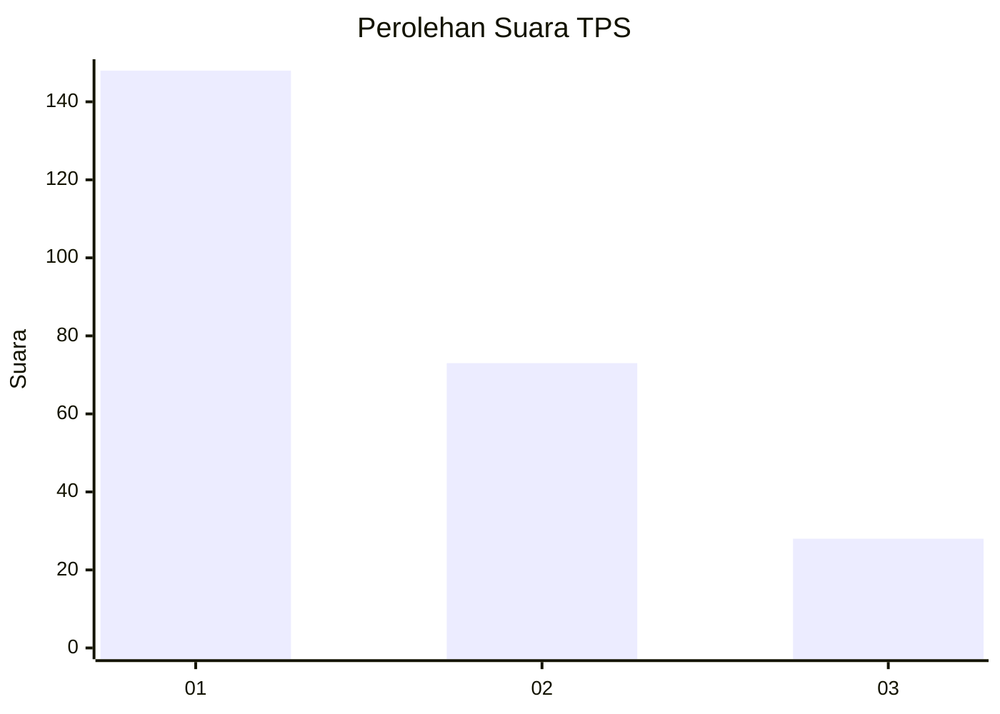
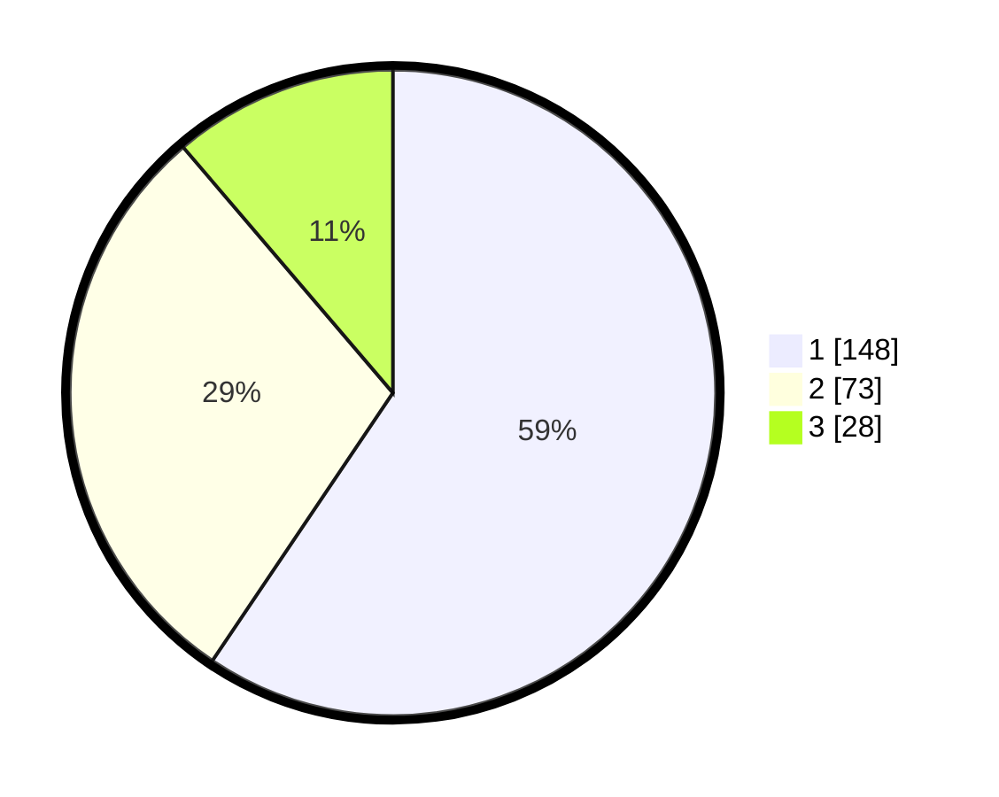

# Hasil

## Grafik

## Tabel

| No. | Nama Paslon    | Suara | Suara (raw) | Persentase |
|:--- |:-------------- | -----:| -----------:| ----------:|
| 1   | ANIES MUHAIMIN | 148   | [148][p-1]  | 59,44      |
| 2   | PRABOWO GIBRAN | 73    | [73][p-2]   | 29,32      |
| 3   | GANJAR MAHFUD  | 28    | [28][p-3]   | 11,24      |

[p-1]: https://github.com/gigit-pemilu/pemilu-2024-61-kalimantan-barat/blob/main/pilpres/hitung-suara/sub/61-kalimantan-barat/sub/71-kota-pontianak/sub/01-pontianak-selatan/sub/1005-kotabaru/sub/043-tps/sub/paslon-1.txt
[p-2]: https://github.com/gigit-pemilu/pemilu-2024-61-kalimantan-barat/blob/main/pilpres/hitung-suara/sub/61-kalimantan-barat/sub/71-kota-pontianak/sub/01-pontianak-selatan/sub/1005-kotabaru/sub/043-tps/sub/paslon-2.txt
[p-3]: https://github.com/gigit-pemilu/pemilu-2024-61-kalimantan-barat/blob/main/pilpres/hitung-suara/sub/61-kalimantan-barat/sub/71-kota-pontianak/sub/01-pontianak-selatan/sub/1005-kotabaru/sub/043-tps/sub/paslon-3.txt

## Foto C Plano

https://sirekap-obj-formc.kpu.go.id/d669/pemilu/ppwp/61/71/01/10/05/6171011005043-20240215-153917--03fcabe6-a8c7-4054-8f66-6d7ef33cf0b9.jpg

https://sirekap-obj-formc.kpu.go.id/d669/pemilu/ppwp/61/71/01/10/05/6171011005043-20240214-225239--a71eb127-c465-4ecd-94f0-905d4b5daa8b.jpg

https://sirekap-obj-formc.kpu.go.id/d669/pemilu/ppwp/61/71/01/10/05/6171011005043-20240215-022321--5db2796f-aa43-4155-81c0-38f7768b2f89.jpg

## Metadata

| Key        | Value               |
| ---------- | ------------------- |
| Time Stamp | 2024-02-15 23:29:50 |

